# SEQUENCE DIAGRAM - SƠ ĐỒ TUẦN TỰ
## DỰ ÁN: TODOLIST COLLABORATION

> **Phiên bản:** 2.0  
> **Ngày cập nhật:** 05/02/2026  
> **Notation:** UML 2.0 / Mermaid

---

## MỤC LỤC

1. [Authentication Module](#1-authentication-module)
2. [User Module](#2-user-module)
3. [Workspace Module](#3-workspace-module)
4. [Project Module](#4-project-module)
5. [Task Module](#5-task-module)
6. [Comment Module](#6-comment-module)
7. [Notification Module](#7-notification-module)
8. [Attachment Module](#8-attachment-module)

---

## 1. AUTHENTICATION MODULE

### SD-1.1: Đăng ký tài khoản (Register)

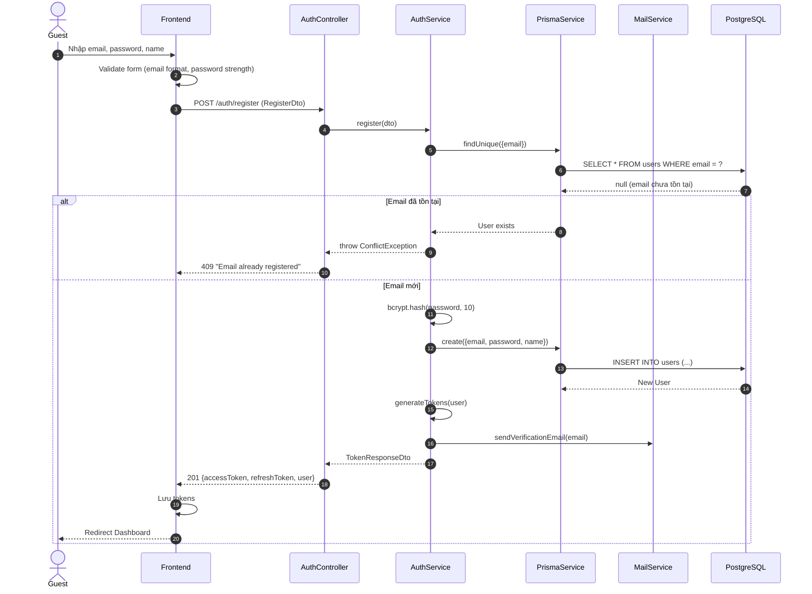

### SD-1.2: Đăng nhập (Login)

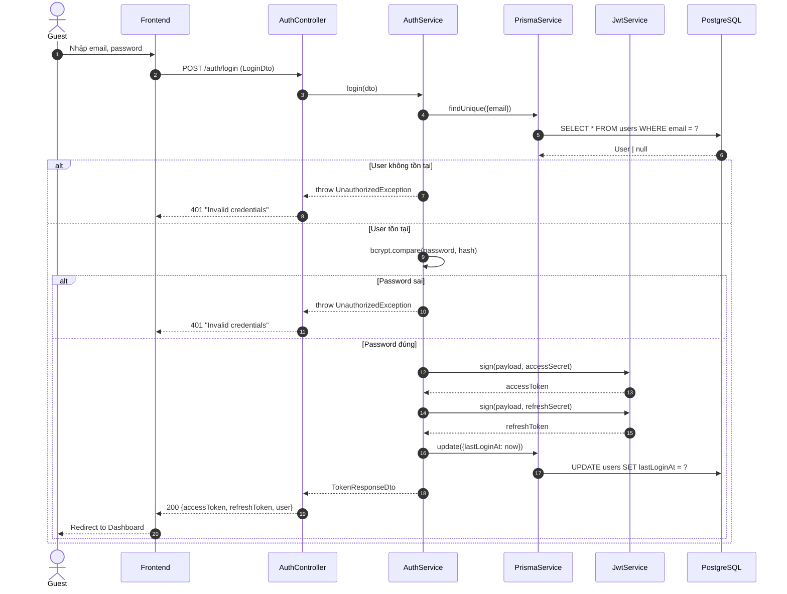

### SD-1.3: Refresh Token

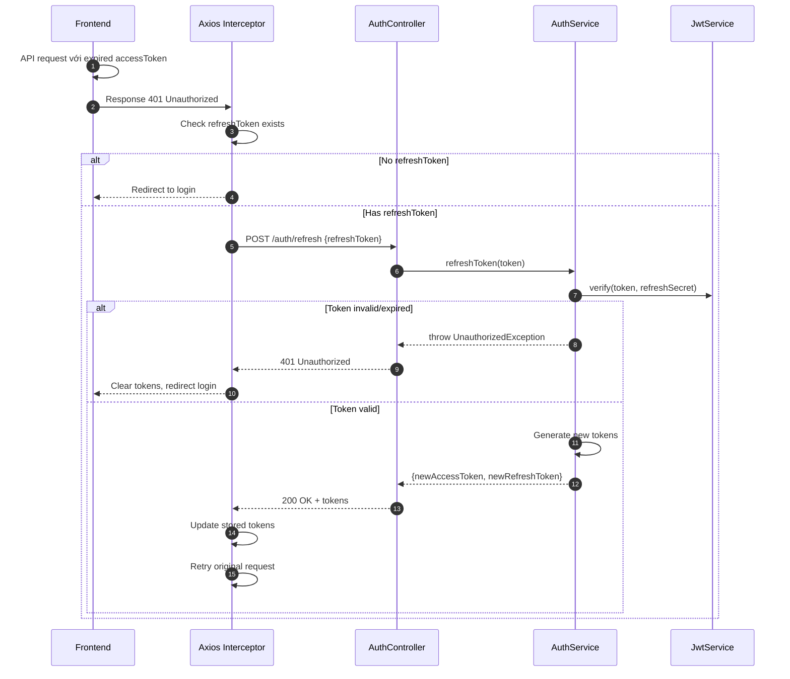

### SD-1.4: OAuth Login (Google/GitHub)

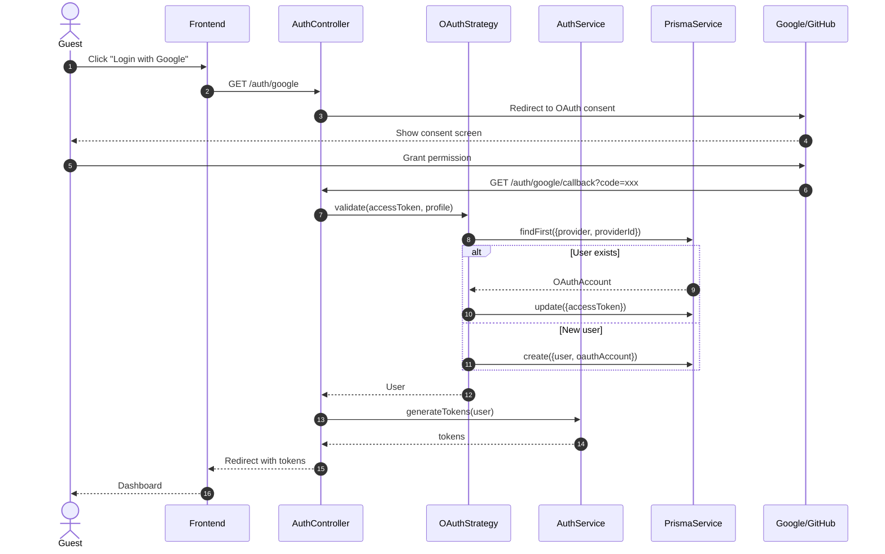

### SD-1.5: Quên mật khẩu (Forgot Password)

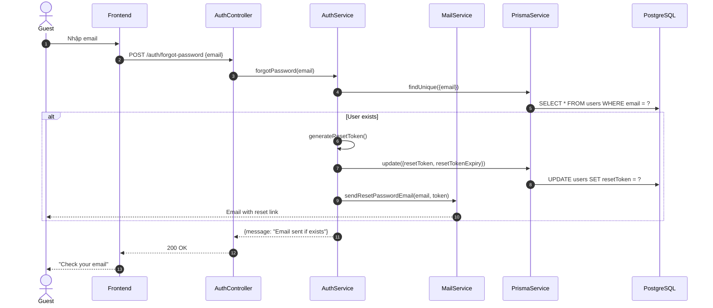

### SD-1.6: Đặt lại mật khẩu (Reset Password)

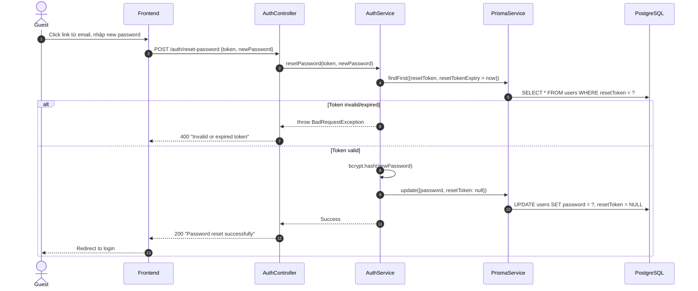

---

## 2. USER MODULE

### SD-2.1: Xem Profile

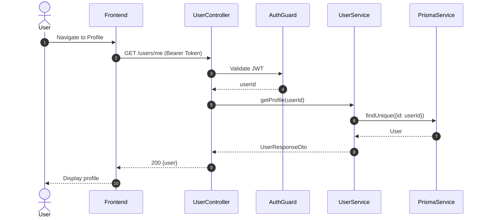

### SD-2.2: Cập nhật Profile

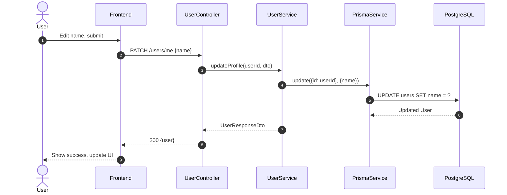

### SD-2.3: Đổi mật khẩu

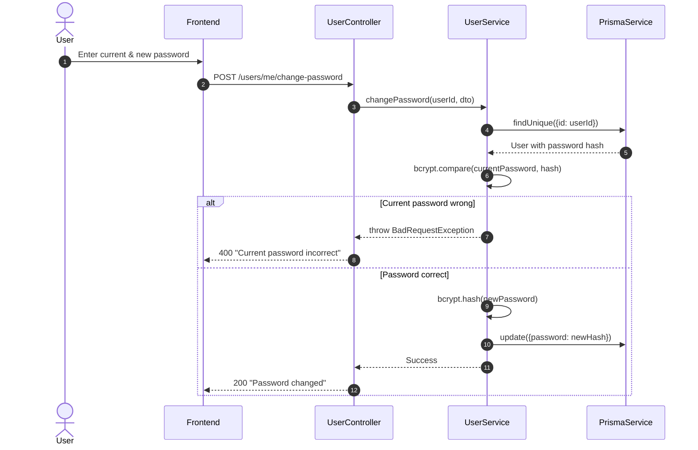

### SD-2.4: Upload Avatar

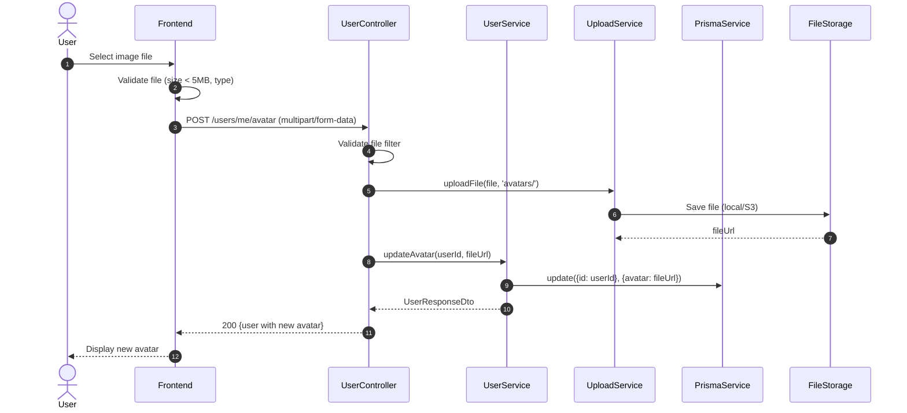

---

## 3. WORKSPACE MODULE

### SD-3.1: Tạo Workspace

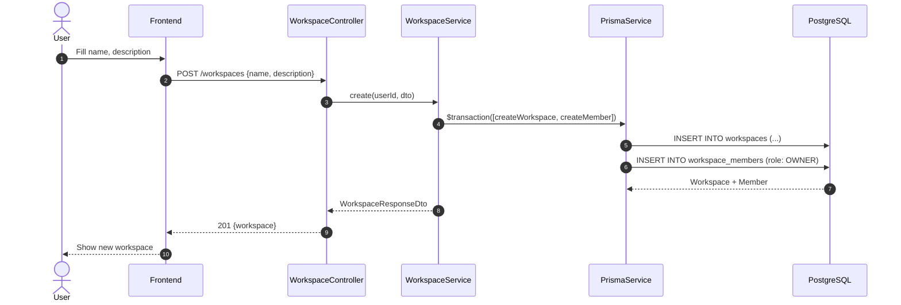

### SD-3.2: Xem danh sách Workspaces

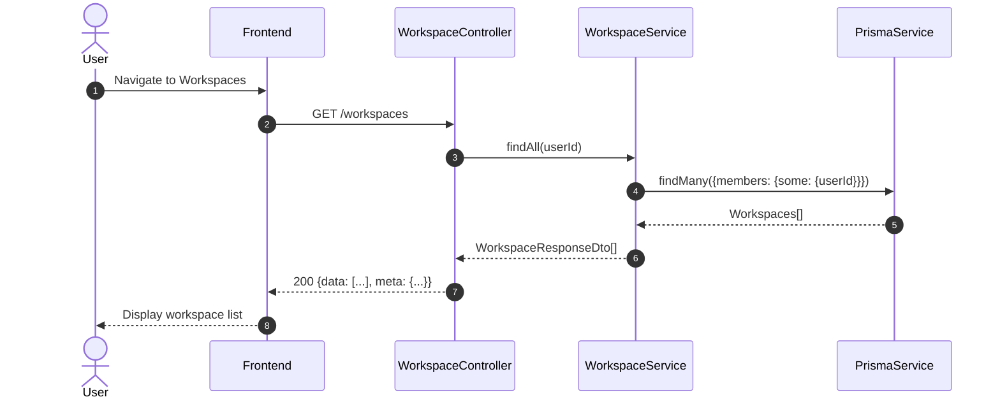

### SD-3.3: Mời thành viên (Invite Member)

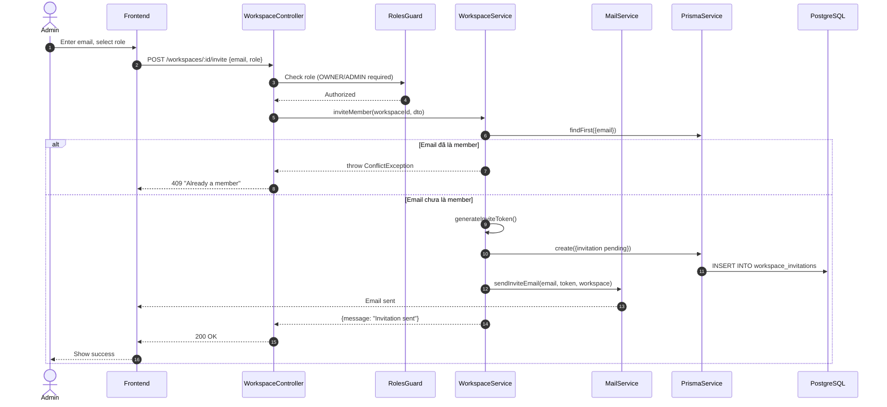

### SD-3.4: Chấp nhận lời mời (Accept Invitation)

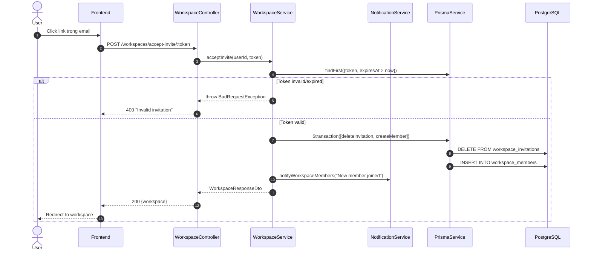

### SD-3.5: Quản lý vai trò (Update Member Role)

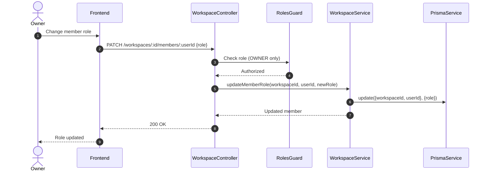

### SD-3.6: Xóa thành viên (Remove Member)

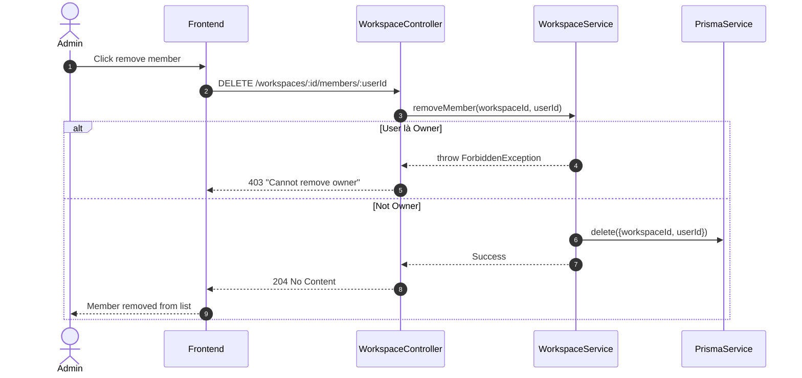

---

## 4. PROJECT MODULE

### SD-4.1: Tạo Project

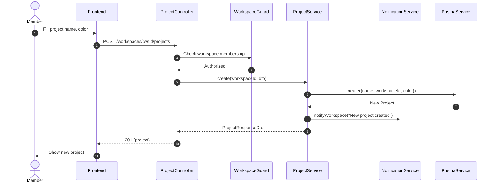

### SD-4.2: Xem chi tiết Project (Kanban Board)

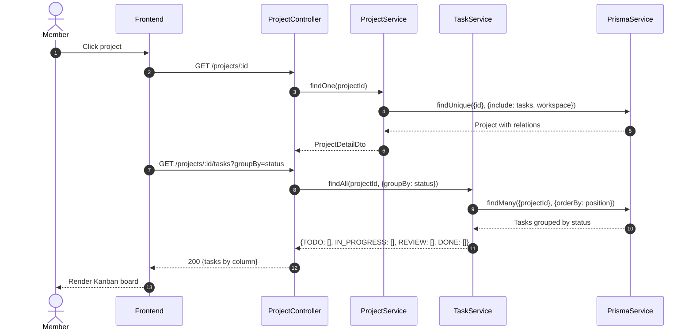

### SD-4.3: Archive/Unarchive Project

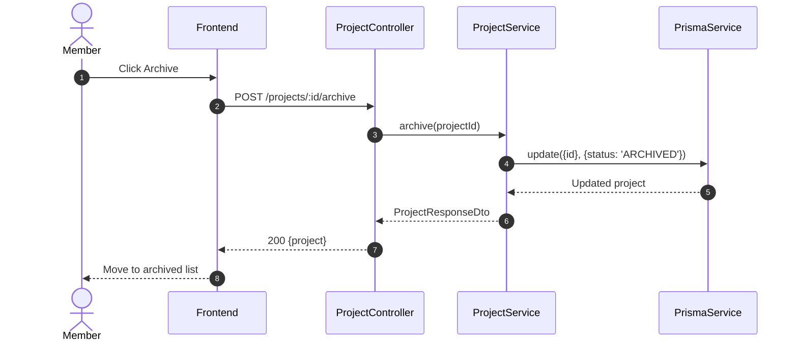

---

## 5. TASK MODULE

### SD-5.1: Tạo Task

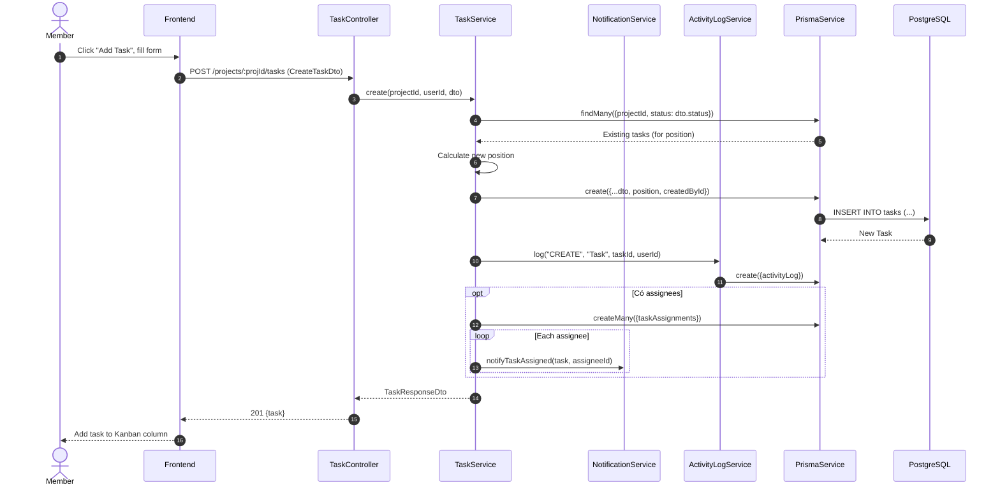

### SD-5.2: Cập nhật Task

```mermaid
sequenceDiagram
    autonumber
    actor Member
    participant FE as Frontend
    participant TC as TaskController
    participant TS as TaskService
    participant ALS as ActivityLogService
    participant PS as PrismaService

    Member->>FE: Edit task details
    FE->>TC: PATCH /tasks/:id (UpdateTaskDto)
    TC->>TS: update(taskId, userId, dto)
    TS->>PS: findUnique({id: taskId})
    PS-->>TS: Current task (for comparison)
    
    TS->>PS: update({id: taskId}, dto)
    PS-->>TS: Updated task
    
    TS->>ALS: log("UPDATE", "Task", taskId, {oldValue, newValue})
    TS-->>TC: TaskResponseDto
    TC-->>FE: 200 {task}
    FE-->>Member: Update task card
```

### SD-5.3: Thay đổi trạng thái (Drag & Drop)

```mermaid
sequenceDiagram
    autonumber
    actor Member
    participant FE as Frontend
    participant TC as TaskController
    participant TS as TaskService
    participant NS as NotificationService
    participant WS as WebSocket Gateway
    participant PS as PrismaService

    Member->>FE: Drag task to new column
    FE->>TC: PATCH /tasks/:id/status {status, position}
    TC->>TS: updateStatus(taskId, status, position)
    
    TS->>PS: findUnique({id: taskId})
    PS-->>TS: Task with project
    
    TS->>TS: Reorder tasks in column
    TS->>PS: updateMany({position adjustments})
    TS->>PS: update({id: taskId}, {status, position})
    
    opt Status = DONE
        TS->>PS: update({completedAt: now()})
    end
    
    PS-->>TS: Updated task
    TS->>WS: broadcast("task:updated", {task, projectId})
    WS-->>FE: Real-time update to all users
    
    TS-->>TC: TaskResponseDto
    TC-->>FE: 200 {task}
    FE-->>Member: Task moved to new column
```

### SD-5.4: Gán người thực hiện (Assign Task)

```mermaid
sequenceDiagram
    autonumber
    actor Member
    participant FE as Frontend
    participant TC as TaskController
    participant TS as TaskService
    participant NS as NotificationService
    participant WS as WebSocket Gateway
    participant PS as PrismaService

    Member->>FE: Select assignee from dropdown
    FE->>TC: POST /tasks/:id/assignees {userId}
    TC->>TS: assignUser(taskId, assigneeId)
    
    TS->>PS: findFirst({taskId, userId: assigneeId})
    alt Already assigned
        TS-->>TC: throw ConflictException
        TC-->>FE: 409 "Already assigned"
    else Not assigned
        TS->>PS: create({taskId, userId: assigneeId})
        PS-->>TS: TaskAssignment
        
        TS->>NS: create({type: TASK_ASSIGNED, userId: assigneeId})
        NS->>PS: create({notification})
        NS->>WS: emit("notification", {userId: assigneeId, data})
        
        TS-->>TC: Success
        TC-->>FE: 200 OK
        FE-->>Member: Show assignee avatar on task
    end
```

### SD-5.5: Hủy gán (Unassign Task)

```mermaid
sequenceDiagram
    autonumber
    actor Member
    participant FE as Frontend
    participant TC as TaskController
    participant TS as TaskService
    participant NS as NotificationService
    participant PS as PrismaService

    Member->>FE: Click remove assignee
    FE->>TC: DELETE /tasks/:id/assignees/:userId
    TC->>TS: unassignUser(taskId, userId)
    TS->>PS: delete({taskId, userId})
    TS->>NS: create({type: TASK_UNASSIGNED, userId})
    TS-->>TC: Success
    TC-->>FE: 204 No Content
    FE-->>Member: Remove avatar from task
```

### SD-5.6: Quản lý Subtasks

```mermaid
sequenceDiagram
    autonumber
    actor Member
    participant FE as Frontend
    participant TC as TaskController
    participant TS as TaskService
    participant PS as PrismaService

    Member->>FE: Add subtask
    FE->>TC: POST /tasks/:taskId/subtasks {title}
    TC->>TS: addSubtask(taskId, title)
    TS->>PS: findMany({taskId}) 
    PS-->>TS: Existing subtasks (for position)
    TS->>PS: create({taskId, title, position})
    PS-->>TS: Subtask
    TS-->>TC: SubtaskResponseDto
    TC-->>FE: 201 {subtask}
    
    Note over FE,Member: Toggle subtask completion
    
    Member->>FE: Click checkbox
    FE->>TC: PATCH /subtasks/:id/toggle
    TC->>TS: toggleSubtask(subtaskId)
    TS->>PS: update({isCompleted: !current})
    TS-->>TC: Subtask
    TC-->>FE: 200 {subtask}
    FE-->>Member: Update checkbox state
```

### SD-5.7: Thêm/Xóa Labels

```mermaid
sequenceDiagram
    autonumber
    actor Member
    participant FE as Frontend
    participant TC as TaskController
    participant TS as TaskService
    participant PS as PrismaService

    Member->>FE: Select label
    FE->>TC: POST /tasks/:id/labels {labelId}
    TC->>TS: addLabel(taskId, labelId)
    TS->>PS: create({taskId, labelId})
    PS-->>TS: TaskLabel
    TS-->>TC: Success
    TC-->>FE: 200 OK
    FE-->>Member: Show label badge on task
    
    Note over FE,Member: Remove label
    
    Member->>FE: Click remove label
    FE->>TC: DELETE /tasks/:id/labels/:labelId
    TC->>TS: removeLabel(taskId, labelId)
    TS->>PS: delete({taskId, labelId})
    TS-->>TC: Success
    TC-->>FE: 204 No Content
```

### SD-5.8: My Tasks (Dashboard)

```mermaid
sequenceDiagram
    autonumber
    actor User
    participant FE as Frontend
    participant TC as TaskController
    participant TS as TaskService
    participant PS as PrismaService

    User->>FE: Open Dashboard
    FE->>TC: GET /tasks/my-tasks?filter=all
    TC->>TS: getMyTasks(userId, filter)
    TS->>PS: findMany({assignments: {some: {userId}}})
    PS-->>TS: Tasks[]
    TS-->>TC: TaskResponseDto[]
    
    par Get due today
        FE->>TC: GET /tasks/my-tasks?filter=due_today
        TC->>TS: getMyTasks(userId, 'due_today')
        TS->>PS: findMany({dueDate: today, assignments: ...})
    and Get overdue
        FE->>TC: GET /tasks/my-tasks?filter=overdue
        TC->>TS: getMyTasks(userId, 'overdue')
        TS->>PS: findMany({dueDate < today, status != DONE})
    end
    
    TS-->>TC: Filtered tasks
    TC-->>FE: 200 {tasks}
    FE-->>User: Display task lists
```

---

## 6. COMMENT MODULE

### SD-6.1: Thêm Comment

```mermaid
sequenceDiagram
    autonumber
    actor Member
    participant FE as Frontend
    participant CC as CommentController
    participant CS as CommentService
    participant NS as NotificationService
    participant WS as WebSocket Gateway
    participant PS as PrismaService

    Member->>FE: Write comment, submit
    FE->>CC: POST /tasks/:taskId/comments {content}
    CC->>CS: create(taskId, userId, content)
    
    CS->>CS: parseMentions(content)
    CS->>PS: create({taskId, authorId, content})
    PS-->>CS: Comment
    
    opt Has @mentions
        loop Each mentioned user
            CS->>NS: create({type: MENTIONED, userId})
            NS->>WS: emit("notification", {userId})
        end
    end
    
    CS->>NS: notifyTaskAssignees({type: COMMENT_ADDED, taskId})
    CS->>WS: broadcast("comment:new", {taskId, comment})
    
    CS-->>CC: CommentResponseDto
    CC-->>FE: 201 {comment}
    FE-->>Member: Display new comment
```

### SD-6.2: Reply Comment

```mermaid
sequenceDiagram
    autonumber
    actor Member
    participant FE as Frontend
    participant CC as CommentController
    participant CS as CommentService
    participant NS as NotificationService
    participant PS as PrismaService

    Member->>FE: Click Reply, write content
    FE->>CC: POST /tasks/:taskId/comments {content, parentId}
    CC->>CS: create(taskId, userId, {content, parentId})
    CS->>PS: create({..., parentId})
    
    CS->>PS: findUnique({id: parentId})
    PS-->>CS: Parent comment with author
    
    CS->>NS: create({type: COMMENT_REPLY, userId: parentAuthorId})
    CS-->>CC: CommentResponseDto
    CC-->>FE: 201 {comment}
    FE-->>Member: Display threaded reply
```

### SD-6.3: Sửa/Xóa Comment

```mermaid
sequenceDiagram
    autonumber
    actor Member
    participant FE as Frontend
    participant CC as CommentController
    participant CS as CommentService
    participant PS as PrismaService

    Note over Member,FE: Edit comment
    Member->>FE: Edit content
    FE->>CC: PATCH /comments/:id {content}
    CC->>CS: update(commentId, userId, content)
    CS->>PS: findUnique({id: commentId})
    
    alt Not author
        CS-->>CC: throw ForbiddenException
    else Is author
        CS->>PS: update({content, isEdited: true})
        CS-->>CC: CommentResponseDto
        CC-->>FE: 200 {comment}
    end
    
    Note over Member,FE: Delete comment
    Member->>FE: Click Delete
    FE->>CC: DELETE /comments/:id
    CC->>CS: delete(commentId, userId)
    CS->>PS: findUnique({id}) with task.project.workspace
    
    alt Not author AND not admin
        CS-->>CC: throw ForbiddenException
    else Authorized
        CS->>PS: delete({id: commentId})
        CS-->>CC: Success
        CC-->>FE: 204 No Content
    end
```

---

## 7. NOTIFICATION MODULE

### SD-7.1: Xem Notifications

```mermaid
sequenceDiagram
    autonumber
    actor User
    participant FE as Frontend
    participant NC as NotificationController
    participant NS as NotificationService
    participant PS as PrismaService

    User->>FE: Click notification bell
    FE->>NC: GET /notifications?limit=20
    NC->>NS: findAll(userId, {limit: 20})
    NS->>PS: findMany({userId}, {orderBy: createdAt desc})
    PS-->>NS: Notifications[]
    NS-->>NC: NotificationResponseDto[]
    NC-->>FE: 200 {notifications}
    FE-->>User: Display notification list
```

### SD-7.2: Đánh dấu đã đọc

```mermaid
sequenceDiagram
    autonumber
    actor User
    participant FE as Frontend
    participant NC as NotificationController
    participant NS as NotificationService
    participant PS as PrismaService

    User->>FE: Click notification
    FE->>NC: PATCH /notifications/:id/read
    NC->>NS: markAsRead(notificationId, userId)
    NS->>PS: update({id, userId}, {isRead: true})
    NS-->>NC: Success
    NC-->>FE: 200 OK
    FE->>FE: Navigate to referenced entity
    FE-->>User: Open task/comment
```

### SD-7.3: Mark All as Read

```mermaid
sequenceDiagram
    autonumber
    actor User
    participant FE as Frontend
    participant NC as NotificationController
    participant NS as NotificationService
    participant PS as PrismaService

    User->>FE: Click "Mark all as read"
    FE->>NC: POST /notifications/read-all
    NC->>NS: markAllAsRead(userId)
    NS->>PS: updateMany({userId, isRead: false}, {isRead: true})
    NS-->>NC: {count: n}
    NC-->>FE: 200 OK
    FE-->>User: Clear badge, update list
```

### SD-7.4: Real-time Notification Delivery

```mermaid
sequenceDiagram
    autonumber
    participant Trigger as Event Trigger
    participant NS as NotificationService
    participant PS as PrismaService
    participant GW as WebSocket Gateway
    participant FE as Frontend
    actor User

    Note over Trigger: Task assigned, Mentioned, etc.
    
    Trigger->>NS: create({type, userId, ...})
    NS->>PS: create(notification)
    PS-->>NS: Notification
    
    NS->>GW: sendToUser(userId, notification)
    GW->>GW: Find socket by userId
    
    alt User online
        GW->>FE: emit("notification", payload)
        FE->>FE: Update badge count
        FE->>FE: Show toast
        FE-->>User: 🔔 Notification appears
    else User offline
        Note over GW: Stored in DB, fetched on next login
    end
```

---

## 8. ATTACHMENT MODULE

### SD-8.1: Upload Attachment

```mermaid
sequenceDiagram
    autonumber
    actor Member
    participant FE as Frontend
    participant AC as AttachmentController
    participant AS as AttachmentService
    participant UPS as UploadService
    participant PS as PrismaService
    participant FS as FileStorage

    Member->>FE: Select file
    FE->>FE: Validate (size < 10MB, allowed type)
    FE->>AC: POST /tasks/:taskId/attachments (multipart/form-data)
    
    AC->>UPS: uploadFile(file, 'attachments/')
    UPS->>FS: saveFile(buffer, path)
    FS-->>UPS: fileUrl
    
    AC->>AS: create(taskId, userId, {fileName, fileUrl, fileSize, mimeType})
    AS->>PS: create({...attachmentData})
    PS-->>AS: Attachment
    AS-->>AC: AttachmentResponseDto
    AC-->>FE: 201 {attachment}
    FE-->>Member: Show attached file
```

### SD-8.2: Delete Attachment

```mermaid
sequenceDiagram
    autonumber
    actor Member
    participant FE as Frontend
    participant AC as AttachmentController
    participant AS as AttachmentService
    participant UPS as UploadService
    participant PS as PrismaService
    participant FS as FileStorage

    Member->>FE: Click delete attachment
    FE->>AC: DELETE /attachments/:id
    AC->>AS: delete(attachmentId, userId)
    
    AS->>PS: findUnique({id: attachmentId})
    PS-->>AS: Attachment with task
    
    alt Not uploader AND not admin
        AS-->>AC: throw ForbiddenException
    else Authorized
        AS->>UPS: deleteFile(fileUrl)
        UPS->>FS: delete(path)
        AS->>PS: delete({id: attachmentId})
        AS-->>AC: Success
        AC-->>FE: 204 No Content
        FE-->>Member: Remove from UI
    end
```

---

## 9. TỔNG KẾT

| Module | Số lượng Diagrams | Mô tả |
|--------|-------------------|-------|
| Authentication | 6 | Register, Login, Refresh, OAuth, Forgot/Reset Password |
| User | 4 | Profile, Update, Change Password, Avatar |
| Workspace | 6 | CRUD, Invite, Accept, Roles, Remove Member |
| Project | 3 | Create, View Kanban, Archive |
| Task | 8 | CRUD, Status, Assign, Subtasks, Labels, My Tasks |
| Comment | 3 | Create, Reply, Edit/Delete |
| Notification | 4 | List, Mark Read, Mark All, Real-time |
| Attachment | 2 | Upload, Delete |
| **Total** | **36** | Tất cả chức năng chính |
