# SEQUENCE DIAGRAMS – SƠ ĐỒ TUẦN TỰ
## DỰ ÁN: TODOLIST COLLABORATION

> Phiên bản: 3.0  
> Ngày cập nhật: 09/04/2026  
> Nguồn sự thật: Mã nguồn backend NestJS hiện tại (AppModule, Auth/User/Workspace/Project/Task/Comment/Notification/Events modules)  
> Ghi chú: Mọi flow bên dưới mô tả **hành vi hiện đang được triển khai** trên backend. Các flow thiết kế nhưng chưa có code đã được di chuyển vào mục riêng "Future / Planned Flows".

---

## MỤC LỤC

### 1. Authentication Flows
1. [User Registration](#1-user-registration)
2. [User Login](#2-user-login)
3. [Refresh Token](#3-refresh-token)
4. [Forgot Password](#4-forgot-password)
5. [Reset Password](#5-reset-password)
6. [Logout](#6-logout)

### 2. User/Profile Flows
7. [View Profile](#7-view-profile)
8. [Update Profile](#8-update-profile)
9. [Change Password](#9-change-password)
10. [Upload Avatar](#10-upload-avatar)

### 3. Workspace Flows
11. [Create Workspace](#11-create-workspace)
12. [List Workspaces](#12-list-workspaces)
13. [Get Workspace Detail](#13-get-workspace-detail)
14. [Update Workspace](#14-update-workspace)
15. [Delete Workspace](#15-delete-workspace)
16. [Invite Member](#16-invite-member)
17. [Accept Invitation](#17-accept-invitation)
18. [Get Workspace Members](#18-get-workspace-members)
19. [Change Member Role](#19-change-member-role)
20. [Remove Member](#20-remove-member)
21. [Leave Workspace](#21-leave-workspace)

### 4. Project Flows
22. [Create Project](#22-create-project)
23. [List Projects In Workspace](#23-list-projects-in-workspace)
24. [Get Project Detail](#24-get-project-detail)
25. [Update Project](#25-update-project)
26. [Delete Project](#26-delete-project)
27. [Archive Project](#27-archive-project)
28. [Unarchive Project](#28-unarchive-project)
29. [Pin Project](#29-pin-project)
30. [Unpin Project](#30-unpin-project)

### 5. Task Flows
31. [List Tasks In Project](#31-list-tasks-in-project)
32. [Get Task Detail](#32-get-task-detail)
33. [Create Task](#33-create-task)
34. [Update Task](#34-update-task)
35. [Delete Task](#35-delete-task)
36. [Change Task Status](#36-change-task-status)
37. [Assign Member To Task](#37-assign-member-to-task)
38. [Unassign Member From Task](#38-unassign-member-from-task)
39. [Manage Task Labels](#39-manage-task-labels)
40. [Manage Subtasks](#40-manage-subtasks)

### 6. Comment Flows
41. [Add Comment](#41-add-comment)
42. [Reply Comment](#42-reply-comment)

### 7. Notification & Realtime Flows
43. [Internal Notification Creation](#43-internal-notification-creation)
44. [WebSocket Auth & Room Join](#44-websocket-auth--room-join)

### 8. Future / Planned Flows (Not yet implemented)
- [OAuth Login](#f1-oauth-login-not-yet-implemented)
- [My Tasks Dashboard](#f2-my-tasks-dashboard-not-yet-implemented)
- [Notification REST APIs](#f3-notification-rest-apis-not-yet-implemented)
- [Comment Edit/Delete](#f4-comment-editdelete-not-yet-implemented)
- [Task Attachments](#f5-task-attachments-not-yet-implemented)

---

## 1. USER REGISTRATION

### Endpoint
- POST /api/v1/auth/register

### Current Implementation Scope
- Đăng ký tài khoản mới và trả về access token + refresh token ngay lập tức. Không có bước email verification.

### Participants
- Client (SPA / FE)
- ValidationPipe (global)
- AuthController
- AuthService
- JwtService
- PrismaService
- PostgreSQL (bảng user, refreshToken)

### Sequence
1. Client gửi yêu cầu POST /api/v1/auth/register với RegisterDto (email, password, name...).
2. ValidationPipe validate body theo RegisterDto (format email, độ dài password...). Nếu không hợp lệ → trả 400 Bad Request.
3. AuthController.register gọi AuthService.register(dto).
4. AuthService dùng PrismaService tìm user theo email trong bảng user.
5. Nếu user đã tồn tại → ném ConflictException → trả 409 "Email already registered" cho client.
6. Nếu email chưa tồn tại:
   - Hash mật khẩu bằng bcrypt.
   - Tạo bản ghi user mới trong bảng user qua PrismaService.
7. AuthService.generateTokens tạo:
   - accessToken bằng JwtService.sign với secret JWT_SECRET.
   - refreshToken bằng JwtService.sign với secret JWT_REFRESH_SECRET.
8. AuthService lưu refreshToken vào bảng refreshToken (gồm userId, tokenId/jti, expiresAt, revokedAt = null...).
9. AuthService trả về payload chứa user đã đăng ký và cặp accessToken + refreshToken cho AuthController.
10. AuthController trả 201 Created với body { user, accessToken, refreshToken }.
11. Client lưu token (localStorage/cookie) và điều hướng người dùng vào ứng dụng.

### Notes
- Route được đánh dấu @Public nên JwtAuthGuard (global APP_GUARD) bỏ qua kiểm tra JWT.
- Toàn bộ logic validate DTO, mapping lỗi 400 được thực hiện bởi ValidationPipe.
- Refresh token luôn được persist vào bảng refreshToken, là cơ sở cho các flow refresh token và logout.

---

## 2. USER LOGIN

### Endpoint
- POST /api/v1/auth/login

### Current Implementation Scope
- Đăng nhập bằng email/password, kiểm tra mật khẩu, cập nhật lastLoginAt, tạo và lưu refresh token mới, trả về cặp token + thông tin user.

### Participants
- Client
- ValidationPipe
- AuthController
- AuthService
- JwtService
- PrismaService
- PostgreSQL (bảng user, refreshToken)

### Sequence
1. Client gửi POST /api/v1/auth/login với LoginDto (email, password).
2. ValidationPipe validate payload; nếu invalid → 400.
3. AuthController.login gọi AuthService.login(dto).
4. AuthService tìm user theo email trong bảng user.
5. Nếu không tìm thấy user → ném UnauthorizedException → 401 "Invalid credentials".
6. Nếu tìm thấy user, AuthService dùng bcrypt.compare để so sánh mật khẩu.
7. Nếu mật khẩu sai → UnauthorizedException → 401.
8. Nếu mật khẩu đúng:
   - Cập nhật trường lastLoginAt cho user qua PrismaService.
   - Gọi generateTokens để tạo accessToken + refreshToken mới.
   - Lưu refreshToken mới vào bảng refreshToken.
9. AuthService trả về { user, accessToken, refreshToken } cho AuthController.
10. AuthController trả 200 OK cho client.

### Notes
- Không có xác thực 2 bước hoặc email verification trong flow hiện tại.
- Refresh token cũ có thể được đánh dấu revoked tùy theo logic trong AuthService (dựa trên bảng refreshToken).

---

## 3. REFRESH TOKEN

### Endpoint
- POST /api/v1/auth/refresh

### Current Implementation Scope
- Nhận refreshToken hợp lệ, kiểm tra trong DB, tạo cặp accessToken + refreshToken mới, revoke token cũ.

### Participants
- Client (thường là HTTP interceptor trên FE)
- ValidationPipe
- AuthController
- AuthService
- JwtService
- PrismaService
- PostgreSQL (bảng user, refreshToken)

### Sequence
1. Client phát hiện access token hết hạn (401 từ API) và gửi POST /api/v1/auth/refresh với RefreshTokenDto (refreshToken).
2. ValidationPipe validate DTO; nếu thiếu hoặc sai format → 400.
3. AuthController.refreshToken gọi AuthService.refreshToken(dto).
4. AuthService dùng JwtService.verify để verify refreshToken với secret JWT_REFRESH_SECRET.
5. Nếu verify thất bại (token hỏng/hết hạn) → UnauthorizedException → 401.
6. Nếu verify thành công, AuthService dùng thông tin trong payload (jti/userId) để tìm bản ghi tương ứng trong bảng refreshToken.
7. Nếu không tìm thấy hoặc bản ghi đã revoked/hết hạn → UnauthorizedException → 401.
8. Nếu refresh token hợp lệ:
   - Đánh dấu bản ghi refreshToken hiện tại là revoked (set revokedAt).
   - Gọi generateTokens để tạo cặp accessToken + refreshToken mới.
   - Lưu bản ghi refreshToken mới vào DB.
9. AuthService trả { user, accessToken, refreshToken } cho AuthController.
10. AuthController trả 200 OK; client cập nhật token và retry request gốc nếu cần.

### Notes
- Flow này **không** implement OAuth (Google/GitHub); OAuth login nằm trong phần Future.
- Endpoint không cần access token vì access token có thể đã hết hạn; route được đánh dấu @Public.

---

## 4. FORGOT PASSWORD

### Endpoint
- POST /api/v1/auth/forgot-password

### Current Implementation Scope
- Nhận email, nếu user tồn tại → tạo bản ghi passwordReset, gửi email reset. Nếu không tồn tại → trả lỗi phù hợp theo AuthService.

### Participants
- Client
- ValidationPipe
- AuthController
- AuthService
- PrismaService
- MailService
- PostgreSQL (bảng user, passwordReset)

### Sequence
1. Client gửi POST /api/v1/auth/forgot-password với ForgotPasswordDto (email).
2. ValidationPipe kiểm tra format email; invalid → 400.
3. AuthController.forgotPassword gọi AuthService.forgotPassword(dto).
4. AuthService tìm user theo email trong bảng user.
5. Nếu không tìm thấy user, tùy implement:
   - Hoặc ném NotFoundException.
   - Hoặc trả về message chung (tuy nhiên mã nguồn hiện tại đang kiểm tra rõ ràng user tồn tại).
6. Nếu tìm thấy user:
   - Sinh token reset ngẫu nhiên và thời gian hết hạn.
   - Tạo bản ghi mới trong bảng passwordReset (userId, token, expiresAt, usedAt = null).
   - Gọi MailService để gửi email chứa link reset (chứa token) cho user.
7. AuthService trả về message xác nhận đã gửi email (hoặc tương đương) cho AuthController.
8. AuthController trả 200 OK cho client.

### Notes
- Thông tin reset password được lưu ở bảng passwordReset, **không** lưu trực tiếp trên bảng user.
- Một token chỉ dùng được một lần; trạng thái usedAt được dùng trong flow reset-password.

---

## 5. RESET PASSWORD

### Endpoint
- POST /api/v1/auth/reset-password

### Current Implementation Scope
- Đổi mật khẩu thông qua token reset hợp lệ; đánh dấu token đã sử dụng.

### Participants
- Client
- ValidationPipe
- AuthController
- AuthService
- PrismaService
- PostgreSQL (bảng user, passwordReset)

### Sequence
1. Người dùng mở link trong email reset password và nhập mật khẩu mới trên FE.
2. Client gửi POST /api/v1/auth/reset-password với ResetPasswordDto (token, newPassword, ...).
3. ValidationPipe kiểm tra DTO; nếu không hợp lệ → 400.
4. AuthController.resetPassword gọi AuthService.resetPassword(dto).
5. AuthService tìm bản ghi passwordReset theo token, kiểm tra:
   - Tồn tại.
   - expiresAt > now.
   - usedAt vẫn null.
6. Nếu token không hợp lệ/hết hạn/đã dùng → ném BadRequestException → 400 "Invalid or expired token".
7. Nếu token hợp lệ:
   - Lấy user tương ứng từ bảng user.
   - Hash newPassword bằng bcrypt.
   - Cập nhật mật khẩu mới cho user trong bảng user.
   - Cập nhật bản ghi passwordReset: set usedAt = now.
8. AuthService trả về message thành công cho AuthController.
9. AuthController trả 200 OK; FE có thể điều hướng người dùng về trang login.

### Notes
- Flow hiện tại không tự động đăng nhập sau khi reset; người dùng cần login lại.
- Việc revoke refresh token sau reset password có thể được thực hiện trong AuthService nếu đã implement (liên quan đến bảng refreshToken).

---

## 6. LOGOUT

### Endpoint
- POST /api/v1/auth/logout

### Current Implementation Scope
- Đăng xuất user hiện tại: revoke toàn bộ refresh tokens của user, thêm access token hiện tại vào blacklist (invalidatedToken).

### Participants
- Client
- JwtAuthGuard (global)
- AuthController
- AuthService
- PrismaService
- PostgreSQL (bảng refreshToken, invalidatedToken)

### Sequence
1. Client gửi POST /api/v1/auth/logout với header Authorization: Bearer accessToken.
2. JwtAuthGuard validate accessToken và gắn thông tin user (id, role, ...) vào request.
3. AuthController.logout nhận userId từ decorator CurrentUser và chuỗi Authorization từ header.
4. AuthController tách accessToken từ header và gọi AuthService.logout(userId, accessToken).
5. AuthService thực hiện:
   - Thêm bản ghi vào bảng invalidatedToken (hoặc tương tự) để đánh dấu access token hiện tại là không còn hợp lệ.
   - Cập nhật tất cả bản ghi refreshToken của user (revokedAt = now) để revoke toàn bộ phiên đăng nhập.
6. AuthService trả về message thành công cho AuthController.
7. AuthController trả 200 OK; FE xóa token và điều hướng user ra khỏi ứng dụng.

### Notes
- Route không có @Public nên bắt buộc phải có access token hợp lệ.
- Backend không quản lý session state trong memory; logout dựa hoàn toàn vào blacklist accessToken + revoke refreshToken.

---

## 7. VIEW PROFILE

### Endpoint
- GET /api/v1/users/me

### Current Implementation Scope
- Trả về thông tin hồ sơ của user hiện tại với tập trường được chọn sẵn (profileSelect) từ UserService.

### Participants
- Client
- JwtAuthGuard
- UserController
- UserService
- PrismaService
- PostgreSQL (bảng user)

### Sequence
1. Client gọi GET /api/v1/users/me với Authorization: Bearer accessToken.
2. JwtAuthGuard verify token; nếu không hợp lệ → 401.
3. Guard gắn userId vào request thông qua decorator CurrentUser.
4. UserController.getProfile nhận userId và gọi UserService.getProfile(userId).
5. UserService dùng PrismaService để truy vấn user theo id với profileSelect (chỉ lấy các field cần thiết như id, email, displayName, avatar, ...).
6. Nếu không tìm thấy user → ném NotFoundException.
7. Nếu tìm thấy → UserService trả về đối tượng user cho UserController.
8. UserController trả 200 OK với user profile.

### Notes
- Mọi endpoint trong UserController đều được bảo vệ bởi JwtAuthGuard ở cấp controller.
- Không trả về password hash hoặc trường nhạy cảm.

---

## 8. UPDATE PROFILE

### Endpoint
- PATCH /api/v1/users/me

### Current Implementation Scope
- Cho phép cập nhật các trường hồ sơ như displayName, bio, name (tùy DTO), không cho đổi email trong flow này.

### Participants
- Client
- JwtAuthGuard
- ValidationPipe
- UserController
- UserService
- PrismaService
- PostgreSQL (bảng user)

### Sequence
1. Client gửi PATCH /api/v1/users/me với UpdateProfileDto (ví dụ: displayName, bio...).
2. JwtAuthGuard xác thực user; nếu fail → 401.
3. ValidationPipe validate payload theo UpdateProfileDto (các field optional nhưng phải đúng kiểu/constraint).
4. UserController.updateProfile nhận userId và dto, gọi UserService.updateProfile(userId, dto).
5. UserService kiểm tra dto không rỗng (tránh request không có field nào).
6. UserService dùng PrismaService.update để cập nhật các trường được phép trong bảng user.
7. PrismaService trả về user đã cập nhật.
8. UserService trả user cho UserController.
9. UserController trả 200 OK với user đã cập nhật.

### Notes
- Không có logic gửi email xác nhận khi đổi profile.
- Quyền truy cập: chỉ user tự cập nhật profile của chính mình (dựa trên CurrentUser).

---

## 9. CHANGE PASSWORD

### Endpoint
- PATCH /api/v1/users/me/change-password

### Current Implementation Scope
- Đổi mật khẩu dựa trên currentPassword + newPassword, đảm bảo currentPassword đúng và newPassword khác mật khẩu hiện tại, revoke các refresh token sau khi đổi.

### Participants
- Client
- JwtAuthGuard
- ValidationPipe
- UserController
- UserService
- PrismaService
- PostgreSQL (bảng user, refreshToken)

### Sequence
1. Client gửi PATCH /api/v1/users/me/change-password với ChangePasswordDto (currentPassword, newPassword, confirmPassword...).
2. JwtAuthGuard xác thực user; nếu fail → 401.
3. ValidationPipe validate DTO (newPassword phải đạt yêu cầu, confirmPassword trùng newPassword nếu có).
4. UserController.changePassword nhận userId và dto, gọi UserService.changePassword(userId, dto).
5. UserService lấy user từ DB (bảng user) để lấy password hash hiện tại.
6. Dùng bcrypt.compare để so sánh currentPassword với hash.
7. Nếu currentPassword sai → ném BadRequestException với message tương ứng.
8. Nếu currentPassword đúng → kiểm tra newPassword khác currentPassword.
9. Hash newPassword và cập nhật vào bảng user.
10. UserService revoke tất cả refreshToken của user (nếu implement) để buộc đăng nhập lại trên các thiết bị.
11. Trả về message thành công cho UserController; UserController trả 200 OK cho client.

### Notes
- Flow này là security-critical: luôn yêu cầu currentPassword để đổi mật khẩu.
- Sau khi đổi mật khẩu, các phiên đăng nhập trước đó có thể bị logout tùy logic revoke refreshToken.

---

## 10. UPLOAD AVATAR

### Endpoint
- POST /api/v1/users/me/avatar

### Current Implementation Scope
- Upload file ảnh đại diện của user, lưu file trên filesystem theo cấu hình Multer, cập nhật tên file avatar cho user; xóa file cũ nếu tồn tại.

### Participants
- Client
- JwtAuthGuard
- UserController
- FileInterceptor (Multer, avatarMulterConfig)
- ParseFilePipe + MaxFileSizeValidator
- UserService
- File System (thư mục uploads/avatars)
- PrismaService
- PostgreSQL (bảng user)

### Sequence
1. User chọn file ảnh trên FE; FE kiểm tra cơ bản (kích thước, định dạng) nếu muốn.
2. Client gửi POST /api/v1/users/me/avatar với multipart/form-data, field tên "avatar".
3. JwtAuthGuard xác thực user.
4. FileInterceptor('avatar', avatarMulterConfig) xử lý upload:
   - Kiểm tra mimetype qua fileFilter trong avatarMulterConfig (image/jpeg, image/png, ...).
   - Lưu file vào thư mục uploads/avatars với tên đã chuẩn hóa.
5. ParseFilePipe + MaxFileSizeValidator đảm bảo file không vượt quá 5MB; nếu vượt → 400.
6. UserController.uploadAvatar nhận userId và file (Express.Multer.File), gọi UserService.uploadAvatar(userId, file).
7. UserService:
   - Nếu user đã có avatar trước đó → xóa file cũ trên filesystem.
   - Cập nhật trường avatar (thường là filename) của user trong bảng user.
8. UserService trả về user đã cập nhật cho controller.
9. UserController trả 200 OK với user (chứa đường dẫn avatar mới tương ứng với /uploads/avatars/:filename).

### Notes
- Không có UploadService/FileStorage abstraction; sử dụng trực tiếp Multer + filesystem.
- Static assets được serve từ thư mục uploads thông qua cấu hình trong main.ts.

---

## 11. CREATE WORKSPACE

### Endpoint
- POST /api/v1/workspaces

### Current Implementation Scope
- Tạo workspace mới và tự động thêm người tạo vào workspace với vai trò OWNER trong một transaction.

### Participants
- Client
- JwtAuthGuard
- ValidationPipe
- WorkspaceController
- WorkspaceService
- PrismaService
- PostgreSQL (bảng workspace, workspaceMember)

### Sequence
1. Client gửi POST /api/v1/workspaces với CreateWorkspaceDto (name, description...).
2. JwtAuthGuard xác thực user.
3. ValidationPipe validate DTO.
4. WorkspaceController.create nhận userId và dto, gọi WorkspaceService.create(userId, dto).
5. WorkspaceService thực hiện Prisma.$transaction:
   - Tạo bản ghi workspace mới trong bảng workspace.
   - Tạo bản ghi workspaceMember với role = OWNER cho user tạo.
6. Transaction thành công → WorkspaceService trả về workspace (có thể kèm thông tin member owner) cho controller.
7. WorkspaceController trả 201 Created cho client.

### Notes
- Mọi endpoint trong WorkspaceController đều được bảo vệ bởi JwtAuthGuard.
- Role OWNER được gán mặc định cho người tạo workspace.

---

## 12. LIST WORKSPACES

### Endpoint
- GET /api/v1/workspaces

### Current Implementation Scope
- Lấy danh sách các workspace mà user hiện tại là thành viên.

### Participants
- Client
- JwtAuthGuard
- WorkspaceController
- WorkspaceService
- PrismaService
- PostgreSQL (bảng workspace, workspaceMember)

### Sequence
1. Client gọi GET /api/v1/workspaces với access token.
2. JwtAuthGuard xác thực user.
3. WorkspaceController.findAll nhận userId và gọi WorkspaceService.findAllForUser(userId).
4. WorkspaceService dùng PrismaService để query các workspace có workspaceMember.some({ userId }).
5. Trả về danh sách workspace tương ứng cho controller.
6. WorkspaceController trả 200 OK với mảng workspace.

### Notes
- Có thể hỗ trợ sort/pagination thông qua DTO nếu được định nghĩa (không bắt buộc trong flow cơ bản).

---

## 13. GET WORKSPACE DETAIL

### Endpoint
- GET /api/v1/workspaces/:id

### Current Implementation Scope
- Trả về thông tin chi tiết một workspace (thường kèm theo metadata khác như số project, role của user trong workspace,... tuỳ WorkspaceService).

### Participants
- Client
- JwtAuthGuard
- WorkspaceController
- WorkspaceService
- PrismaService
- PostgreSQL (bảng workspace, workspaceMember, project ...)

### Sequence
1. Client gọi GET /api/v1/workspaces/:id.
2. JwtAuthGuard xác thực user.
3. WorkspaceController.findOne nhận userId và workspaceId, gọi WorkspaceService.findOne(userId, workspaceId).
4. WorkspaceService kiểm tra user có là thành viên workspace không (bảng workspaceMember).
5. Nếu không phải member → ném ForbiddenException hoặc NotFound tùy logic.
6. Nếu là member → query chi tiết workspace (có thể include projects/members tuỳ implement).
7. WorkspaceService trả dữ liệu cho controller.
8. WorkspaceController trả 200 OK cho client.

### Notes
- Đây là flow quan trọng nhưng trước đây chưa có diagram trong tài liệu v2.0.

---

## 14. UPDATE WORKSPACE

### Endpoint
- PATCH /api/v1/workspaces/:id

### Current Implementation Scope
- Cập nhật thông tin workspace (ví dụ: name, description) với kiểm tra quyền (chỉ OWNER/ADMIN được phép).

### Participants
- Client
- JwtAuthGuard
- ValidationPipe
- WorkspaceController
- WorkspaceService
- PrismaService
- PostgreSQL (bảng workspace, workspaceMember)

### Sequence
1. Client gửi PATCH /api/v1/workspaces/:id với UpdateWorkspaceDto.
2. JwtAuthGuard xác thực user.
3. WorkspaceController.update nhận userId, workspaceId, dto và gọi WorkspaceService.update(userId, workspaceId, dto).
4. WorkspaceService kiểm tra user là member và có role đủ quyền (thường là OWNER hoặc ADMIN) trong bảng workspaceMember.
5. Nếu không đủ quyền → ForbiddenException.
6. Nếu đủ quyền → PrismaService.update bản ghi workspace với các trường được phép chỉnh sửa.
7. WorkspaceService trả workspace đã cập nhật cho controller.
8. WorkspaceController trả 200 OK.

### Notes
- Không có RolesGuard riêng; kiểm tra role nằm trong WorkspaceService.

---

## 15. DELETE WORKSPACE

### Endpoint
- DELETE /api/v1/workspaces/:id

### Current Implementation Scope
- Xóa workspace, chỉ cho phép OWNER (và có thể ADMIN tùy logic) thực hiện; xử lý cascade liên quan thông qua Prisma.

### Participants
- Client
- JwtAuthGuard
- WorkspaceController
- WorkspaceService
- PrismaService
- PostgreSQL (workspace và các quan hệ liên quan)

### Sequence
1. Client gửi DELETE /api/v1/workspaces/:id.
2. JwtAuthGuard xác thực user.
3. WorkspaceController.remove nhận userId, workspaceId, gọi WorkspaceService.remove(userId, workspaceId).
4. WorkspaceService kiểm tra quyền của user trong workspaceMember (chỉ OWNER được phép).
5. Nếu không đủ quyền → ForbiddenException.
6. Nếu đủ quyền → PrismaService xóa workspace; các quan hệ liên quan (project, task, ...) được xử lý theo cấu hình schema.
7. WorkspaceService trả kết quả cho controller.
8. WorkspaceController trả 200/204 cho client (tuỳ implement cụ thể).

### Notes
- Hành vi cascade cụ thể phụ thuộc vào schema.prisma.

---

## 16. INVITE MEMBER

### Endpoint
- POST /api/v1/workspaces/:id/invite

### Current Implementation Scope
- Người có quyền (OWNER/ADMIN) gửi lời mời tham gia workspace tới email; tạo bản ghi workspaceInvite với token, gửi email.

### Participants
- Client
- JwtAuthGuard
- ValidationPipe
- WorkspaceController
- WorkspaceService
- PrismaService
- MailService
- PostgreSQL (bảng workspace, workspaceMember, workspaceInvite)

### Sequence
1. Client gửi POST /api/v1/workspaces/:id/invite với InviteMemberDto (email, role...).
2. JwtAuthGuard xác thực user.
3. WorkspaceController.createInvite nhận userId, workspaceId, dto, gọi WorkspaceService.createInvite(userId, workspaceId, dto).
4. WorkspaceService kiểm tra user là member workspace và có role đủ quyền (OWNER/ADMIN).
5. Kiểm tra người được mời đã là member chưa; nếu đã là member → ConflictException.
6. Tạo token mời ngẫu nhiên và bản ghi workspaceInvite (workspaceId, email, role được mời, token, expiresAt, status PENDING...).
7. Gọi MailService gửi email mời chứa link accept với token.
8. Trả về message thành công cho controller; controller trả 200.

### Notes
- Không dùng NotificationService trong flow invite; chỉ dùng email.
- Trạng thái invite và token được lưu trong bảng workspaceInvite.

---

## 17. ACCEPT INVITATION

### Endpoint
- POST /api/v1/workspaces/accept-invite/:token

### Current Implementation Scope
- User đã đăng nhập chấp nhận lời mời thông qua token; thêm user làm member workspace và cập nhật trạng thái invite.

### Participants
- Client
- JwtAuthGuard
- WorkspaceController
- WorkspaceService
- PrismaService
- EventsService (emit sự kiện realtime cho workspace nếu được implement)
- PostgreSQL (bảng workspaceInvite, workspaceMember)

### Sequence
1. Người dùng click link trong email mời workspace; FE điều hướng đến màn hình accept và gửi POST /api/v1/workspaces/accept-invite/:token.
2. JwtAuthGuard xác thực user (user phải login để accept).
3. WorkspaceController.acceptInvite nhận userId và token, gọi WorkspaceService.acceptInvite(userId, token).
4. WorkspaceService tìm bản ghi workspaceInvite theo token, kiểm tra:
   - Tồn tại.
   - Chưa hết hạn.
   - status còn PENDING.
5. Kiểm tra email của user hiện tại khớp với email trong invite (nếu có logic này trong service).
6. Kiểm tra user chưa là member workspace.
7. Thực hiện transaction:
   - Cập nhật workspaceInvite thành ACCEPTED hoặc đánh dấu sử dụng.
   - Tạo bản ghi workspaceMember (userId, workspaceId, role...).
8. Có thể emit sự kiện realtime qua EventsService (ví dụ: member joined) đến các client khác.
9. Trả workspace (hoặc thông tin liên quan) cho controller; controller trả 200 OK.

### Notes
- Flow này hiện tại **không** tự động tạo notification riêng qua NotificationService; chủ yếu dựa trên email + membership.

---

## 18. GET WORKSPACE MEMBERS

### Endpoint
- GET /api/v1/workspaces/:id/members

### Current Implementation Scope
- Lấy danh sách các member trong workspace và role tương ứng.

### Participants
- Client
- JwtAuthGuard
- WorkspaceController
- WorkspaceService
- PrismaService
- PostgreSQL (bảng workspaceMember, user)

### Sequence
1. Client gửi GET /api/v1/workspaces/:id/members.
2. JwtAuthGuard xác thực user.
3. WorkspaceController.getMembers nhận userId, workspaceId, gọi WorkspaceService.getMembers(userId, workspaceId).
4. WorkspaceService kiểm tra user là member workspace.
5. Nếu không phải member → Forbidden/NotFound.
6. Nếu là member → PrismaService query danh sách workspaceMember + thông tin user.
7. Trả về mảng members cho controller; controller trả 200 OK.

### Notes
- Đây là flow đã được implement nhưng trước đây chưa có diagram riêng trong tài liệu.

---

## 19. CHANGE MEMBER ROLE

### Endpoint
- PATCH /api/v1/workspaces/:id/members/:userId

### Current Implementation Scope
- Chủ workspace (OWNER) hoặc role đủ quyền cập nhật role của member khác.

### Participants
- Client
- JwtAuthGuard
- ValidationPipe
- WorkspaceController
- WorkspaceService
- PrismaService
- PostgreSQL (bảng workspaceMember)

### Sequence
1. Client gửi PATCH /api/v1/workspaces/:id/members/:userId với ChangeRoleDto (role mới).
2. JwtAuthGuard xác thực user.
3. WorkspaceController.changeMemberRole nhận userId (actor), workspaceId, memberId (target), dto; gọi WorkspaceService.changeMemberRole(userId, workspaceId, memberId, dto).
4. WorkspaceService kiểm tra actor là member workspace và có role đủ quyền (thường là OWNER, có thể ADMIN tùy logic).
5. Nếu không đủ quyền hoặc target là OWNER và bị hạ quyền sai quy tắc → ForbiddenException.
6. Nếu hợp lệ → PrismaService.update bản ghi workspaceMember tương ứng với role mới.
7. WorkspaceService trả về member đã cập nhật cho controller.
8. WorkspaceController trả 200 OK.

### Notes
- Không sử dụng RolesGuard riêng; toàn bộ logic quyền nằm trong WorkspaceService.

---

## 20. REMOVE MEMBER

### Endpoint
- DELETE /api/v1/workspaces/:id/members/:userId

### Current Implementation Scope
- Xóa một member khỏi workspace; không cho phép xóa OWNER; kiểm tra quyền người thực hiện.

### Participants
- Client
- JwtAuthGuard
- WorkspaceController
- WorkspaceService
- PrismaService
- PostgreSQL (bảng workspaceMember)

### Sequence
1. Client gửi DELETE /api/v1/workspaces/:id/members/:userId.
2. JwtAuthGuard xác thực user.
3. WorkspaceController.removeMember nhận userId (actor), workspaceId, memberId (target), gọi WorkspaceService.removeMember(userId, workspaceId, memberId).
4. WorkspaceService kiểm tra actor là member và có role đủ quyền (OWNER/ADMIN), và target không phải OWNER.
5. Nếu vi phạm rule (ví dụ: cố xóa OWNER) → ForbiddenException.
6. Nếu hợp lệ → PrismaService.delete bản ghi workspaceMember tương ứng.
7. WorkspaceService trả kết quả cho controller.
8. WorkspaceController trả 200/204 cho client.

### Notes
- Rule chi tiết (ADMIN có thể xóa ai, xử lý tự xóa bản thân...) nằm trong WorkspaceService.

---

## 21. LEAVE WORKSPACE

### Endpoint
- DELETE /api/v1/workspaces/:id/leave

### Current Implementation Scope
- Member tự rời khỏi workspace, với rule đặc biệt cho OWNER (thường không được tự leave nếu còn thành viên khác).

### Participants
- Client
- JwtAuthGuard
- WorkspaceController
- WorkspaceService
- PrismaService
- PostgreSQL (bảng workspaceMember)

### Sequence
1. Client gửi DELETE /api/v1/workspaces/:id/leave.
2. JwtAuthGuard xác thực user.
3. WorkspaceController.leaveWorkspace nhận userId, workspaceId, gọi WorkspaceService.leaveWorkspace(userId, workspaceId).
4. WorkspaceService kiểm tra user là member workspace.
5. Kiểm tra rule đặc biệt: nếu user là OWNER, có thể không được leave nếu còn member khác (tùy logic implement).
6. Nếu không hợp lệ → ForbiddenException.
7. Nếu hợp lệ → PrismaService.delete bản ghi workspaceMember tương ứng.
8. WorkspaceService trả kết quả cho controller; controller trả 200/204.

### Notes
- Flow này trước đây không được mô tả trong tài liệu v2.0 nhưng đã tồn tại trong code.

---

## 22. CREATE PROJECT

### Endpoint
- POST /api/v1/workspaces/:wsId/projects

### Current Implementation Scope
- Tạo project mới trong một workspace mà user là member, với kiểm tra quyền ở Workspace/ProjectService.

### Participants
- Client
- JwtAuthGuard (qua CurrentUser decorator)
- ValidationPipe
- ProjectController
- ProjectService
- WorkspaceService/ProjectService (kiểm tra membership)
- PrismaService
- PostgreSQL (bảng project, workspaceMember)

### Sequence
1. Client gửi POST /api/v1/workspaces/:wsId/projects với CreateProjectDto (name, color, ...).
2. JwtAuthGuard xác thực user; CurrentUser cung cấp userId.
3. ProjectController.create nhận userId, workspaceId, dto; gọi ProjectService.create(userId, workspaceId, dto).
4. ProjectService kiểm tra user là member của workspace qua Workspace/Prisma (bảng workspaceMember).
5. Nếu không phải member → Forbidden/NotFound.
6. Nếu hợp lệ → PrismaService.create bản ghi project mới với workspaceId.
7. ProjectService trả project mới cho controller; controller trả 201 Created cho client.

### Notes
- NotificationService không được sử dụng trong code hiện tại cho flow tạo project, dù trước đây có trong diagram.

---

## 23. LIST PROJECTS IN WORKSPACE

### Endpoint
- GET /api/v1/workspaces/:wsId/projects

### Current Implementation Scope
- Trả về danh sách project thuộc một workspace, hỗ trợ filter/sort/pagination qua QueryProjectDto.

### Participants
- Client
- JwtAuthGuard
- ProjectController
- ProjectService
- PrismaService
- PostgreSQL (bảng project, workspaceMember)

### Sequence
1. Client gửi GET /api/v1/workspaces/:wsId/projects với query (filter, sort...).
2. JwtAuthGuard xác thực user.
3. ProjectController.findAll nhận userId, workspaceId, query; gọi ProjectService.findAllByWorkspace(userId, workspaceId, query).
4. ProjectService kiểm tra user là member của workspace.
5. Nếu không phải member → Forbidden/NotFound.
6. Nếu hợp lệ → PrismaService.findMany project theo workspaceId và query.
7. ProjectService trả danh sách project cho controller; controller trả 200 OK.

### Notes
- Kanban board phía FE sẽ kết hợp thông tin project với danh sách tasks từ TaskService.

---

## 24. GET PROJECT DETAIL

### Endpoint
- GET /api/v1/projects/:id

### Current Implementation Scope
- Trả về thông tin chi tiết project cho user là member của workspace chứa project đó; có thể include thống kê số task.

### Participants
- Client
- JwtAuthGuard
- ProjectController
- ProjectService
- PrismaService
- PostgreSQL (bảng project, workspace, task ...)

### Sequence
1. Client gửi GET /api/v1/projects/:id.
2. JwtAuthGuard xác thực user.
3. ProjectController.findOne nhận userId, projectId; gọi ProjectService.findOne(userId, projectId).
4. ProjectService lấy project theo id và kiểm tra user là member của workspace chứa project.
5. Nếu không phải member → Forbidden/NotFound.
6. Nếu hợp lệ → PrismaService trả về chi tiết project (có thể include các số liệu task theo status).
7. ProjectService trả dữ liệu cho controller; controller trả 200 OK.

### Notes
- Việc group task theo status cho Kanban board được xử lý qua TaskService.findAllByProject, không gộp trong endpoint này.

---

## 25. UPDATE PROJECT

### Endpoint
- PATCH /api/v1/projects/:id

### Current Implementation Scope
- Cập nhật thông tin project (tên, màu, mô tả, ...), chỉ cho phép member có vai trò phù hợp (OWNER/ADMIN trong workspace hoặc rule tương tự) thực hiện.

### Participants
- Client
- JwtAuthGuard
- ValidationPipe
- ProjectController
- ProjectService
- PrismaService
- PostgreSQL (bảng project, workspaceMember)

### Sequence
1. Client gửi PATCH /api/v1/projects/:id với UpdateProjectDto.
2. JwtAuthGuard xác thực user.
3. ProjectController.update nhận userId, projectId, dto; gọi ProjectService.update(userId, projectId, dto).
4. ProjectService tải project và kiểm tra membership + quyền của user trong workspace.
5. Nếu không đủ quyền → ForbiddenException.
6. Nếu hợp lệ → PrismaService.update bản ghi project với các field trong dto.
7. ProjectService trả project đã cập nhật cho controller; controller trả 200 OK.

### Notes
- Không có ActivityLogService hoặc NotificationService cho thao tác update project trong code hiện tại.

---

## 26. DELETE PROJECT

### Endpoint
- DELETE /api/v1/projects/:id

### Current Implementation Scope
- Xóa project, với kiểm tra membership/role tương tự update.

### Participants
- Client
- JwtAuthGuard
- ProjectController
- ProjectService
- PrismaService
- PostgreSQL (bảng project và các quan hệ liên quan)

### Sequence
1. Client gửi DELETE /api/v1/projects/:id.
2. JwtAuthGuard xác thực user.
3. ProjectController.remove nhận userId, projectId; gọi ProjectService.remove(userId, projectId).
4. ProjectService kiểm tra user có quyền xóa project (dựa trên workspaceMember/role).
5. Nếu không đủ quyền → ForbiddenException.
6. Nếu hợp lệ → PrismaService.delete bản ghi project.
7. ProjectService trả kết quả cho controller; controller trả 200/204.

### Notes
- Hành vi cascade (xóa tasks, subtasks, comments, attachments nếu có) phụ thuộc vào schema.prisma.

---

## 27. ARCHIVE PROJECT

### Endpoint
- POST /api/v1/projects/:id/archive

### Current Implementation Scope
- Đánh dấu project là archived; chỉ cho phép member có quyền (OWNER/ADMIN) và project chưa ở trạng thái archived.

### Participants
- Client
- JwtAuthGuard
- ProjectController
- ProjectService
- PrismaService
- PostgreSQL (bảng project, workspaceMember)

### Sequence
1. Client gửi POST /api/v1/projects/:id/archive.
2. JwtAuthGuard xác thực user.
3. ProjectController.archive nhận userId, projectId; gọi ProjectService.archive(userId, projectId).
4. ProjectService kiểm tra membership + quyền của user.
5. Kiểm tra project chưa archived; nếu đã archived → BadRequest/No-op (tùy implement).
6. Nếu hợp lệ → PrismaService.update project, set trạng thái archived.
7. ProjectService trả project đã cập nhật cho controller; controller trả 200 OK.

### Notes
- Không emit notification riêng trong flow archive hiện tại.

---

## 28. UNARCHIVE PROJECT

### Endpoint
- POST /api/v1/projects/:id/unarchive

### Current Implementation Scope
- Đưa project từ trạng thái archived về active, với kiểm tra quyền tương tự archive.

### Participants
- Client
- JwtAuthGuard
- ProjectController
- ProjectService
- PrismaService
- PostgreSQL (bảng project, workspaceMember)

### Sequence
1. Client gửi POST /api/v1/projects/:id/unarchive.
2. JwtAuthGuard xác thực user.
3. ProjectController.unarchive nhận userId, projectId; gọi ProjectService.unarchive(userId, projectId).
4. ProjectService kiểm tra membership/role.
5. Kiểm tra project đang ở trạng thái archived; nếu không → BadRequest.
6. Nếu hợp lệ → PrismaService.update project về trạng thái active.
7. ProjectService trả project; controller trả 200 OK.

### Notes
- Đây là flow bổ sung so với tài liệu v2.0 (v2.0 chỉ có archive/unarchive gộp chung).

---

## 29. PIN PROJECT

### Endpoint
- POST /api/v1/projects/:id/pin

### Current Implementation Scope
- Ghim project để hiển thị ưu tiên; quyền và logic cụ thể nằm trong ProjectService.

### Participants
- Client
- JwtAuthGuard
- ProjectController
- ProjectService
- PrismaService
- PostgreSQL (bảng project, userProjectPin hoặc trường tương tự)

### Sequence
1. Client gửi POST /api/v1/projects/:id/pin.
2. JwtAuthGuard xác thực user.
3. ProjectController.pin nhận userId, projectId; gọi ProjectService.pin(userId, projectId).
4. ProjectService kiểm tra membership user trong workspace chứa project.
5. Nếu hợp lệ → cập nhật trạng thái pin cho project đối với user (tùy cách model trong schema).
6. Trả dữ liệu cho controller; controller trả 200 OK.

### Notes
- Chi tiết model pin (bảng riêng hay field trên project) xem trong schema.prisma; diagram chỉ mô tả flow tổng thể.

---

## 30. UNPIN PROJECT

### Endpoint
- POST /api/v1/projects/:id/unpin

### Current Implementation Scope
- Bỏ ghim project, ngược lại với pin.

### Participants
- Client
- JwtAuthGuard
- ProjectController
- ProjectService
- PrismaService
- PostgreSQL (bảng project và/hoặc bảng pin liên quan)

### Sequence
1. Client gửi POST /api/v1/projects/:id/unpin.
2. JwtAuthGuard xác thực user.
3. ProjectController.unpin nhận userId, projectId; gọi ProjectService.unpin(userId, projectId).
4. ProjectService kiểm tra membership.
5. Nếu hợp lệ → cập nhật trạng thái unpin trong DB.
6. Trả dữ liệu cho controller; controller trả 200 OK.

### Notes
- Không có ActivityLog hoặc Notification riêng cho pin/unpin trong code hiện tại.

---

## 31. LIST TASKS IN PROJECT

### Endpoint
- GET /api/v1/projects/:projectId/tasks

### Current Implementation Scope
- Lấy danh sách tasks trong một project, hỗ trợ filter/sort/pagination qua FilterTaskDto; dùng cho Kanban board và các view khác.

### Participants
- Client
- JwtAuthGuard
- ValidationPipe
- TaskController
- TaskService
- PrismaService
- PostgreSQL (bảng task, project, workspaceMember, taskAssignment, label, subtask, ...)

### Sequence
1. Client gửi GET /api/v1/projects/:projectId/tasks với query (status, assignee, search, ...).
2. JwtAuthGuard xác thực user.
3. TaskController.findAll nhận userId, projectId, query; gọi TaskService.findAllByProject(userId, projectId, query).
4. TaskService kiểm tra user là member workspace chứa project.
5. Nếu không phải member → Forbidden/NotFound.
6. Nếu hợp lệ → PrismaService.findMany task theo projectId và điều kiện trong FilterTaskDto.
7. TaskService trả danh sách tasks (có thể kèm _count cho subtasks, attachments...); controller trả 200 OK.

### Notes
- Không có endpoint riêng /tasks/my-tasks; dashboard My Tasks ở tài liệu v2.0 là thiết kế tương lai.

---

## 32. GET TASK DETAIL

### Endpoint
- GET /api/v1/tasks/:id

### Current Implementation Scope
- Trả chi tiết task, bao gồm thông tin liên quan (assignees, labels, subtasks, ... tuỳ include trong TaskService.findOne) cho user là member workspace tương ứng.

### Participants
- Client
- JwtAuthGuard
- TaskController
- TaskService
- PrismaService
- PostgreSQL (bảng task, project, workspaceMember, taskAssignment, label, subtask, comment ...)

### Sequence
1. Client gửi GET /api/v1/tasks/:id.
2. JwtAuthGuard xác thực user.
3. TaskController.findOne nhận userId, taskId; gọi TaskService.findOne(userId, taskId).
4. TaskService load task cùng quan hệ project → workspace và kiểm tra user là member workspace.
5. Nếu không phải member hoặc task không tồn tại → NotFound/Forbidden.
6. Nếu hợp lệ → PrismaService trả task cùng các quan hệ cần thiết.
7. TaskService trả dữ liệu cho controller; controller trả 200 OK.

### Notes
- Flow này trước đây chưa có diagram riêng trong tài liệu v2.0.

---

## 33. CREATE TASK

### Endpoint
- POST /api/v1/projects/:projectId/tasks

### Current Implementation Scope
- Tạo mới task trong project, tính toán position trong cột status, phát realtime event tới room project.

### Participants
- Client
- JwtAuthGuard
- ValidationPipe
- TaskController
- TaskService
- EventsService (emitToProject)
- PrismaService
- PostgreSQL (bảng task, project, workspaceMember, taskAssignment, taskLabel, subtask ...)

### Sequence
1. Client gửi POST /api/v1/projects/:projectId/tasks với CreateTaskDto (title, description, status, dueDate, ...).
2. JwtAuthGuard xác thực user.
3. TaskController.create nhận userId, projectId, dto; gọi TaskService.create(userId, projectId, dto).
4. TaskService kiểm tra user là member workspace qua project.
5. TaskService query các task hiện có cùng projectId + status để tính position mới (ví dụ: max(position) + 1).
6. TaskService tạo bản ghi task mới với position, createdById = userId.
7. Nếu DTO có assignees/labels (tuỳ implement) → tạo thêm các bản ghi liên quan.
8. TaskService gọi EventsService.emitToProject để emit sự kiện (ví dụ: task.created) tới room project cho các client đang mở.
9. TaskService trả task (với include liên quan) cho controller; controller trả 201 Created.

### Notes
- Không có ActivityLogService trong code hiện tại, dù trước đây diagram cũ có.
- NotificationService không được gọi trực tiếp trong create task; notification chủ yếu gắn với comment.

---

## 34. UPDATE TASK

### Endpoint
- PATCH /api/v1/tasks/:id

### Current Implementation Scope
- Cập nhật nội dung task (title, description, dueDate, status khác flow updateStatus, v.v.) với kiểm tra membership, sau đó emit sự kiện realtime.

### Participants
- Client
- JwtAuthGuard
- ValidationPipe
- TaskController
- TaskService
- EventsService
- PrismaService
- PostgreSQL (bảng task, project, workspaceMember)

### Sequence
1. Client gửi PATCH /api/v1/tasks/:id với UpdateTaskDto.
2. JwtAuthGuard xác thực user.
3. TaskController.update nhận userId, taskId, dto; gọi TaskService.update(userId, taskId, dto).
4. TaskService lấy task và kiểm tra user là member workspace.
5. Nếu không hợp lệ → Forbidden/NotFound.
6. Nếu hợp lệ → PrismaService.update bản ghi task với các field trong dto.
7. TaskService gọi EventsService.emitToProject/emitToTask để thông báo task đã cập nhật cho client khác.
8. TaskService trả task đã cập nhật; controller trả 200 OK.

### Notes
- Không có log chi tiết old/new value như diagram v2.0 mô tả; nếu cần phải bổ sung sau.

---

## 35. DELETE TASK

### Endpoint
- DELETE /api/v1/tasks/:id

### Current Implementation Scope
- Xóa task sau khi kiểm tra quyền; emit sự kiện realtime.

### Participants
- Client
- JwtAuthGuard
- TaskController
- TaskService
- EventsService
- PrismaService
- PostgreSQL (bảng task và quan hệ liên quan)

### Sequence
1. Client gửi DELETE /api/v1/tasks/:id.
2. JwtAuthGuard xác thực user.
3. TaskController.remove nhận userId, taskId; gọi TaskService.remove(userId, taskId).
4. TaskService lấy task, kiểm tra user là member workspace và có quyền xóa (thường chỉ cần là member trong workspace đó).
5. Nếu không hợp lệ → Forbidden/NotFound.
6. Nếu hợp lệ → PrismaService.delete bản ghi task (và các quan hệ theo cascade).
7. TaskService gọi EventsService.emitToProject/emitToTask để thông báo task đã bị xóa.
8. TaskService trả kết quả; controller trả 200/204.

### Notes
- Flow delete task trước đây chưa được mô tả trong tài liệu v2.0.

---

## 36. CHANGE TASK STATUS

### Endpoint
- PATCH /api/v1/tasks/:id/status

### Current Implementation Scope
- Thay đổi status của task (ví dụ khi kéo thả giữa các cột Kanban) và có thể cập nhật position; emit realtime event.

### Participants
- Client
- JwtAuthGuard
- ValidationPipe
- TaskController
- TaskService
- EventsService
- PrismaService
- PostgreSQL (bảng task, project, workspaceMember)

### Sequence
1. Client kéo task sang cột mới trên UI; FE gửi PATCH /api/v1/tasks/:id/status với UpdateStatusDto (status mới, thông tin position nếu có).
2. JwtAuthGuard xác thực user.
3. TaskController.updateStatus nhận userId, taskId, dto; gọi TaskService.updateStatus(userId, taskId, dto).
4. TaskService load task, kiểm tra membership trong workspace.
5. TaskService cập nhật status (và position nếu có logic sắp xếp) trong bảng task.
6. Nếu status = DONE và code có trường completedAt → update completedAt (tuỳ implement).
7. TaskService emit sự kiện qua EventsService để cập nhật realtime cho các client khác.
8. Trả task đã cập nhật cho controller; controller trả 200 OK.

### Notes
- Diagram v2.0 mô tả logic reorder rất chi tiết; code hiện tại có thể đơn giản hơn (tập trung vào update status + position cơ bản).

---

## 37. ASSIGN MEMBER TO TASK

### Endpoint
- POST /api/v1/tasks/:id/assign

### Current Implementation Scope
- Gán một member (thuộc workspace) vào task; kiểm tra membership và quyền truy cập project.

### Participants
- Client
- JwtAuthGuard
- ValidationPipe
- TaskController
- TaskService
- PrismaService
- PostgreSQL (bảng task, taskAssignment, workspaceMember)

### Sequence
1. Client gửi POST /api/v1/tasks/:id/assign với AssignTaskDto (userId của member cần assign).
2. JwtAuthGuard xác thực user (actor).
3. TaskController.assignMember nhận actorId, taskId, dto; gọi TaskService.assignMember(actorId, taskId, dto.userId).
4. TaskService lấy task + project + workspace và kiểm tra actor là member workspace.
5. TaskService kiểm tra target user (user được assign) cũng là member workspace.
6. Kiểm tra xem target user đã được assign vào task chưa; nếu rồi → ConflictException.
7. Nếu chưa → PrismaService.create bản ghi taskAssignment (taskId, userId).
8. TaskService trả task (hoặc thông tin assignment) cho controller; controller trả 200 OK.

### Notes
- NotificationService **không** được gọi trong assign task ở code hiện tại; diagram v2.0 trước đó có đề cập nhưng không còn đúng.

---

## 38. UNASSIGN MEMBER FROM TASK

### Endpoint
- DELETE /api/v1/tasks/:id/assign/:userId

### Current Implementation Scope
- Gỡ một member khỏi task sau khi kiểm tra membership và quyền.

### Participants
- Client
- JwtAuthGuard
- TaskController
- TaskService
- PrismaService
- PostgreSQL (bảng taskAssignment, task, workspaceMember)

### Sequence
1. Client gửi DELETE /api/v1/tasks/:id/assign/:userId.
2. JwtAuthGuard xác thực actor.
3. TaskController.unassignMember nhận actorId, taskId, targetUserId; gọi TaskService.unassignMember(actorId, taskId, targetUserId).
4. TaskService kiểm tra actor là member workspace của task.
5. Kiểm tra target user có assignment với task không; nếu không có → NotFound/No-op.
6. Nếu có → PrismaService.delete bản ghi taskAssignment tương ứng.
7. TaskService trả kết quả cho controller; controller trả 200/204.

### Notes
- Không có NotificationService hoặc realtime event riêng cho unassign trong code hiện tại (ngoài các sự kiện chung nếu có).

---

## 39. MANAGE TASK LABELS

### Endpoint
- POST /api/v1/tasks/:id/labels  
- DELETE /api/v1/tasks/:id/labels/:labelId

### Current Implementation Scope
- Gắn/gỡ label cho task; đảm bảo label thuộc workspace của project chứa task và tránh gắn trùng.

### Participants
- Client
- JwtAuthGuard
- ValidationPipe
- TaskController
- TaskService
- PrismaService
- PostgreSQL (bảng label, taskLabel, task, project, workspaceMember)

### Sequence
1. Gắn label:
   1. Client gửi POST /api/v1/tasks/:id/labels với TaskLabelDto (labelId).
   2. JwtAuthGuard xác thực user.
   3. TaskController.addLabel nhận userId, taskId, dto; gọi TaskService.addLabel(userId, taskId, dto.labelId).
   4. TaskService kiểm tra user là member workspace.
   5. Kiểm tra label thuộc cùng workspace với project của task.
   6. Kiểm tra chưa tồn tại bản ghi taskLabel (taskId, labelId); nếu có → Conflict/No-op.
   7. Nếu hợp lệ → PrismaService.create taskLabel.
2. Gỡ label:
   1. Client gửi DELETE /api/v1/tasks/:id/labels/:labelId.
   2. JwtAuthGuard xác thực user.
   3. TaskController.removeLabel gọi TaskService.removeLabel(userId, taskId, labelId).
   4. TaskService kiểm tra membership và tồn tại của taskLabel.
   5. PrismaService.delete bản ghi taskLabel nếu tồn tại.

### Notes
- Labels được scope theo workspace, không phải global.

---

## 40. MANAGE SUBTASKS

### Endpoint
- POST /api/v1/tasks/:id/subtasks  
- GET /api/v1/tasks/:id/subtasks  
- PATCH /api/v1/subtasks/:id/complete  
- DELETE /api/v1/subtasks/:id

### Current Implementation Scope
- Quản lý subtasks của một task: tạo/list/toggle complete/xóa.

### Participants
- Client
- JwtAuthGuard
- ValidationPipe
- TaskController
- TaskService
- PrismaService
- PostgreSQL (bảng subtask, task, project, workspaceMember)

### Sequence
1. Tạo subtask:
   1. Client gửi POST /api/v1/tasks/:id/subtasks với CreateSubtaskDto (title, ...).
   2. JwtAuthGuard xác thực user.
   3. TaskController.createSubtask gọi TaskService.createSubtask(userId, taskId, dto).
   4. TaskService kiểm tra user là member workspace của task.
   5. Có thể tính position dựa trên số subtask hiện có.
   6. PrismaService.create bản ghi subtask.
2. List subtasks:
   1. Client gửi GET /api/v1/tasks/:id/subtasks.
   2. JwtAuthGuard xác thực user.
   3. TaskController.findSubtasks gọi TaskService.findSubtasks(userId, taskId).
   4. TaskService kiểm tra membership và trả danh sách subtasks.
3. Toggle complete:
   1. Client gửi PATCH /api/v1/subtasks/:id/complete.
   2. JwtAuthGuard xác thực user.
   3. TaskController.toggleSubtask gọi TaskService.toggleSubtask(userId, subtaskId).
   4. TaskService kiểm tra quyền/membership và flip trạng thái isCompleted của subtask.
4. Xóa subtask:
   1. Client gửi DELETE /api/v1/subtasks/:id.
   2. JwtAuthGuard xác thực user.
   3. TaskController.removeSubtask gọi TaskService.removeSubtask(userId, subtaskId).
   4. TaskService kiểm tra membership rồi xóa bản ghi subtask.

### Notes
- Không có ActivityLog hoặc Notification riêng cho subtasks trong code hiện tại.

---

## 41. ADD COMMENT

### Endpoint
- POST /api/v1/tasks/:taskId/comments

### Current Implementation Scope
- Thêm comment mới vào task, gửi realtime event đến room task và tạo notifications cho assignees + creator (trừ chính người comment).

### Participants
- Client
- JwtAuthGuard
- ValidationPipe
- CommentController
- CommentService
- TaskService/PrismaService (validate task)
- EventsService
- NotificationService
- PostgreSQL (bảng task, comment, notification, taskAssignment)

### Sequence
1. Client gửi POST /api/v1/tasks/:taskId/comments với CreateCommentDto (content).
2. JwtAuthGuard xác thực user.
3. CommentController.create nhận userId, taskId, dto; gọi CommentService.create(userId, taskId, dto.content).
4. CommentService kiểm tra task tồn tại (bằng PrismaService) và user là member workspace chứa task.
5. Tạo bản ghi comment mới (taskId, authorId, content, parentId = null).
6. CommentService dùng EventsService.emitToTask để emit sự kiện comment.created tới room task để các client đang mở task nhận realtime update.
7. CommentService xác định tập người nhận notification: creator của task + tất cả assignees, loại trừ author hiện tại.
8. Với mỗi recipient, gọi NotificationService.create để tạo notification (ví dụ type COMMENT_ADDED) và đồng thời emit qua EventsService.emitToUser (bên trong NotificationService).
9. CommentService trả comment (kèm author) cho controller; controller trả 201 Created.

### Notes
- Không parse @mentions như diagram cũ; notification dựa trên tập assignees/creator.
- NotificationService chịu trách nhiệm vừa insert DB vừa emit qua EventsGateway.

---

## 42. REPLY COMMENT

### Endpoint
- POST /api/v1/tasks/:taskId/comments/:parentId/reply

### Current Implementation Scope
- Trả lời một comment hiện có trong task; emit realtime event và gửi notification cho tác giả comment gốc nếu khác người reply.

### Participants
- Client
- JwtAuthGuard
- ValidationPipe
- CommentController
- CommentService
- EventsService
- NotificationService
- PrismaService
- PostgreSQL (bảng comment, task, notification)

### Sequence
1. Client gửi POST /api/v1/tasks/:taskId/comments/:parentId/reply với CreateCommentDto (content).
2. JwtAuthGuard xác thực user.
3. CommentController.reply nhận userId, taskId, parentId, dto; gọi CommentService.reply(userId, taskId, parentId, dto.content).
4. CommentService kiểm tra task tồn tại và user là member workspace.
5. CommentService load parent comment (bao gồm authorId) để kiểm tra quan hệ và người nhận notification.
6. Tạo bản ghi comment mới với parentId = id của comment gốc.
7. Gọi EventsService.emitToTask để emit sự kiện comment.replied tới room task.
8. Nếu parentAuthorId khác userId hiện tại → gọi NotificationService.create tạo notification (ví dụ type COMMENT_REPLY) cho tác giả comment gốc; NotificationService sẽ emit realtime đến user đó.
9. CommentService trả reply comment cho controller; controller trả 201 Created.

### Notes
- Không có endpoint edit/delete comment trong CommentController; các flow này được coi là future.

---

## 43. INTERNAL NOTIFICATION CREATION

### Endpoint
- POST /api/v1/notifications (chỉ phục vụ test)  
- Gọi nội bộ từ các service khác (ví dụ CommentService) qua NotificationService.create

### Current Implementation Scope
- Tạo notification trong DB và đồng thời gửi realtime event đến user thông qua EventsGateway.

### Participants
- CommentService (hoặc service khác gọi nội bộ)
- NotificationController (test endpoint)
- NotificationService
- EventsService / EventsGateway
- PrismaService
- PostgreSQL (bảng notification, user)

### Sequence
1. Trường hợp nội bộ (ví dụ từ CommentService):
   1. CommentService gọi NotificationService.create với payload (userId, type, title, body, data...).
   2. NotificationService dùng PrismaService.create để thêm bản ghi notification vào bảng notification.
   3. Sau khi create, NotificationService dùng EventsService.emitToUser để gửi sự kiện đến room user:userId trong EventsGateway.
2. Trường hợp test endpoint:
   1. Client (hoặc admin) gửi POST /api/v1/notifications với CreateNotificationDto.
   2. JwtAuthGuard xác thực user (endpoint được bảo vệ).
   3. NotificationController.create gọi NotificationService.create(dto).
   4. Các bước tiếp theo giống như trên: insert DB rồi emit realtime.

### Notes
- Không có các endpoint REST chính thức cho list/mark read/mark all read; chúng nằm trong mục Future.

---

## 44. WEBSOCKET AUTH & ROOM JOIN

### Endpoint
- WebSocket namespace /events (Socket.IO)  
- Sự kiện client: connect, joinRoom, leaveRoom

### Current Implementation Scope
- Mọi kết nối WebSocket vào /events đều phải gửi JWT; gateway verify token, gán user vào socket, tự động join room user:{userId}; cho phép client join/leave các room khác để nhận sự kiện realtime.

### Participants
- Client (Socket.IO)
- EventsGateway
- JwtService
- ConfigService (JWT_SECRET)
- EventsService (helper emitToUser/emitToProject/emitToTask...)
- PostgreSQL (gián tiếp qua các service phát sự kiện)

### Sequence
1. Client khởi tạo kết nối Socket.IO tới /events, truyền JWT qua:
   - handshake.auth.token, hoặc
   - query token, hoặc
   - header Authorization: Bearer.
2. EventsGateway.handleConnection nhận socket mới.
3. Gateway đọc token từ auth/query/header; nếu không có → log cảnh báo và disconnect socket.
4. Gateway lấy JWT_SECRET từ ConfigService; nếu thiếu → log lỗi và disconnect.
5. Gateway dùng JwtService.verifyAsync(token, { secret }) để verify JWT.
6. Nếu verify fail → log cảnh báo và disconnect socket.
7. Nếu verify thành công → attach payload vào socket.data.user, suy ra userId từ payload (sub/userId/id).
8. Nếu có userId → socket.join("user:" + userId) để tạo room riêng cho user.
9. Khi client gửi message "joinRoom" với tên room → handleJoinRoom cho socket join room đó.
10. Khi client gửi message "leaveRoom" → handleLeaveRoom cho socket rời room tương ứng.

### Notes
- EventsService sử dụng server instance của EventsGateway để emit sự kiện đến các room như workspace:{id}, project:{id}, task:{id}, user:{id}.
- Không có flow WebSocket nào khác (ví dụ chat, typing) trong code hiện tại.

---

## FUTURE / PLANNED FLOWS (NOT YET IMPLEMENTED)

Các flow sau **đang tồn tại trong tài liệu v2.0** nhưng **chưa có hoặc chưa đầy đủ trong mã nguồn backend hiện tại**. Chúng được giữ lại như thiết kế tương lai, không phản ánh trạng thái hệ thống hiện tại.

### F1. OAUTH LOGIN (NOT YET IMPLEMENTED)

### Endpoint (dự kiến)
- GET /api/v1/auth/google, GET /api/v1/auth/github, ...

### Status
- Không có OAuthStrategy, provider callback handler hay logic liên quan trong AuthModule hiện tại. Toàn bộ login hiện tại dùng email/password + JWT.

### Notes
- Các diagram OAuth trong bản v2.0 đã được loại khỏi phần chính và gom về đây.

---

### F2. MY TASKS DASHBOARD (NOT YET IMPLEMENTED)

### Endpoint (dự kiến)
- GET /api/v1/tasks/my-tasks?filter=...

### Status
- TaskController/TaskService hiện **không** có endpoint /tasks/my-tasks; My Tasks dashboard hiện tại có thể được build phía FE dựa trên các endpoint list task theo project/workspace.

### Notes
- Nếu cần API riêng cho My Tasks, cần bổ sung controller/service và cập nhật tài liệu.

---

### F3. NOTIFICATION REST APIS (NOT YET IMPLEMENTED)

### Endpoint (dự kiến)
- GET /api/v1/notifications  
- PATCH /api/v1/notifications/:id/read  
- POST /api/v1/notifications/read-all

### Status
- NotificationController hiện chỉ có POST /api/v1/notifications cho mục đích test; không có các endpoint list/mark-as-read/mark-all như mô tả trong v2.0.

### Notes
- Logic notification hiện tại chủ yếu phục vụ realtime (insert + emit) từ các service nội bộ, đặc biệt là CommentService.

---

### F4. COMMENT EDIT/DELETE (NOT YET IMPLEMENTED)

### Endpoint (dự kiến)
- PATCH /api/v1/comments/:id  
- DELETE /api/v1/comments/:id

### Status
- CommentController hiện chỉ có 2 endpoint: tạo comment mới và reply comment; không có edit/delete.

### Notes
- Nếu cần chức năng edit/delete comment, phải bổ sung controller/service và xác định rule quyền (author vs admin...).

---

### F5. TASK ATTACHMENTS (NOT YET IMPLEMENTED)

### Endpoint (dự kiến)
- POST /api/v1/tasks/:taskId/attachments  
- DELETE /api/v1/attachments/:id

### Status
- Không có AttachmentController/AttachmentService trong mã nguồn hiện tại.
- TaskService chỉ tham chiếu attachments ở mức đếm/cascade (nếu có trong schema), không có flow upload/delete file hoặc expose URL.

### Notes
- Các diagram upload/delete attachment trong v2.0 đã được chuyển vào phần Future.

---

## SUMMARY

- Tổng số flow hiện tại trong phần **đã triển khai**: 44 (Auth, User/Profile, Workspace, Project, Task, Comment, Notification internal, WebSocket).
- Các flow Future (chưa triển khai): OAuth Login, My Tasks Dashboard, Notification REST APIs, Comment Edit/Delete, Task Attachments.

### Cập nhật so với phiên bản 2.0
- Các flow Authentication, Task, Workspace, Project đã được viết lại để:
  - Sử dụng đúng tên controller/service/guard (AuthController, JwtAuthGuard, WorkspaceService, TaskService, EventsGateway...).
  - Phản ánh chính xác việc sử dụng các bảng refreshToken, passwordReset, workspaceInvite, invalidatedToken.
  - Bỏ các service không tồn tại (UploadService, ActivityLogService trong task, NotificationService trong project create...).
- Các flow quan trọng nhưng trước đây **chưa có diagram** đã được bổ sung: Logout, Get Workspace Detail, Workspace Update/Delete/Leave, Project Update/Delete/Pin/Unpin, Task Detail/Delete, WebSocket auth & room join, Internal notification creation.
- Các flow thiết kế nhưng **chưa có code** đã được tách riêng, đánh dấu rõ là Future/Not yet implemented để tránh hiểu nhầm về trạng thái hệ thống hiện tại.

## PlantUML Sequence Diagrams

### 1. User Registration
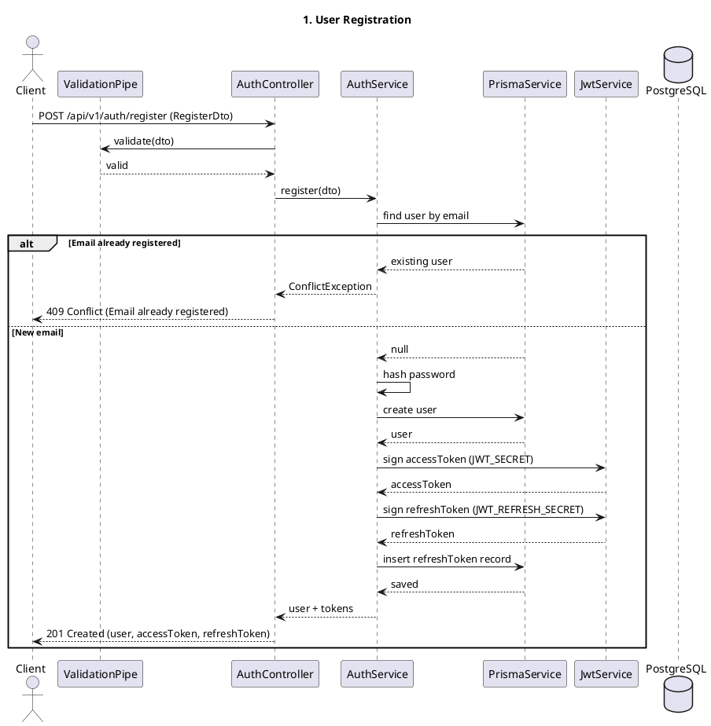
```plantuml
@startuml
title 1. User Registration

actor Client
participant "ValidationPipe" as Validation
participant "AuthController" as AuthCtrl
participant "AuthService" as AuthSvc
participant "PrismaService" as Prisma
participant "JwtService" as Jwt
database "PostgreSQL" as DB

Client -> AuthCtrl : POST /api/v1/auth/register (RegisterDto)
AuthCtrl -> Validation : validate(dto)
Validation --> AuthCtrl : valid
AuthCtrl -> AuthSvc : register(dto)
AuthSvc -> Prisma : find user by email
alt Email already registered
   Prisma --> AuthSvc : existing user
   AuthSvc --> AuthCtrl : ConflictException
   AuthCtrl --> Client : 409 Conflict (Email already registered)
else New email
   Prisma --> AuthSvc : null
   AuthSvc -> AuthSvc : hash password
   AuthSvc -> Prisma : create user
   Prisma --> AuthSvc : user
   AuthSvc -> Jwt : sign accessToken (JWT_SECRET)
   Jwt --> AuthSvc : accessToken
   AuthSvc -> Jwt : sign refreshToken (JWT_REFRESH_SECRET)
   Jwt --> AuthSvc : refreshToken
   AuthSvc -> Prisma : insert refreshToken record
   Prisma --> AuthSvc : saved
   AuthSvc --> AuthCtrl : user + tokens
   AuthCtrl --> Client : 201 Created (user, accessToken, refreshToken)
end

@enduml
```

### 2. User Login
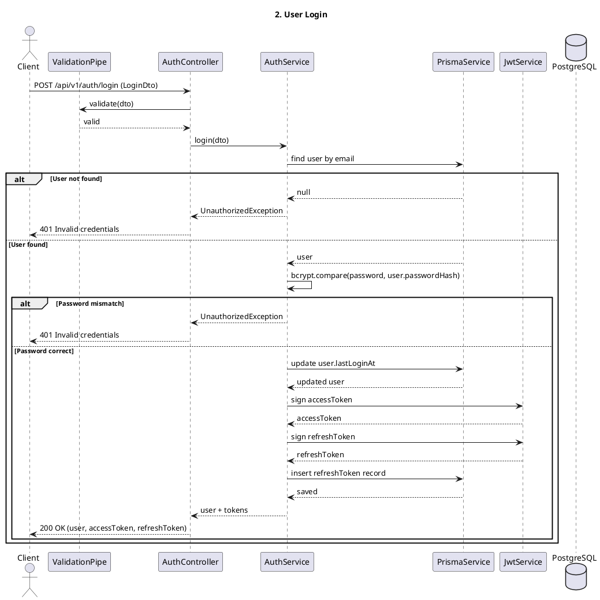
```plantuml
@startuml
title 2. User Login

actor Client
participant "ValidationPipe" as Validation
participant "AuthController" as AuthCtrl
participant "AuthService" as AuthSvc
participant "PrismaService" as Prisma
participant "JwtService" as Jwt
database "PostgreSQL" as DB

Client -> AuthCtrl : POST /api/v1/auth/login (LoginDto)
AuthCtrl -> Validation : validate(dto)
Validation --> AuthCtrl : valid
AuthCtrl -> AuthSvc : login(dto)
AuthSvc -> Prisma : find user by email
alt User not found
   Prisma --> AuthSvc : null
   AuthSvc --> AuthCtrl : UnauthorizedException
   AuthCtrl --> Client : 401 Invalid credentials
else User found
   Prisma --> AuthSvc : user
   AuthSvc -> AuthSvc : bcrypt.compare(password, user.passwordHash)
   alt Password mismatch
      AuthSvc --> AuthCtrl : UnauthorizedException
      AuthCtrl --> Client : 401 Invalid credentials
   else Password correct
      AuthSvc -> Prisma : update user.lastLoginAt
      Prisma --> AuthSvc : updated user
      AuthSvc -> Jwt : sign accessToken
      Jwt --> AuthSvc : accessToken
      AuthSvc -> Jwt : sign refreshToken
      Jwt --> AuthSvc : refreshToken
      AuthSvc -> Prisma : insert refreshToken record
      Prisma --> AuthSvc : saved
      AuthSvc --> AuthCtrl : user + tokens
      AuthCtrl --> Client : 200 OK (user, accessToken, refreshToken)
   end
end

@enduml
```

### 3. Refresh Token
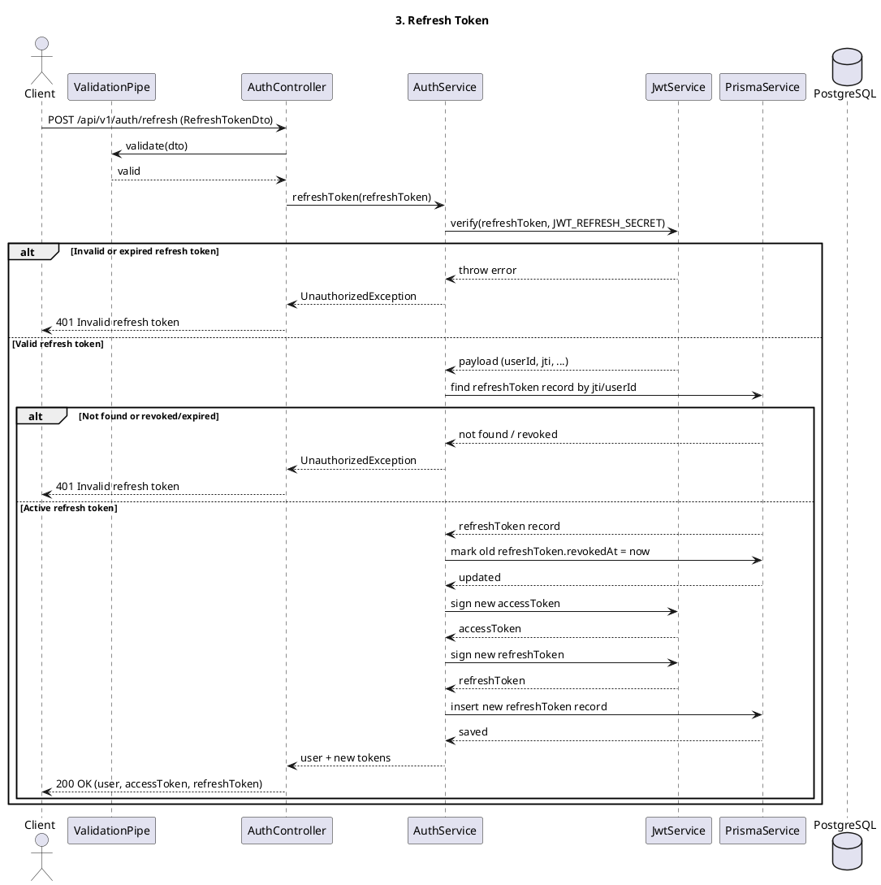
```plantuml
@startuml
title 3. Refresh Token

actor Client
participant "ValidationPipe" as Validation
participant "AuthController" as AuthCtrl
participant "AuthService" as AuthSvc
participant "JwtService" as Jwt
participant "PrismaService" as Prisma
database "PostgreSQL" as DB

Client -> AuthCtrl : POST /api/v1/auth/refresh (RefreshTokenDto)
AuthCtrl -> Validation : validate(dto)
Validation --> AuthCtrl : valid
AuthCtrl -> AuthSvc : refreshToken(refreshToken)
AuthSvc -> Jwt : verify(refreshToken, JWT_REFRESH_SECRET)
alt Invalid or expired refresh token
   Jwt --> AuthSvc : throw error
   AuthSvc --> AuthCtrl : UnauthorizedException
   AuthCtrl --> Client : 401 Invalid refresh token
else Valid refresh token
   Jwt --> AuthSvc : payload (userId, jti, ...)
   AuthSvc -> Prisma : find refreshToken record by jti/userId
   alt Not found or revoked/expired
      Prisma --> AuthSvc : not found / revoked
      AuthSvc --> AuthCtrl : UnauthorizedException
      AuthCtrl --> Client : 401 Invalid refresh token
   else Active refresh token
      Prisma --> AuthSvc : refreshToken record
      AuthSvc -> Prisma : mark old refreshToken.revokedAt = now
      Prisma --> AuthSvc : updated
      AuthSvc -> Jwt : sign new accessToken
      Jwt --> AuthSvc : accessToken
      AuthSvc -> Jwt : sign new refreshToken
      Jwt --> AuthSvc : refreshToken
      AuthSvc -> Prisma : insert new refreshToken record
      Prisma --> AuthSvc : saved
      AuthSvc --> AuthCtrl : user + new tokens
      AuthCtrl --> Client : 200 OK (user, accessToken, refreshToken)
   end
end

@enduml
```

### 4. Forgot Password
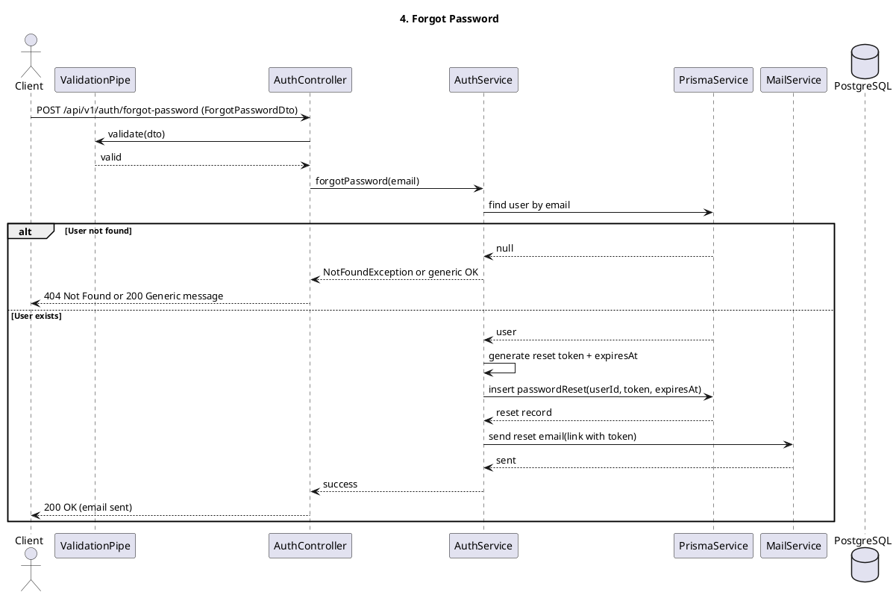
```plantuml
@startuml
title 4. Forgot Password

actor Client
participant "ValidationPipe" as Validation
participant "AuthController" as AuthCtrl
participant "AuthService" as AuthSvc
participant "PrismaService" as Prisma
participant "MailService" as Mail
database "PostgreSQL" as DB

Client -> AuthCtrl : POST /api/v1/auth/forgot-password (ForgotPasswordDto)
AuthCtrl -> Validation : validate(dto)
Validation --> AuthCtrl : valid
AuthCtrl -> AuthSvc : forgotPassword(email)
AuthSvc -> Prisma : find user by email
alt User not found
   Prisma --> AuthSvc : null
   AuthSvc --> AuthCtrl : NotFoundException or generic OK
   AuthCtrl --> Client : 404 Not Found or 200 Generic message
else User exists
   Prisma --> AuthSvc : user
   AuthSvc -> AuthSvc : generate reset token + expiresAt
   AuthSvc -> Prisma : insert passwordReset(userId, token, expiresAt)
   Prisma --> AuthSvc : reset record
   AuthSvc -> Mail : send reset email(link with token)
   Mail --> AuthSvc : sent
   AuthSvc --> AuthCtrl : success
   AuthCtrl --> Client : 200 OK (email sent)
end

@enduml
```

### 5. Reset Password
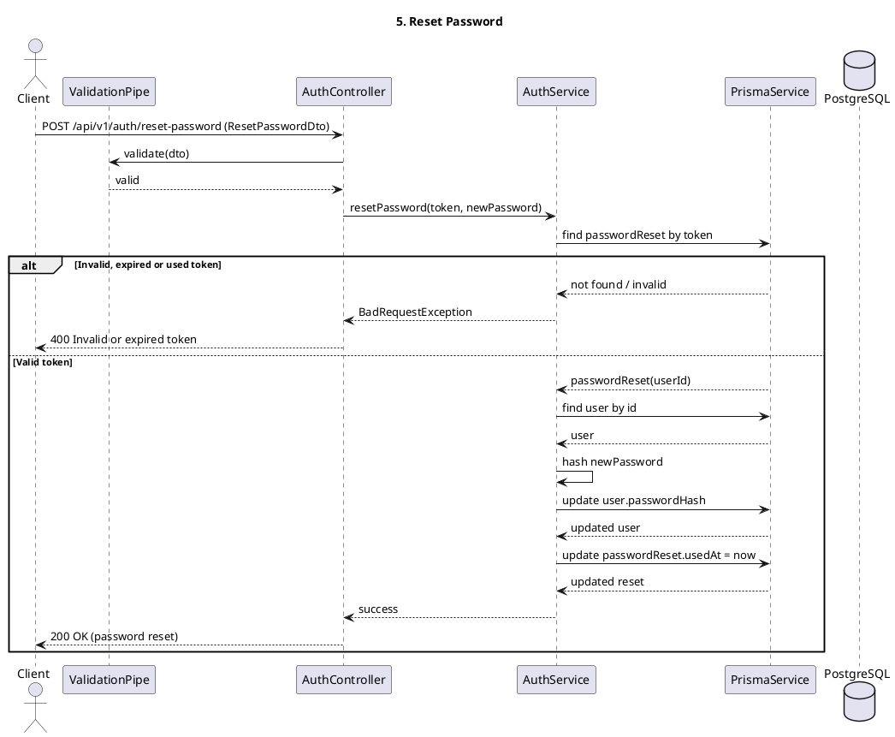
```plantuml
@startuml
title 5. Reset Password

actor Client
participant "ValidationPipe" as Validation
participant "AuthController" as AuthCtrl
participant "AuthService" as AuthSvc
participant "PrismaService" as Prisma
database "PostgreSQL" as DB

Client -> AuthCtrl : POST /api/v1/auth/reset-password (ResetPasswordDto)
AuthCtrl -> Validation : validate(dto)
Validation --> AuthCtrl : valid
AuthCtrl -> AuthSvc : resetPassword(token, newPassword)
AuthSvc -> Prisma : find passwordReset by token
alt Invalid, expired or used token
   Prisma --> AuthSvc : not found / invalid
   AuthSvc --> AuthCtrl : BadRequestException
   AuthCtrl --> Client : 400 Invalid or expired token
else Valid token
   Prisma --> AuthSvc : passwordReset(userId)
   AuthSvc -> Prisma : find user by id
   Prisma --> AuthSvc : user
   AuthSvc -> AuthSvc : hash newPassword
   AuthSvc -> Prisma : update user.passwordHash
   Prisma --> AuthSvc : updated user
   AuthSvc -> Prisma : update passwordReset.usedAt = now
   Prisma --> AuthSvc : updated reset
   AuthSvc --> AuthCtrl : success
   AuthCtrl --> Client : 200 OK (password reset)
end

@enduml
```

### 6. Logout
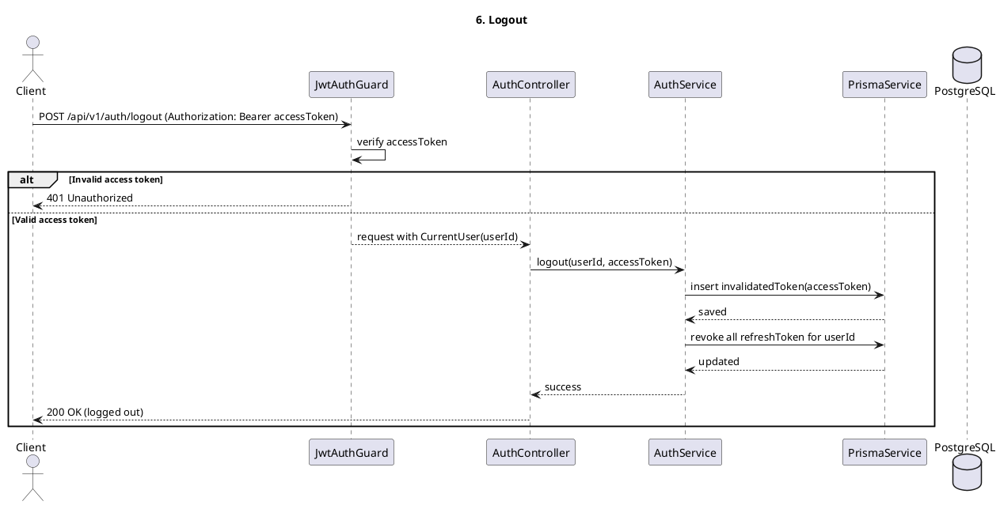
```plantuml
@startuml
title 6. Logout

actor Client
participant "JwtAuthGuard" as JwtGuard
participant "AuthController" as AuthCtrl
participant "AuthService" as AuthSvc
participant "PrismaService" as Prisma
database "PostgreSQL" as DB

Client -> JwtGuard : POST /api/v1/auth/logout (Authorization: Bearer accessToken)
JwtGuard -> JwtGuard : verify accessToken
alt Invalid access token
   JwtGuard --> Client : 401 Unauthorized
else Valid access token
   JwtGuard --> AuthCtrl : request with CurrentUser(userId)
   AuthCtrl -> AuthSvc : logout(userId, accessToken)
   AuthSvc -> Prisma : insert invalidatedToken(accessToken)
   Prisma --> AuthSvc : saved
   AuthSvc -> Prisma : revoke all refreshToken for userId
   Prisma --> AuthSvc : updated
   AuthSvc --> AuthCtrl : success
   AuthCtrl --> Client : 200 OK (logged out)
end

@enduml
```

### 7. View Profile
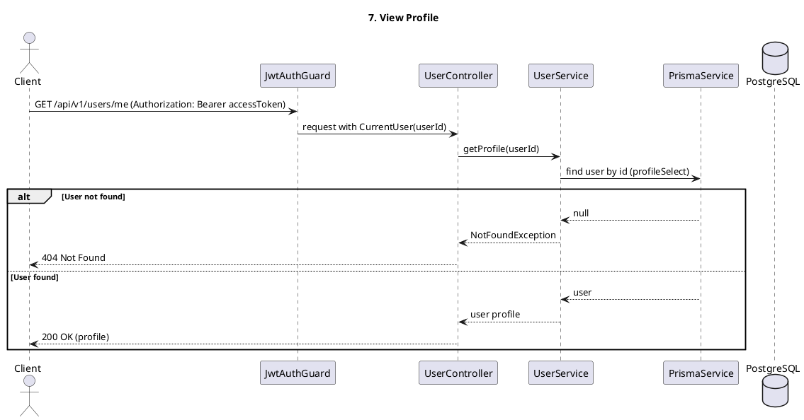
```plantuml
@startuml
title 7. View Profile

actor Client
participant "JwtAuthGuard" as JwtGuard
participant "UserController" as UserCtrl
participant "UserService" as UserSvc
participant "PrismaService" as Prisma
database "PostgreSQL" as DB

Client -> JwtGuard : GET /api/v1/users/me (Authorization: Bearer accessToken)
JwtGuard -> UserCtrl : request with CurrentUser(userId)
UserCtrl -> UserSvc : getProfile(userId)
UserSvc -> Prisma : find user by id (profileSelect)
alt User not found
   Prisma --> UserSvc : null
   UserSvc --> UserCtrl : NotFoundException
   UserCtrl --> Client : 404 Not Found
else User found
   Prisma --> UserSvc : user
   UserSvc --> UserCtrl : user profile
   UserCtrl --> Client : 200 OK (profile)
end

@enduml
```

### 8. Update Profile
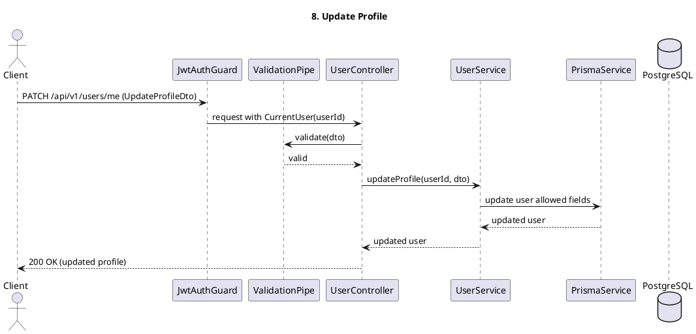
```plantuml
@startuml
title 8. Update Profile

actor Client
participant "JwtAuthGuard" as JwtGuard
participant "ValidationPipe" as Validation
participant "UserController" as UserCtrl
participant "UserService" as UserSvc
participant "PrismaService" as Prisma
database "PostgreSQL" as DB

Client -> JwtGuard : PATCH /api/v1/users/me (UpdateProfileDto)
JwtGuard -> UserCtrl : request with CurrentUser(userId)
UserCtrl -> Validation : validate(dto)
Validation --> UserCtrl : valid
UserCtrl -> UserSvc : updateProfile(userId, dto)
UserSvc -> Prisma : update user allowed fields
Prisma --> UserSvc : updated user
UserSvc --> UserCtrl : updated user
UserCtrl --> Client : 200 OK (updated profile)

@enduml
```

### 9. Change Password
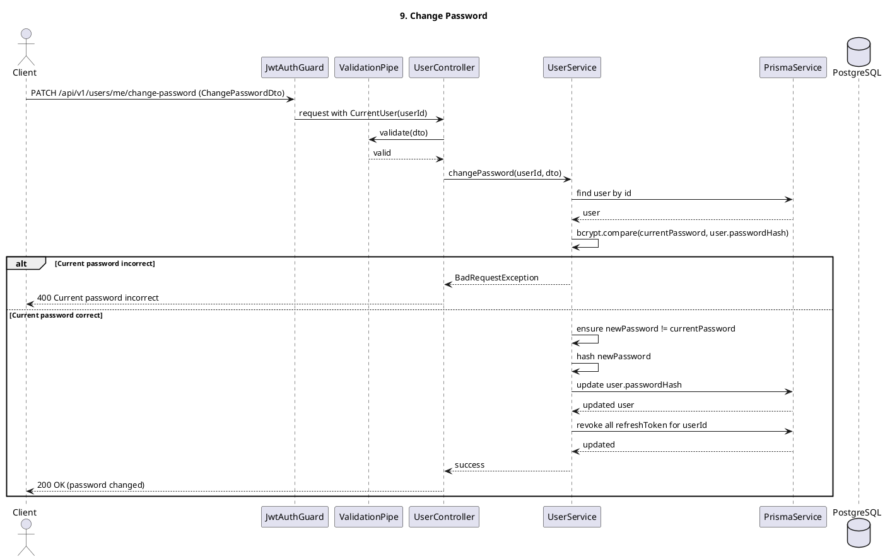
```plantuml
@startuml
title 9. Change Password

actor Client
participant "JwtAuthGuard" as JwtGuard
participant "ValidationPipe" as Validation
participant "UserController" as UserCtrl
participant "UserService" as UserSvc
participant "PrismaService" as Prisma
database "PostgreSQL" as DB

Client -> JwtGuard : PATCH /api/v1/users/me/change-password (ChangePasswordDto)
JwtGuard -> UserCtrl : request with CurrentUser(userId)
UserCtrl -> Validation : validate(dto)
Validation --> UserCtrl : valid
UserCtrl -> UserSvc : changePassword(userId, dto)
UserSvc -> Prisma : find user by id
Prisma --> UserSvc : user
UserSvc -> UserSvc : bcrypt.compare(currentPassword, user.passwordHash)
alt Current password incorrect
   UserSvc --> UserCtrl : BadRequestException
   UserCtrl --> Client : 400 Current password incorrect
else Current password correct
   UserSvc -> UserSvc : ensure newPassword != currentPassword
   UserSvc -> UserSvc : hash newPassword
   UserSvc -> Prisma : update user.passwordHash
   Prisma --> UserSvc : updated user
   UserSvc -> Prisma : revoke all refreshToken for userId
   Prisma --> UserSvc : updated
   UserSvc --> UserCtrl : success
   UserCtrl --> Client : 200 OK (password changed)
end

@enduml
```

### 10. Upload Avatar
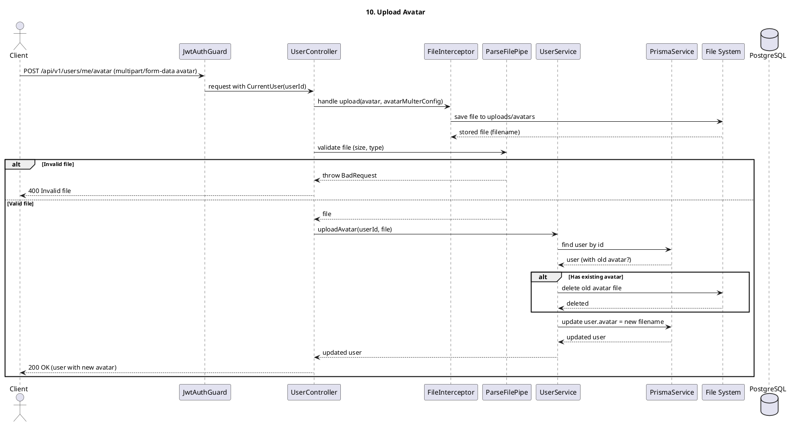
```plantuml
@startuml
title 10. Upload Avatar

actor Client
participant "JwtAuthGuard" as JwtGuard
participant "UserController" as UserCtrl
participant "FileInterceptor" as FileInt
participant "ParseFilePipe" as FilePipe
participant "UserService" as UserSvc
participant "PrismaService" as Prisma
participant "File System" as FS
database "PostgreSQL" as DB

Client -> JwtGuard : POST /api/v1/users/me/avatar (multipart/form-data avatar)
JwtGuard -> UserCtrl : request with CurrentUser(userId)
UserCtrl -> FileInt : handle upload(avatar, avatarMulterConfig)
FileInt -> FS : save file to uploads/avatars
FS --> FileInt : stored file (filename)
UserCtrl -> FilePipe : validate file (size, type)
alt Invalid file
   FilePipe --> UserCtrl : throw BadRequest
   UserCtrl --> Client : 400 Invalid file
else Valid file
   FilePipe --> UserCtrl : file
   UserCtrl -> UserSvc : uploadAvatar(userId, file)
   UserSvc -> Prisma : find user by id
   Prisma --> UserSvc : user (with old avatar?)
   alt Has existing avatar
      UserSvc -> FS : delete old avatar file
      FS --> UserSvc : deleted
   end
   UserSvc -> Prisma : update user.avatar = new filename
   Prisma --> UserSvc : updated user
   UserSvc --> UserCtrl : updated user
   UserCtrl --> Client : 200 OK (user with new avatar)
end

@enduml
```

### 11. Create Workspace
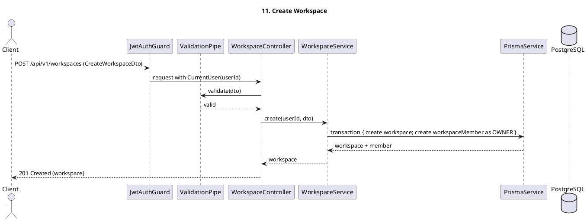
```plantuml
@startuml
title 11. Create Workspace

actor Client
participant "JwtAuthGuard" as JwtGuard
participant "ValidationPipe" as Validation
participant "WorkspaceController" as WsCtrl
participant "WorkspaceService" as WsSvc
participant "PrismaService" as Prisma
database "PostgreSQL" as DB

Client -> JwtGuard : POST /api/v1/workspaces (CreateWorkspaceDto)
JwtGuard -> WsCtrl : request with CurrentUser(userId)
WsCtrl -> Validation : validate(dto)
Validation --> WsCtrl : valid
WsCtrl -> WsSvc : create(userId, dto)
WsSvc -> Prisma : transaction { create workspace; create workspaceMember as OWNER }
Prisma --> WsSvc : workspace + member
WsSvc --> WsCtrl : workspace
WsCtrl --> Client : 201 Created (workspace)

@enduml
```

### 12. List Workspaces
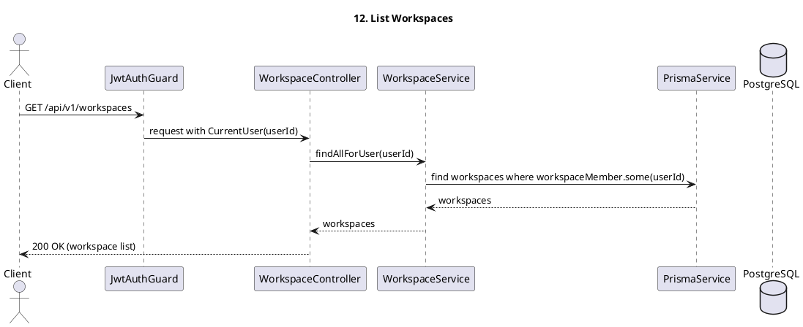
```plantuml
@startuml
title 12. List Workspaces

actor Client
participant "JwtAuthGuard" as JwtGuard
participant "WorkspaceController" as WsCtrl
participant "WorkspaceService" as WsSvc
participant "PrismaService" as Prisma
database "PostgreSQL" as DB

Client -> JwtGuard : GET /api/v1/workspaces
JwtGuard -> WsCtrl : request with CurrentUser(userId)
WsCtrl -> WsSvc : findAllForUser(userId)
WsSvc -> Prisma : find workspaces where workspaceMember.some(userId)
Prisma --> WsSvc : workspaces
WsSvc --> WsCtrl : workspaces
WsCtrl --> Client : 200 OK (workspace list)

@enduml
```

### 13. Get Workspace Detail
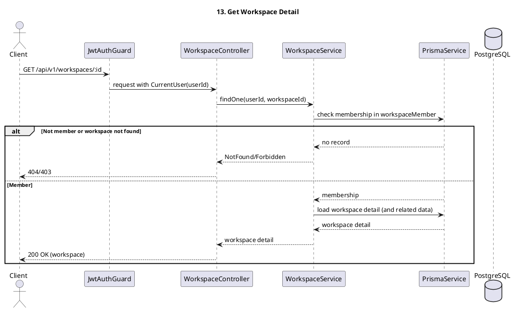
```plantuml
@startuml
title 13. Get Workspace Detail

actor Client
participant "JwtAuthGuard" as JwtGuard
participant "WorkspaceController" as WsCtrl
participant "WorkspaceService" as WsSvc
participant "PrismaService" as Prisma
database "PostgreSQL" as DB

Client -> JwtGuard : GET /api/v1/workspaces/:id
JwtGuard -> WsCtrl : request with CurrentUser(userId)
WsCtrl -> WsSvc : findOne(userId, workspaceId)
WsSvc -> Prisma : check membership in workspaceMember
alt Not member or workspace not found
   Prisma --> WsSvc : no record
   WsSvc --> WsCtrl : NotFound/Forbidden
   WsCtrl --> Client : 404/403
else Member
   Prisma --> WsSvc : membership
   WsSvc -> Prisma : load workspace detail (and related data)
   Prisma --> WsSvc : workspace detail
   WsSvc --> WsCtrl : workspace detail
   WsCtrl --> Client : 200 OK (workspace)
end

@enduml
```

### 14. Update Workspace
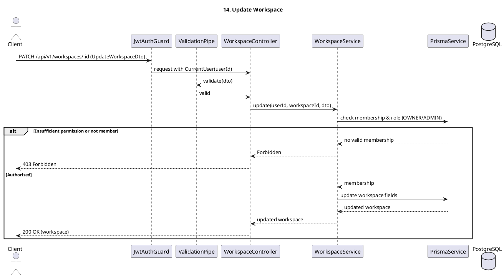
```plantuml
@startuml
title 14. Update Workspace

actor Client
participant "JwtAuthGuard" as JwtGuard
participant "ValidationPipe" as Validation
participant "WorkspaceController" as WsCtrl
participant "WorkspaceService" as WsSvc
participant "PrismaService" as Prisma
database "PostgreSQL" as DB

Client -> JwtGuard : PATCH /api/v1/workspaces/:id (UpdateWorkspaceDto)
JwtGuard -> WsCtrl : request with CurrentUser(userId)
WsCtrl -> Validation : validate(dto)
Validation --> WsCtrl : valid
WsCtrl -> WsSvc : update(userId, workspaceId, dto)
WsSvc -> Prisma : check membership & role (OWNER/ADMIN)
alt Insufficient permission or not member
   Prisma --> WsSvc : no valid membership
   WsSvc --> WsCtrl : Forbidden
   WsCtrl --> Client : 403 Forbidden
else Authorized
   Prisma --> WsSvc : membership
   WsSvc -> Prisma : update workspace fields
   Prisma --> WsSvc : updated workspace
   WsSvc --> WsCtrl : updated workspace
   WsCtrl --> Client : 200 OK (workspace)
end

@enduml
```

### 15. Delete Workspace
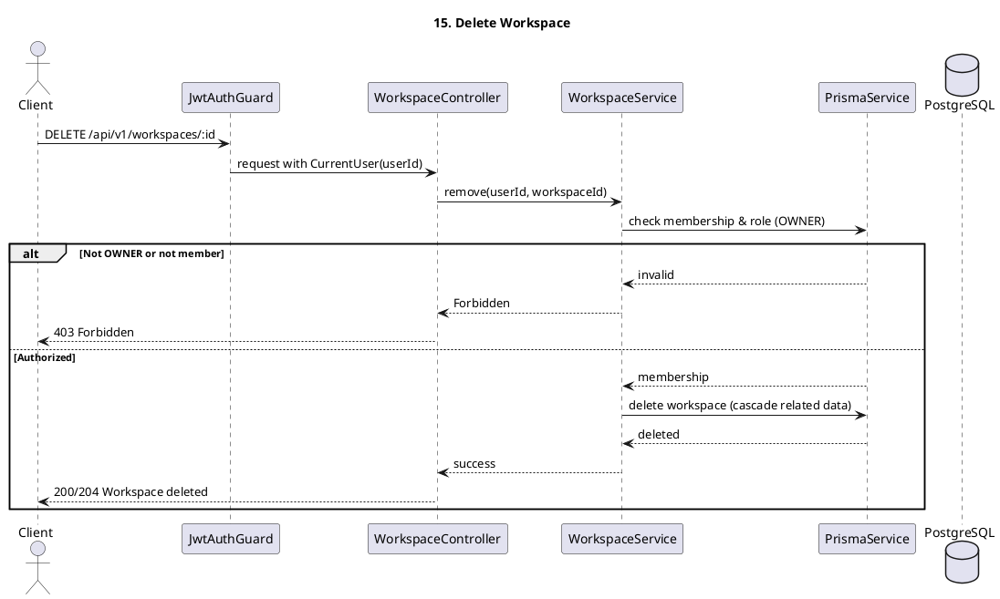
```plantuml
@startuml
title 15. Delete Workspace

actor Client
participant "JwtAuthGuard" as JwtGuard
participant "WorkspaceController" as WsCtrl
participant "WorkspaceService" as WsSvc
participant "PrismaService" as Prisma
database "PostgreSQL" as DB

Client -> JwtGuard : DELETE /api/v1/workspaces/:id
JwtGuard -> WsCtrl : request with CurrentUser(userId)
WsCtrl -> WsSvc : remove(userId, workspaceId)
WsSvc -> Prisma : check membership & role (OWNER)
alt Not OWNER or not member
   Prisma --> WsSvc : invalid
   WsSvc --> WsCtrl : Forbidden
   WsCtrl --> Client : 403 Forbidden
else Authorized
   Prisma --> WsSvc : membership
   WsSvc -> Prisma : delete workspace (cascade related data)
   Prisma --> WsSvc : deleted
   WsSvc --> WsCtrl : success
   WsCtrl --> Client : 200/204 Workspace deleted
end

@enduml
```

### 16. Invite Member to Workspace
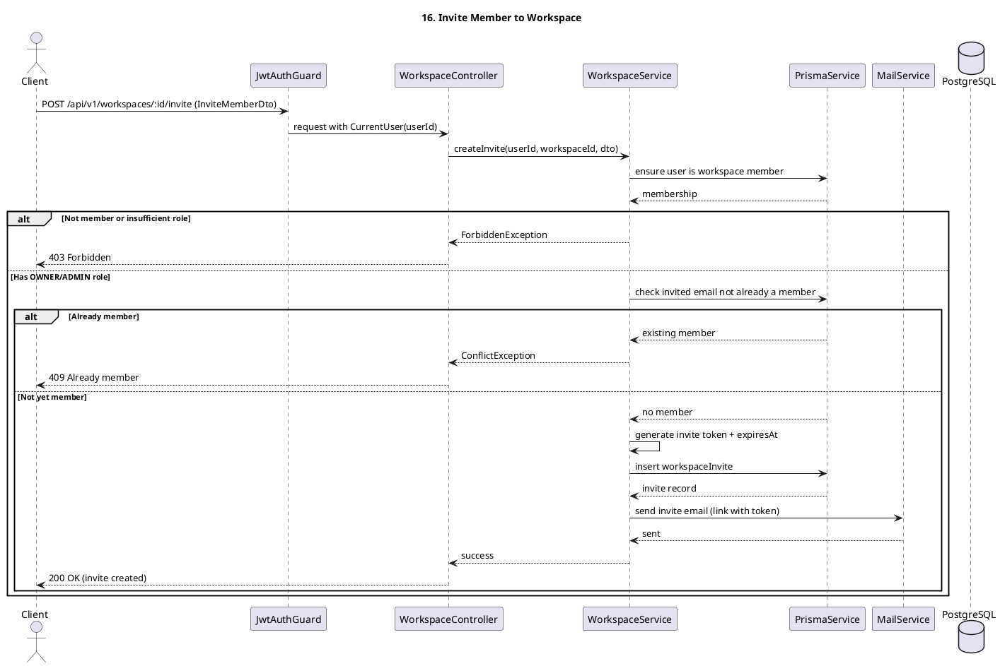
```plantuml
@startuml
title 16. Invite Member to Workspace

actor Client
participant "JwtAuthGuard" as JwtGuard
participant "WorkspaceController" as WsCtrl
participant "WorkspaceService" as WsSvc
participant "PrismaService" as Prisma
participant "MailService" as Mail
database "PostgreSQL" as DB

Client -> JwtGuard : POST /api/v1/workspaces/:id/invite (InviteMemberDto)
JwtGuard -> WsCtrl : request with CurrentUser(userId)
WsCtrl -> WsSvc : createInvite(userId, workspaceId, dto)
WsSvc -> Prisma : ensure user is workspace member
Prisma --> WsSvc : membership
alt Not member or insufficient role
   WsSvc --> WsCtrl : ForbiddenException
   WsCtrl --> Client : 403 Forbidden
else Has OWNER/ADMIN role
   WsSvc -> Prisma : check invited email not already a member
   alt Already member
      Prisma --> WsSvc : existing member
      WsSvc --> WsCtrl : ConflictException
      WsCtrl --> Client : 409 Already member
   else Not yet member
      Prisma --> WsSvc : no member
      WsSvc -> WsSvc : generate invite token + expiresAt
      WsSvc -> Prisma : insert workspaceInvite
      Prisma --> WsSvc : invite record
      WsSvc -> Mail : send invite email (link with token)
      Mail --> WsSvc : sent
      WsSvc --> WsCtrl : success
      WsCtrl --> Client : 200 OK (invite created)
   end
end

@enduml
```

### 17. Accept Workspace Invitation
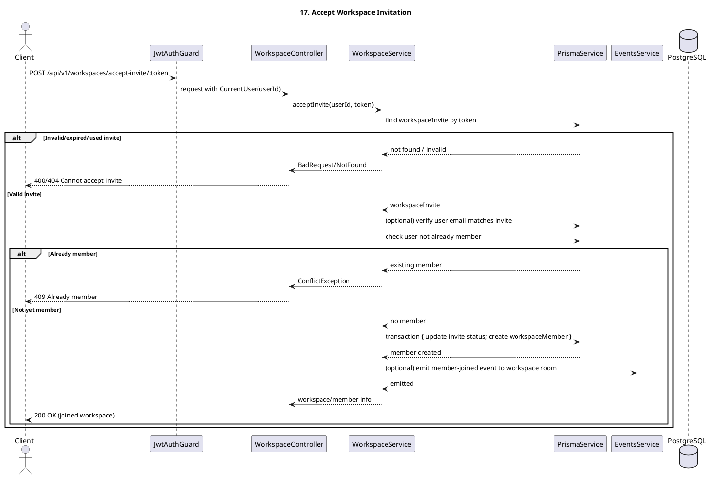
```plantuml
@startuml
title 17. Accept Workspace Invitation

actor Client
participant "JwtAuthGuard" as JwtGuard
participant "WorkspaceController" as WsCtrl
participant "WorkspaceService" as WsSvc
participant "PrismaService" as Prisma
participant "EventsService" as Events
database "PostgreSQL" as DB

Client -> JwtGuard : POST /api/v1/workspaces/accept-invite/:token
JwtGuard -> WsCtrl : request with CurrentUser(userId)
WsCtrl -> WsSvc : acceptInvite(userId, token)
WsSvc -> Prisma : find workspaceInvite by token
alt Invalid/expired/used invite
   Prisma --> WsSvc : not found / invalid
   WsSvc --> WsCtrl : BadRequest/NotFound
   WsCtrl --> Client : 400/404 Cannot accept invite
else Valid invite
   Prisma --> WsSvc : workspaceInvite
   WsSvc -> Prisma : (optional) verify user email matches invite
   WsSvc -> Prisma : check user not already member
   alt Already member
      Prisma --> WsSvc : existing member
      WsSvc --> WsCtrl : ConflictException
      WsCtrl --> Client : 409 Already member
   else Not yet member
      Prisma --> WsSvc : no member
      WsSvc -> Prisma : transaction { update invite status; create workspaceMember }
      Prisma --> WsSvc : member created
      WsSvc -> Events : (optional) emit member-joined event to workspace room
      Events --> WsSvc : emitted
      WsSvc --> WsCtrl : workspace/member info
      WsCtrl --> Client : 200 OK (joined workspace)
   end
end

@enduml
```

### 18. Get Workspace Members
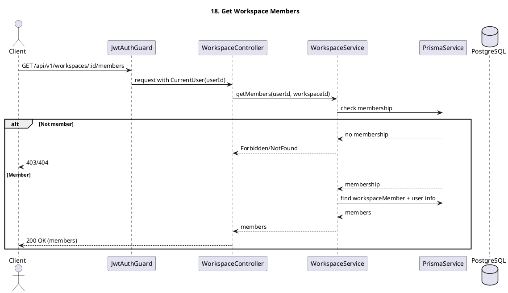
```plantuml
@startuml
title 18. Get Workspace Members

actor Client
participant "JwtAuthGuard" as JwtGuard
participant "WorkspaceController" as WsCtrl
participant "WorkspaceService" as WsSvc
participant "PrismaService" as Prisma
database "PostgreSQL" as DB

Client -> JwtGuard : GET /api/v1/workspaces/:id/members
JwtGuard -> WsCtrl : request with CurrentUser(userId)
WsCtrl -> WsSvc : getMembers(userId, workspaceId)
WsSvc -> Prisma : check membership
alt Not member
   Prisma --> WsSvc : no membership
   WsSvc --> WsCtrl : Forbidden/NotFound
   WsCtrl --> Client : 403/404
else Member
   Prisma --> WsSvc : membership
   WsSvc -> Prisma : find workspaceMember + user info
   Prisma --> WsSvc : members
   WsSvc --> WsCtrl : members
   WsCtrl --> Client : 200 OK (members)
end

@enduml
```

### 19. Change Member Role
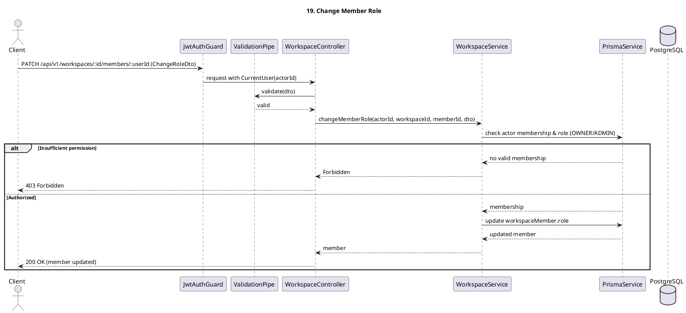
```plantuml
@startuml
title 19. Change Member Role

actor Client
participant "JwtAuthGuard" as JwtGuard
participant "ValidationPipe" as Validation
participant "WorkspaceController" as WsCtrl
participant "WorkspaceService" as WsSvc
participant "PrismaService" as Prisma
database "PostgreSQL" as DB

Client -> JwtGuard : PATCH /api/v1/workspaces/:id/members/:userId (ChangeRoleDto)
JwtGuard -> WsCtrl : request with CurrentUser(actorId)
WsCtrl -> Validation : validate(dto)
Validation --> WsCtrl : valid
WsCtrl -> WsSvc : changeMemberRole(actorId, workspaceId, memberId, dto)
WsSvc -> Prisma : check actor membership & role (OWNER/ADMIN)
alt Insufficient permission
   Prisma --> WsSvc : no valid membership
   WsSvc --> WsCtrl : Forbidden
   WsCtrl --> Client : 403 Forbidden
else Authorized
   Prisma --> WsSvc : membership
   WsSvc -> Prisma : update workspaceMember.role
   Prisma --> WsSvc : updated member
   WsSvc --> WsCtrl : member
   WsCtrl --> Client : 200 OK (member updated)
end

@enduml
```

### 20. Remove Member
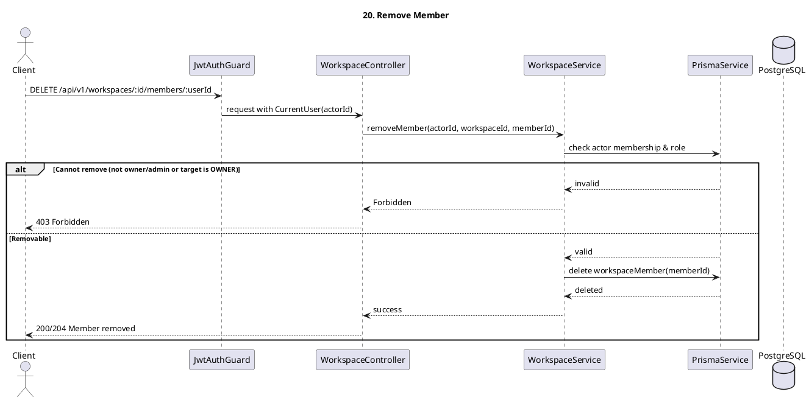
```plantuml
@startuml
title 20. Remove Member

actor Client
participant "JwtAuthGuard" as JwtGuard
participant "WorkspaceController" as WsCtrl
participant "WorkspaceService" as WsSvc
participant "PrismaService" as Prisma
database "PostgreSQL" as DB

Client -> JwtGuard : DELETE /api/v1/workspaces/:id/members/:userId
JwtGuard -> WsCtrl : request with CurrentUser(actorId)
WsCtrl -> WsSvc : removeMember(actorId, workspaceId, memberId)
WsSvc -> Prisma : check actor membership & role
alt Cannot remove (not owner/admin or target is OWNER)
   Prisma --> WsSvc : invalid
   WsSvc --> WsCtrl : Forbidden
   WsCtrl --> Client : 403 Forbidden
else Removable
   Prisma --> WsSvc : valid
   WsSvc -> Prisma : delete workspaceMember(memberId)
   Prisma --> WsSvc : deleted
   WsSvc --> WsCtrl : success
   WsCtrl --> Client : 200/204 Member removed
end

@enduml
```

### 21. Leave Workspace
```plantuml
@startuml
title 21. Leave Workspace

actor Client
participant "JwtAuthGuard" as JwtGuard
participant "WorkspaceController" as WsCtrl
participant "WorkspaceService" as WsSvc
participant "PrismaService" as Prisma
database "PostgreSQL" as DB

Client -> JwtGuard : DELETE /api/v1/workspaces/:id/leave
JwtGuard -> WsCtrl : request with CurrentUser(userId)
WsCtrl -> WsSvc : leaveWorkspace(userId, workspaceId)
WsSvc -> Prisma : check membership and role
alt Cannot leave (e.g. OWNER with other members)
   Prisma --> WsSvc : invalid
   WsSvc --> WsCtrl : Forbidden
   WsCtrl --> Client : 403 Forbidden
else Can leave
   Prisma --> WsSvc : valid
   WsSvc -> Prisma : delete workspaceMember(userId)
   Prisma --> WsSvc : deleted
   WsSvc --> WsCtrl : success
   WsCtrl --> Client : 200/204 Left workspace
end

@enduml
```

### 22. Create Project
```plantuml
@startuml
title 22. Create Project in Workspace

actor Client
participant "JwtAuthGuard" as JwtGuard
participant "ProjectController" as ProjCtrl
participant "ProjectService" as ProjSvc
participant "PrismaService" as Prisma
database "PostgreSQL" as DB

Client -> JwtGuard : POST /api/v1/workspaces/:wsId/projects (CreateProjectDto)
JwtGuard -> ProjCtrl : request with CurrentUser(userId)
ProjCtrl -> ProjSvc : create(userId, workspaceId, dto)
ProjSvc -> Prisma : verify user is workspace member
alt Not member
   Prisma --> ProjSvc : no membership
   ProjSvc --> ProjCtrl : Forbidden/NotFound
   ProjCtrl --> Client : 403/404
else Member
   Prisma --> ProjSvc : membership
   ProjSvc -> Prisma : create project(workspaceId, dto)
   Prisma --> ProjSvc : project
   ProjSvc --> ProjCtrl : project
   ProjCtrl --> Client : 201 Created (project)
end

@enduml
```

### 23. List Projects In Workspace
```plantuml
@startuml
title 23. List Projects In Workspace

actor Client
participant "JwtAuthGuard" as JwtGuard
participant "ProjectController" as ProjCtrl
participant "ProjectService" as ProjSvc
participant "PrismaService" as Prisma
database "PostgreSQL" as DB

Client -> JwtGuard : GET /api/v1/workspaces/:wsId/projects (with query)
JwtGuard -> ProjCtrl : request with CurrentUser(userId)
ProjCtrl -> ProjSvc : findAllByWorkspace(userId, workspaceId, query)
ProjSvc -> Prisma : verify membership in workspaceMember
alt Not member
   Prisma --> ProjSvc : no membership
   ProjSvc --> ProjCtrl : Forbidden/NotFound
   ProjCtrl --> Client : 403/404
else Member
   Prisma --> ProjSvc : membership
   ProjSvc -> Prisma : findMany projects by workspaceId and query
   Prisma --> ProjSvc : projects
   ProjSvc --> ProjCtrl : projects
   ProjCtrl --> Client : 200 OK (projects)
end

@enduml
```

### 24. Get Project Detail
```plantuml
@startuml
title 24. Get Project Detail

actor Client
participant "JwtAuthGuard" as JwtGuard
participant "ProjectController" as ProjCtrl
participant "ProjectService" as ProjSvc
participant "PrismaService" as Prisma
database "PostgreSQL" as DB

Client -> JwtGuard : GET /api/v1/projects/:id
JwtGuard -> ProjCtrl : request with CurrentUser(userId)
ProjCtrl -> ProjSvc : findOne(userId, projectId)
ProjSvc -> Prisma : load project + workspace membership
alt Project not found or user not member
   Prisma --> ProjSvc : not found / no membership
   ProjSvc --> ProjCtrl : NotFound/Forbidden
   ProjCtrl --> Client : 404/403
else Authorized
   Prisma --> ProjSvc : project + workspace
   ProjSvc --> ProjCtrl : project
   ProjCtrl --> Client : 200 OK (project)
end

@enduml
```

### 25. Update Project
```plantuml
@startuml
title 25. Update Project

actor Client
participant "JwtAuthGuard" as JwtGuard
participant "ValidationPipe" as Validation
participant "ProjectController" as ProjCtrl
participant "ProjectService" as ProjSvc
participant "PrismaService" as Prisma
database "PostgreSQL" as DB

Client -> JwtGuard : PATCH /api/v1/projects/:id (UpdateProjectDto)
JwtGuard -> ProjCtrl : request with CurrentUser(userId)
ProjCtrl -> Validation : validate(dto)
Validation --> ProjCtrl : valid
ProjCtrl -> ProjSvc : update(userId, projectId, dto)
ProjSvc -> Prisma : load project + membership & role
alt Not authorized or not member
   Prisma --> ProjSvc : invalid
   ProjSvc --> ProjCtrl : Forbidden/NotFound
   ProjCtrl --> Client : 403/404
else Authorized
   Prisma --> ProjSvc : project
   ProjSvc -> Prisma : update project fields
   Prisma --> ProjSvc : updated project
   ProjSvc --> ProjCtrl : updated project
   ProjCtrl --> Client : 200 OK (project)
end

@enduml
```

### 26. Delete Project
```plantuml
@startuml
title 26. Delete Project

actor Client
participant "JwtAuthGuard" as JwtGuard
participant "ProjectController" as ProjCtrl
participant "ProjectService" as ProjSvc
participant "PrismaService" as Prisma
database "PostgreSQL" as DB

Client -> JwtGuard : DELETE /api/v1/projects/:id
JwtGuard -> ProjCtrl : request with CurrentUser(userId)
ProjCtrl -> ProjSvc : remove(userId, projectId)
ProjSvc -> Prisma : load project + membership & role
alt Not authorized
   Prisma --> ProjSvc : invalid
   ProjSvc --> ProjCtrl : Forbidden/NotFound
   ProjCtrl --> Client : 403/404
else Authorized
   Prisma --> ProjSvc : project
   ProjSvc -> Prisma : delete project (cascade)
   Prisma --> ProjSvc : deleted
   ProjSvc --> ProjCtrl : success
   ProjCtrl --> Client : 200/204 Project deleted
end

@enduml
```

### 27. Archive Project
```plantuml
@startuml
title 27. Archive Project

actor Client
participant "JwtAuthGuard" as JwtGuard
participant "ProjectController" as ProjCtrl
participant "ProjectService" as ProjSvc
participant "PrismaService" as Prisma
database "PostgreSQL" as DB

Client -> JwtGuard : POST /api/v1/projects/:id/archive
JwtGuard -> ProjCtrl : request with CurrentUser(userId)
ProjCtrl -> ProjSvc : archive(userId, projectId)
ProjSvc -> Prisma : load project + membership & role
alt Not authorized
   Prisma --> ProjSvc : invalid
   ProjSvc --> ProjCtrl : Forbidden/NotFound
   ProjCtrl --> Client : 403/404
else Authorized
   Prisma --> ProjSvc : project
   ProjSvc -> Prisma : set project.archived = true
   Prisma --> ProjSvc : updated project
   ProjSvc --> ProjCtrl : project
   ProjCtrl --> Client : 200 OK (archived)
end

@enduml
```

### 28. Unarchive Project
```plantuml
@startuml
title 28. Unarchive Project

actor Client
participant "JwtAuthGuard" as JwtGuard
participant "ProjectController" as ProjCtrl
participant "ProjectService" as ProjSvc
participant "PrismaService" as Prisma
database "PostgreSQL" as DB

Client -> JwtGuard : POST /api/v1/projects/:id/unarchive
JwtGuard -> ProjCtrl : request with CurrentUser(userId)
ProjCtrl -> ProjSvc : unarchive(userId, projectId)
ProjSvc -> Prisma : load project + membership & role
alt Not authorized
   Prisma --> ProjSvc : invalid
   ProjSvc --> ProjCtrl : Forbidden/NotFound
   ProjCtrl --> Client : 403/404
else Authorized
   Prisma --> ProjSvc : project
   ProjSvc -> Prisma : set project.archived = false
   Prisma --> ProjSvc : updated project
   ProjSvc --> ProjCtrl : project
   ProjCtrl --> Client : 200 OK (unarchived)
end

@enduml
```

### 29. Pin Project
```plantuml
@startuml
title 29. Pin Project

actor Client
participant "JwtAuthGuard" as JwtGuard
participant "ProjectController" as ProjCtrl
participant "ProjectService" as ProjSvc
participant "PrismaService" as Prisma
database "PostgreSQL" as DB

Client -> JwtGuard : POST /api/v1/projects/:id/pin
JwtGuard -> ProjCtrl : request with CurrentUser(userId)
ProjCtrl -> ProjSvc : pin(userId, projectId)
ProjSvc -> Prisma : verify membership
alt Not member
   Prisma --> ProjSvc : no membership
   ProjSvc --> ProjCtrl : Forbidden/NotFound
   ProjCtrl --> Client : 403/404
else Member
   Prisma --> ProjSvc : membership
   ProjSvc -> Prisma : set pin for user/project (model-dependent)
   Prisma --> ProjSvc : updated
   ProjSvc --> ProjCtrl : success / project
   ProjCtrl --> Client : 200 OK (pinned)
end

@enduml
```

### 30. Unpin Project
```plantuml
@startuml
title 30. Unpin Project

actor Client
participant "JwtAuthGuard" as JwtGuard
participant "ProjectController" as ProjCtrl
participant "ProjectService" as ProjSvc
participant "PrismaService" as Prisma
database "PostgreSQL" as DB

Client -> JwtGuard : POST /api/v1/projects/:id/unpin
JwtGuard -> ProjCtrl : request with CurrentUser(userId)
ProjCtrl -> ProjSvc : unpin(userId, projectId)
ProjSvc -> Prisma : verify membership
alt Not member
   Prisma --> ProjSvc : no membership
   ProjSvc --> ProjCtrl : Forbidden/NotFound
   ProjCtrl --> Client : 403/404
else Member
   Prisma --> ProjSvc : membership
   ProjSvc -> Prisma : clear pin for user/project
   Prisma --> ProjSvc : updated
   ProjSvc --> ProjCtrl : success / project
   ProjCtrl --> Client : 200 OK (unpinned)
end

@enduml
```

### 31. List Tasks In Project
```plantuml
@startuml
title 31. List Tasks In Project

actor Client
participant "JwtAuthGuard" as JwtGuard
participant "TaskController" as TaskCtrl
participant "TaskService" as TaskSvc
participant "PrismaService" as Prisma
database "PostgreSQL" as DB

Client -> JwtGuard : GET /api/v1/projects/:projectId/tasks (FilterTaskDto)
JwtGuard -> TaskCtrl : request with CurrentUser(userId)
TaskCtrl -> TaskSvc : findAllByProject(userId, projectId, query)
TaskSvc -> Prisma : load project + workspace membership
alt Not member or project not found
   Prisma --> TaskSvc : invalid
   TaskSvc --> TaskCtrl : Forbidden/NotFound
   TaskCtrl --> Client : 403/404
else Authorized
   Prisma --> TaskSvc : project + membership
   TaskSvc -> Prisma : findMany tasks by projectId & filters
   Prisma --> TaskSvc : tasks
   TaskSvc --> TaskCtrl : tasks
   TaskCtrl --> Client : 200 OK (tasks)
end

@enduml
```

### 32. Get Task Detail
```plantuml
@startuml
title 32. Get Task Detail

actor Client
participant "JwtAuthGuard" as JwtGuard
participant "TaskController" as TaskCtrl
participant "TaskService" as TaskSvc
participant "PrismaService" as Prisma
database "PostgreSQL" as DB

Client -> JwtGuard : GET /api/v1/tasks/:id
JwtGuard -> TaskCtrl : request with CurrentUser(userId)
TaskCtrl -> TaskSvc : findOne(userId, taskId)
TaskSvc -> Prisma : load task + project + workspace membership
alt Task not found or user not member
   Prisma --> TaskSvc : invalid
   TaskSvc --> TaskCtrl : NotFound/Forbidden
   TaskCtrl --> Client : 404/403
else Authorized
   Prisma --> TaskSvc : task + relations
   TaskSvc --> TaskCtrl : task detail
   TaskCtrl --> Client : 200 OK (task)
end

@enduml
```

### 33. Create Task
```plantuml
@startuml
title 33. Create Task in Project

actor Client
participant "JwtAuthGuard" as JwtGuard
participant "TaskController" as TaskCtrl
participant "TaskService" as TaskSvc
participant "EventsService" as Events
participant "PrismaService" as Prisma
database "PostgreSQL" as DB

Client -> JwtGuard : POST /api/v1/projects/:projectId/tasks (CreateTaskDto)
JwtGuard -> TaskCtrl : request with CurrentUser(userId)
TaskCtrl -> TaskSvc : create(userId, projectId, dto)
TaskSvc -> Prisma : verify user is workspace member via project
alt Not member
   Prisma --> TaskSvc : no membership
   TaskSvc --> TaskCtrl : Forbidden/NotFound
   TaskCtrl --> Client : 403/404
else Member
   Prisma --> TaskSvc : membership
   TaskSvc -> Prisma : find tasks in project with same status
   Prisma --> TaskSvc : existing tasks
   TaskSvc -> TaskSvc : compute position (max + 1)
   TaskSvc -> Prisma : create task(projectId, dto, position, createdById)
   Prisma --> TaskSvc : task
   TaskSvc -> Events : emitToProject(projectId, "task.created", task)
   Events --> TaskSvc : emitted
   TaskSvc --> TaskCtrl : task
   TaskCtrl --> Client : 201 Created (task)
end

@enduml
```

### 34. Update Task
```plantuml
@startuml
title 34. Update Task

actor Client
participant "JwtAuthGuard" as JwtGuard
participant "TaskController" as TaskCtrl
participant "TaskService" as TaskSvc
participant "EventsService" as Events
participant "PrismaService" as Prisma
database "PostgreSQL" as DB

Client -> JwtGuard : PATCH /api/v1/tasks/:id (UpdateTaskDto)
JwtGuard -> TaskCtrl : request with CurrentUser(userId)
TaskCtrl -> TaskSvc : update(userId, taskId, dto)
TaskSvc -> Prisma : load task + project + workspace
alt Task not found or user not member
   Prisma --> TaskSvc : not found / no membership
   TaskSvc --> TaskCtrl : NotFound/Forbidden
   TaskCtrl --> Client : 404/403
else Member and task found
   Prisma --> TaskSvc : task + relations
   TaskSvc -> Prisma : update task fields from dto
   Prisma --> TaskSvc : updated task
   TaskSvc -> Events : emitToProject/emitToTask("task.updated", task)
   Events --> TaskSvc : emitted
   TaskSvc --> TaskCtrl : updated task
   TaskCtrl --> Client : 200 OK (task)
end

@enduml
```

### 35. Delete Task
```plantuml
@startuml
title 35. Delete Task

actor Client
participant "JwtAuthGuard" as JwtGuard
participant "TaskController" as TaskCtrl
participant "TaskService" as TaskSvc
participant "EventsService" as Events
participant "PrismaService" as Prisma
database "PostgreSQL" as DB

Client -> JwtGuard : DELETE /api/v1/tasks/:id
JwtGuard -> TaskCtrl : request with CurrentUser(userId)
TaskCtrl -> TaskSvc : remove(userId, taskId)
TaskSvc -> Prisma : load task + project + workspace membership
alt Task not found or user not member
   Prisma --> TaskSvc : invalid
   TaskSvc --> TaskCtrl : NotFound/Forbidden
   TaskCtrl --> Client : 404/403
else Authorized
   Prisma --> TaskSvc : task
   TaskSvc -> Prisma : delete task (and related via cascade)
   Prisma --> TaskSvc : deleted
   TaskSvc -> Events : emitToProject/emitToTask("task.deleted", task)
   Events --> TaskSvc : emitted
   TaskSvc --> TaskCtrl : success
   TaskCtrl --> Client : 200/204 Task deleted
end

@enduml
```

### 36. Change Task Status
```plantuml
@startuml
title 36. Change Task Status

actor Client
participant "JwtAuthGuard" as JwtGuard
participant "TaskController" as TaskCtrl
participant "TaskService" as TaskSvc
participant "EventsService" as Events
participant "PrismaService" as Prisma
database "PostgreSQL" as DB

Client -> JwtGuard : PATCH /api/v1/tasks/:id/status (UpdateStatusDto)
JwtGuard -> TaskCtrl : request with CurrentUser(userId)
TaskCtrl -> TaskSvc : updateStatus(userId, taskId, dto)
TaskSvc -> Prisma : load task + project + workspace
alt Task not found or user not member
   Prisma --> TaskSvc : not found / no membership
   TaskSvc --> TaskCtrl : NotFound/Forbidden
   TaskCtrl --> Client : 404/403
else Member and task found
   Prisma --> TaskSvc : task
   TaskSvc -> TaskSvc : update status (and position if needed)
   TaskSvc -> Prisma : save updated task
   Prisma --> TaskSvc : updated task
   TaskSvc -> Events : emitToProject/emitToTask("task.statusChanged", task)
   Events --> TaskSvc : emitted
   TaskSvc --> TaskCtrl : updated task
   TaskCtrl --> Client : 200 OK (task)
end

@enduml
```

### 37. Assign Member To Task
```plantuml
@startuml
title 37. Assign Member To Task

actor Client
participant "JwtAuthGuard" as JwtGuard
participant "ValidationPipe" as Validation
participant "TaskController" as TaskCtrl
participant "TaskService" as TaskSvc
participant "PrismaService" as Prisma
database "PostgreSQL" as DB

Client -> JwtGuard : POST /api/v1/tasks/:id/assign (AssignTaskDto)
JwtGuard -> TaskCtrl : request with CurrentUser(actorId)
TaskCtrl -> Validation : validate(dto)
Validation --> TaskCtrl : valid
TaskCtrl -> TaskSvc : assignMember(actorId, taskId, dto.userId)
TaskSvc -> Prisma : load task + workspace membership for actor
alt Actor not member or task not found
   Prisma --> TaskSvc : invalid
   TaskSvc --> TaskCtrl : NotFound/Forbidden
   TaskCtrl --> Client : 404/403
else Actor member
   Prisma --> TaskSvc : task + workspace
   TaskSvc -> Prisma : verify target user is workspace member
   alt Target not member
      Prisma --> TaskSvc : no membership
      TaskSvc --> TaskCtrl : Forbidden
      TaskCtrl --> Client : 403 Forbidden
   else Target member
      Prisma --> TaskSvc : membership
      TaskSvc -> Prisma : check existing taskAssignment
      alt Already assigned
         Prisma --> TaskSvc : existing assignment
         TaskSvc --> TaskCtrl : ConflictException
         TaskCtrl --> Client : 409 Already assigned
      else Not assigned
         Prisma --> TaskSvc : none
         TaskSvc -> Prisma : create taskAssignment(taskId, userId)
         Prisma --> TaskSvc : assignment
         TaskSvc --> TaskCtrl : success / task
         TaskCtrl --> Client : 200 OK (assigned)
      end
   end
end

@enduml
```

### 38. Unassign Member From Task
```plantuml
@startuml
title 38. Unassign Member From Task

actor Client
participant "JwtAuthGuard" as JwtGuard
participant "TaskController" as TaskCtrl
participant "TaskService" as TaskSvc
participant "PrismaService" as Prisma
database "PostgreSQL" as DB

Client -> JwtGuard : DELETE /api/v1/tasks/:id/assign/:userId
JwtGuard -> TaskCtrl : request with CurrentUser(actorId)
TaskCtrl -> TaskSvc : unassignMember(actorId, taskId, targetUserId)
TaskSvc -> Prisma : load task + workspace membership for actor
alt Actor not member or task not found
   Prisma --> TaskSvc : invalid
   TaskSvc --> TaskCtrl : NotFound/Forbidden
   TaskCtrl --> Client : 404/403
else Actor member
   Prisma --> TaskSvc : task + workspace
   TaskSvc -> Prisma : find taskAssignment(taskId, targetUserId)
   alt Assignment not found
      Prisma --> TaskSvc : none
      TaskSvc --> TaskCtrl : NotFound/No-op
      TaskCtrl --> Client : 404/204
   else Assignment found
      Prisma --> TaskSvc : assignment
      TaskSvc -> Prisma : delete taskAssignment
      Prisma --> TaskSvc : deleted
      TaskSvc --> TaskCtrl : success
      TaskCtrl --> Client : 200/204 Unassigned
   end
end

@enduml
```

### 39. Manage Task Labels
```plantuml
@startuml
title 39. Manage Task Labels

actor Client
participant "JwtAuthGuard" as JwtGuard
participant "ValidationPipe" as Validation
participant "TaskController" as TaskCtrl
participant "TaskService" as TaskSvc
participant "PrismaService" as Prisma
database "PostgreSQL" as DB

== Add Label ==
Client -> JwtGuard : POST /api/v1/tasks/:id/labels (TaskLabelDto)
JwtGuard -> TaskCtrl : request with CurrentUser(userId)
TaskCtrl -> Validation : validate(dto)
Validation --> TaskCtrl : valid
TaskCtrl -> TaskSvc : addLabel(userId, taskId, labelId)
TaskSvc -> Prisma : load task + workspace membership
alt Not member or task not found
   Prisma --> TaskSvc : invalid
   TaskSvc --> TaskCtrl : NotFound/Forbidden
   TaskCtrl --> Client : 404/403
else Authorized
   Prisma --> TaskSvc : task + workspace
   TaskSvc -> Prisma : verify label belongs to same workspace
   Prisma --> TaskSvc : label or null
   alt Label invalid
      TaskSvc --> TaskCtrl : BadRequest/NotFound
      TaskCtrl --> Client : 400/404
   else Label valid
      TaskSvc -> Prisma : find taskLabel(taskId, labelId)
      alt Already exists
         Prisma --> TaskSvc : existing
         TaskSvc --> TaskCtrl : Conflict/No-op
         TaskCtrl --> Client : 409/204
      else Not exists
         Prisma --> TaskSvc : none
         TaskSvc -> Prisma : create taskLabel
         Prisma --> TaskSvc : taskLabel
         TaskSvc --> TaskCtrl : success
         TaskCtrl --> Client : 200/201
      end
   end
end

== Remove Label ==
Client -> JwtGuard : DELETE /api/v1/tasks/:id/labels/:labelId
JwtGuard -> TaskCtrl : request with CurrentUser(userId)
TaskCtrl -> TaskSvc : removeLabel(userId, taskId, labelId)
TaskSvc -> Prisma : load task + workspace membership
alt Not member or task not found
   Prisma --> TaskSvc : invalid
   TaskSvc --> TaskCtrl : NotFound/Forbidden
   TaskCtrl --> Client : 404/403
else Authorized
   Prisma --> TaskSvc : task + workspace
   TaskSvc -> Prisma : find taskLabel(taskId, labelId)
   alt Not found
      Prisma --> TaskSvc : none
      TaskSvc --> TaskCtrl : NotFound/No-op
      TaskCtrl --> Client : 404/204
   else Found
      Prisma --> TaskSvc : taskLabel
      TaskSvc -> Prisma : delete taskLabel
      Prisma --> TaskSvc : deleted
      TaskSvc --> TaskCtrl : success
      TaskCtrl --> Client : 200/204
   end
end

@enduml
```

### 40. Manage Subtasks
```plantuml
@startuml
title 40. Manage Subtasks

actor Client
participant "JwtAuthGuard" as JwtGuard
participant "ValidationPipe" as Validation
participant "TaskController" as TaskCtrl
participant "TaskService" as TaskSvc
participant "PrismaService" as Prisma
database "PostgreSQL" as DB

== Create Subtask ==
Client -> JwtGuard : POST /api/v1/tasks/:id/subtasks (CreateSubtaskDto)
JwtGuard -> TaskCtrl : request with CurrentUser(userId)
TaskCtrl -> Validation : validate(dto)
Validation --> TaskCtrl : valid
TaskCtrl -> TaskSvc : createSubtask(userId, taskId, dto)
TaskSvc -> Prisma : load task + workspace membership
alt Not member or task not found
   Prisma --> TaskSvc : invalid
   TaskSvc --> TaskCtrl : NotFound/Forbidden
   TaskCtrl --> Client : 404/403
else Authorized
   Prisma --> TaskSvc : task
   TaskSvc -> Prisma : create subtask(taskId, title,...)
   Prisma --> TaskSvc : subtask
   TaskSvc --> TaskCtrl : subtask
   TaskCtrl --> Client : 201 Created (subtask)
end

== List Subtasks ==
Client -> JwtGuard : GET /api/v1/tasks/:id/subtasks
JwtGuard -> TaskCtrl : request with CurrentUser(userId)
TaskCtrl -> TaskSvc : findSubtasks(userId, taskId)
TaskSvc -> Prisma : load task + membership
alt Not member or task not found
   Prisma --> TaskSvc : invalid
   TaskSvc --> TaskCtrl : NotFound/Forbidden
   TaskCtrl --> Client : 404/403
else Authorized
   Prisma --> TaskSvc : task
   TaskSvc -> Prisma : findMany subtasks by taskId
   Prisma --> TaskSvc : subtasks
   TaskSvc --> TaskCtrl : subtasks
   TaskCtrl --> Client : 200 OK (subtasks)
end

== Toggle Complete ==
Client -> JwtGuard : PATCH /api/v1/subtasks/:id/complete
JwtGuard -> TaskCtrl : request with CurrentUser(userId)
TaskCtrl -> TaskSvc : toggleSubtaskComplete(userId, subtaskId)
TaskSvc -> Prisma : load subtask + task + membership
alt Not member or subtask not found
   Prisma --> TaskSvc : invalid
   TaskSvc --> TaskCtrl : NotFound/Forbidden
   TaskCtrl --> Client : 404/403
else Authorized
   Prisma --> TaskSvc : subtask
   TaskSvc -> Prisma : flip subtask.isCompleted
   Prisma --> TaskSvc : updated subtask
   TaskSvc --> TaskCtrl : updated subtask
   TaskCtrl --> Client : 200 OK (subtask)
end

== Delete Subtask ==
Client -> JwtGuard : DELETE /api/v1/subtasks/:id
JwtGuard -> TaskCtrl : request with CurrentUser(userId)
TaskCtrl -> TaskSvc : removeSubtask(userId, subtaskId)
TaskSvc -> Prisma : load subtask + task + membership
alt Not member or subtask not found
   Prisma --> TaskSvc : invalid
   TaskSvc --> TaskCtrl : NotFound/Forbidden
   TaskCtrl --> Client : 404/403
else Authorized
   Prisma --> TaskSvc : subtask
   TaskSvc -> Prisma : delete subtask
   Prisma --> TaskSvc : deleted
   TaskSvc --> TaskCtrl : success
   TaskCtrl --> Client : 200/204
end

@enduml
```

### 41. Add Comment
```plantuml
@startuml
title 41. Add Comment to Task

actor Client
participant "JwtAuthGuard" as JwtGuard
participant "CommentController" as CmtCtrl
participant "CommentService" as CmtSvc
participant "EventsService" as Events
participant "NotificationService" as NotiSvc
participant "PrismaService" as Prisma
database "PostgreSQL" as DB

Client -> JwtGuard : POST /api/v1/tasks/:taskId/comments (CreateCommentDto)
JwtGuard -> CmtCtrl : request with CurrentUser(userId)
CmtCtrl -> CmtSvc : create(userId, taskId, content)
CmtSvc -> Prisma : load task + workspace membership
alt Task not found or user not member
   Prisma --> CmtSvc : not found / no membership
   CmtSvc --> CmtCtrl : NotFound/Forbidden
   CmtCtrl --> Client : 404/403
else Valid
   Prisma --> CmtSvc : task
   CmtSvc -> Prisma : insert comment(taskId, authorId, content, parentId=null)
   Prisma --> CmtSvc : comment
   CmtSvc -> Events : emitToTask(taskId, "comment.created", comment)
   Events --> CmtSvc : emitted
   CmtSvc -> Prisma : find task creator + assignees
   Prisma --> CmtSvc : recipients
   loop For each recipient != author
      CmtSvc -> NotiSvc : create(userId, type=COMMENT_ADDED, data)
      NotiSvc -> Prisma : insert notification
      Prisma --> NotiSvc : notification
      NotiSvc -> Events : emitToUser(userId, "notification.created", notification)
      Events --> NotiSvc : emitted
   end
   CmtSvc --> CmtCtrl : comment
   CmtCtrl --> Client : 201 Created (comment)
end

@enduml
```

### 42. Reply Comment
```plantuml
@startuml
title 42. Reply to Comment

actor Client
participant "JwtAuthGuard" as JwtGuard
participant "CommentController" as CmtCtrl
participant "CommentService" as CmtSvc
participant "EventsService" as Events
participant "NotificationService" as NotiSvc
participant "PrismaService" as Prisma
database "PostgreSQL" as DB

Client -> JwtGuard : POST /api/v1/tasks/:taskId/comments/:parentId/reply (CreateCommentDto)
JwtGuard -> CmtCtrl : request with CurrentUser(userId)
CmtCtrl -> CmtSvc : reply(userId, taskId, parentId, content)
CmtSvc -> Prisma : load task + workspace membership
alt Task not found or user not member
   Prisma --> CmtSvc : not found / no membership
   CmtSvc --> CmtCtrl : NotFound/Forbidden
   CmtCtrl --> Client : 404/403
else Valid
   Prisma --> CmtSvc : task
   CmtSvc -> Prisma : load parent comment
   alt Parent comment not found or not in task
      Prisma --> CmtSvc : not found
      CmtSvc --> CmtCtrl : NotFound
      CmtCtrl --> Client : 404
   else Parent found
      Prisma --> CmtSvc : parentComment(authorId)
      CmtSvc -> Prisma : insert reply comment(parentId)
      Prisma --> CmtSvc : replyComment
      CmtSvc -> Events : emitToTask(taskId, "comment.replied", replyComment)
      Events --> CmtSvc : emitted
      alt parentAuthorId != currentUserId
         CmtSvc -> NotiSvc : create(parentAuthorId, type=COMMENT_REPLY, data)
         NotiSvc -> Prisma : insert notification
         Prisma --> NotiSvc : notification
         NotiSvc -> Events : emitToUser(parentAuthorId, "notification.created", notification)
         Events --> NotiSvc : emitted
      end
      CmtSvc --> CmtCtrl : replyComment
      CmtCtrl --> Client : 201 Created (reply)
   end
end

@enduml
```

### 43. Internal Notification Creation
```plantuml
@startuml
title 43. Internal Notification Creation

participant "CommentService" as CmtSvc
participant "NotificationController" as NotiCtrl
participant "NotificationService" as NotiSvc
participant "EventsService" as Events
participant "PrismaService" as Prisma
database "PostgreSQL" as DB

== Internal from CommentService ==
CmtSvc -> NotiSvc : create(userId, type, data)
NotiSvc -> Prisma : insert notification(userId, type, data, read=false)
Prisma --> NotiSvc : notification
NotiSvc -> Events : emitToUser(userId, "notification.created", notification)
Events --> NotiSvc : emitted

== Test Endpoint ==
NotiCtrl -> NotiSvc : create(dto)
NotiSvc -> Prisma : insert notification
Prisma --> NotiSvc : notification
NotiSvc -> Events : emitToUser(userId, "notification.created", notification)
Events --> NotiSvc : emitted

@enduml
```

### 44. WebSocket Auth & Room Join
```plantuml
@startuml
title 44. WebSocket Auth & Room Join

actor Client
participant "EventsGateway" as Gateway
participant "JwtService" as Jwt
participant "ConfigService" as Config
participant "EventsService" as Events

Client -> Gateway : Connect to /events (token in auth/query/header)
Gateway -> Config : get(JWT_SECRET)
alt Missing JWT_SECRET
   Config --> Gateway : null/undefined
   Gateway -> Client : disconnect()
else Has secret
   Config --> Gateway : JWT_SECRET
   Gateway -> Jwt : verifyAsync(token, JWT_SECRET)
   alt Invalid token
      Jwt --> Gateway : throw error
      Gateway -> Client : disconnect()
   else Valid token
      Jwt --> Gateway : payload(userId,...)
      Gateway -> Gateway : socket.data.user = payload
      Gateway -> Gateway : socket.join("user:" + userId)
      Client -> Gateway : "joinRoom"(room)
      Gateway -> Gateway : socket.join(room)
      Client -> Gateway : "leaveRoom"(room)
      Gateway -> Gateway : socket.leave(room)
   end
end

@enduml
```

