# SEQUENCE DIAGRAM - CORE FLOWS
## DỰ ÁN: TODOLIST COLLABORATION

> **Phiên bản:** 1.0
> **Ngày cập nhật:** 27/03/2026
> **Notation:** UML 2.0 / Mermaid
> **Mục đích:** Các luồng chức năng chính cần thiết cho quản lý Task, Project, Workspace

---

## MỤC LỤC

### Core Authentication (2 flows)
1. [User Login](#1-user-login)
2. [Refresh Token](#2-refresh-token)

### Core Workspace Management (2 flows)
3. [Create Workspace](#3-create-workspace)
4. [Invite & Accept Member](#4-invite--accept-member)

### Core Project Management (1 flow)
5. [Create Project & View Kanban Board](#5-create-project--view-kanban-board)

### Core Task Management (5 flows)
6. [Create Task](#6-create-task)
7. [Update Task](#7-update-task)
8. [Change Task Status (Drag & Drop)](#8-change-task-status-drag--drop)
9. [Assign Task](#9-assign-task)
10. [Add Comment & Notification](#10-add-comment--notification)

### Core Security (1 flow)
11. [RBAC Permission Check](#11-rbac-permission-check)

---

## 1. USER LOGIN

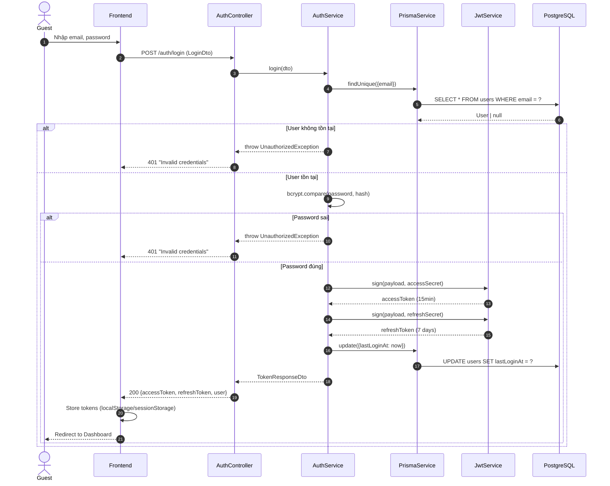

---

## 2. REFRESH TOKEN

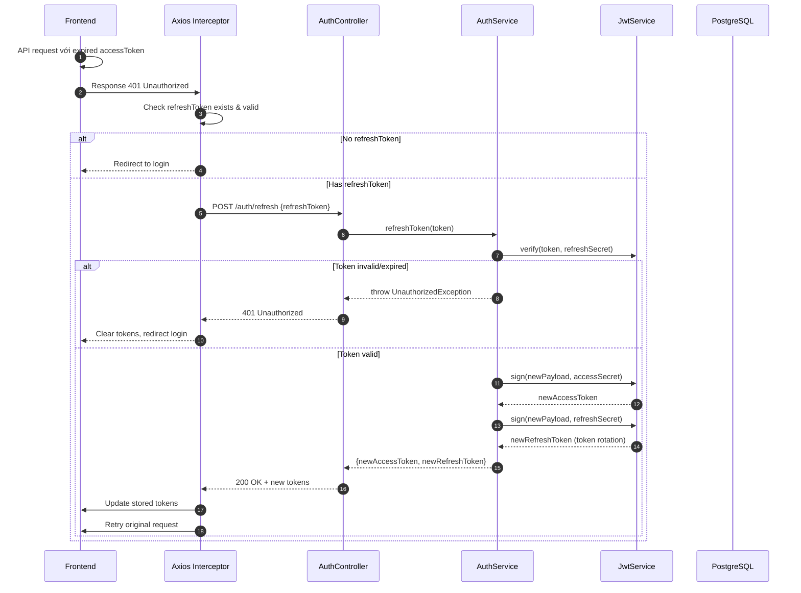

---

## 3. CREATE WORKSPACE

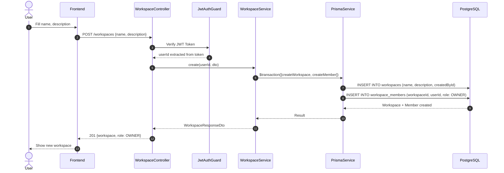

---

## 4. INVITE & ACCEPT MEMBER

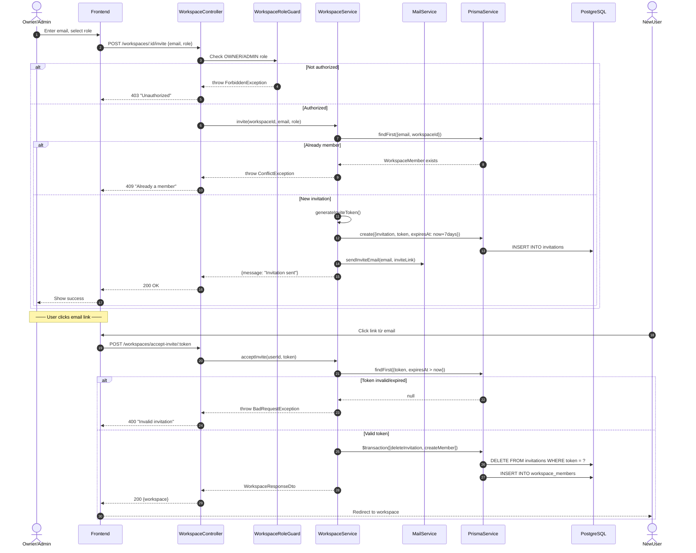

---

## 5. CREATE PROJECT & VIEW KANBAN BOARD

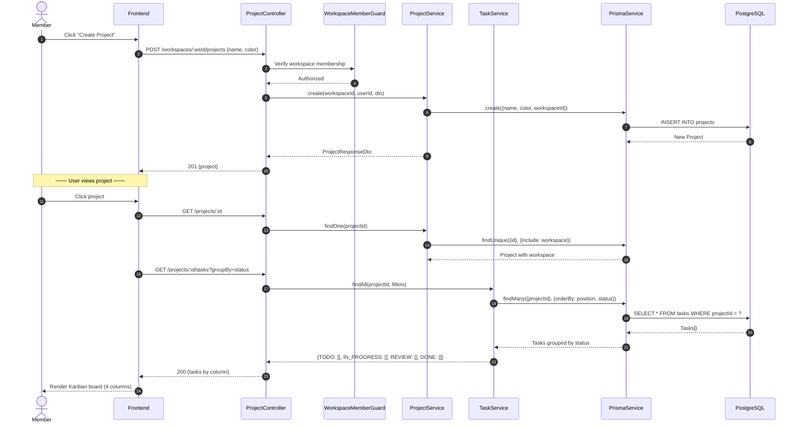

---

## 6. CREATE TASK

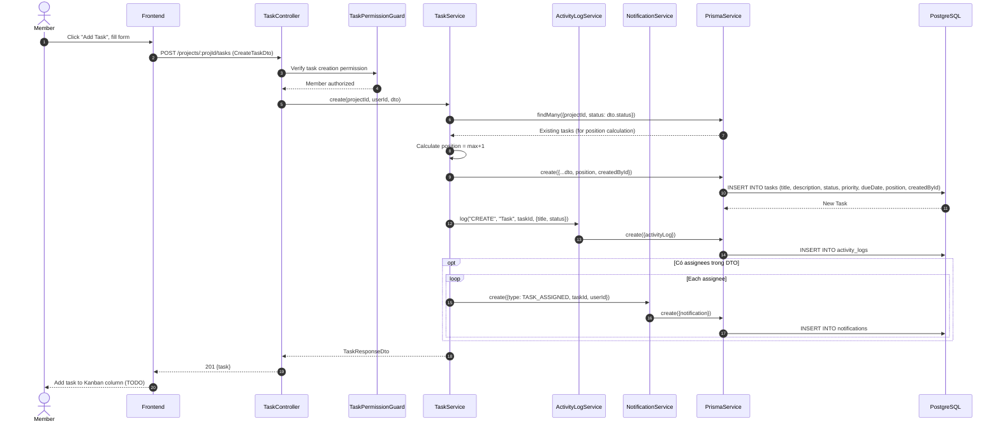

---

## 7. UPDATE TASK

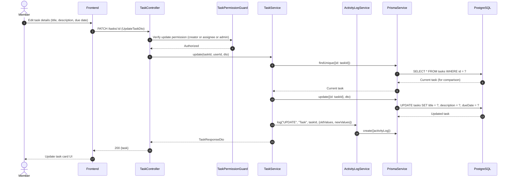

---

## 8. CHANGE TASK STATUS (DRAG & DROP)

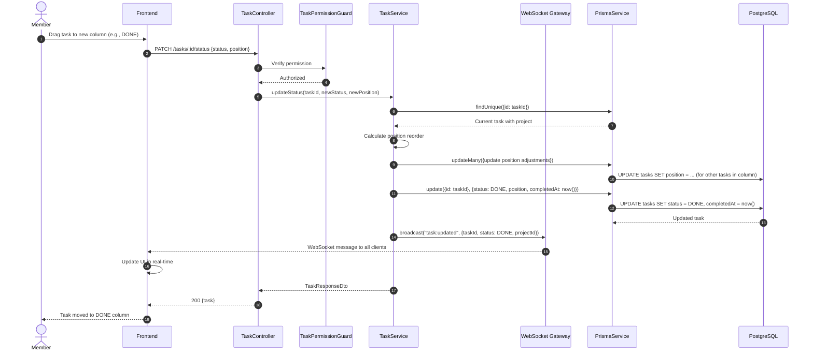

---

## 9. ASSIGN TASK

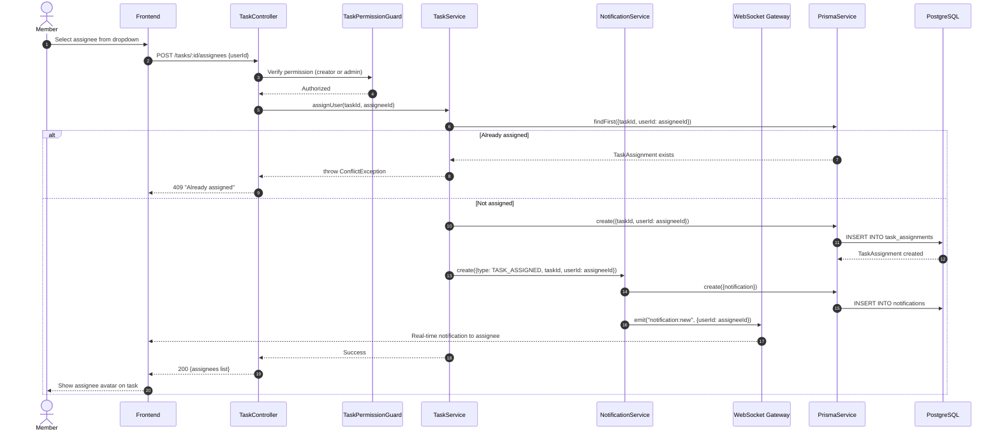

---

## 10. ADD COMMENT & NOTIFICATION

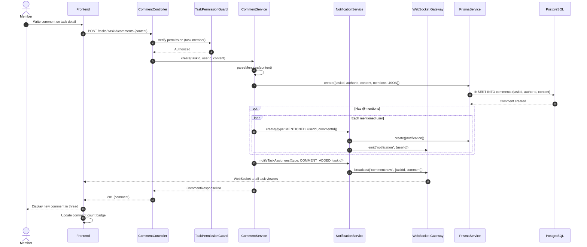

---

## 11. RBAC PERMISSION CHECK

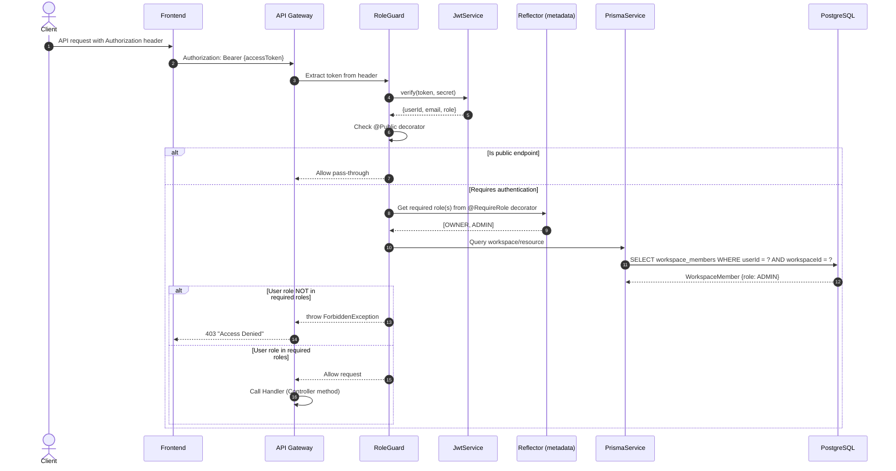

---

## SUMMARY

**Total Core Flows: 11** - Đủ để hiểu toàn bộ quy trình

| Category | Flows | Count |
|----------|-------|-------|
| Authentication | Login, Refresh Token | 2 |
| Workspace Management | Create, Invite & Accept | 2 |
| Project Management | Create & View Kanban | 1 |
| Task Management | Create, Update, Status, Assign, Comment & Notification | 5 |
| Security | RBAC Permission Check | 1 |
| **Total** | | **11** |

### Key Takeaways
✅ **Covers**: Toàn bộ quy trình từ login → workspace → project → task → collaboration
✅ **Simplified**: Chỉ giữ lại flows chính, dễ theo dõi
✅ **Security**: Bao gồm RBAC & Permission checks
✅ **Collaboration**: Comment, Notification, Real-time updates
✅ **Database**: Hiển thị các bảng chính (users, workspaces, projects, tasks, comments, notifications)
