# Chương 8: Phân tích và thiết kế hệ thống

> **Mục tiêu chương học:** Sau khi hoàn thành chương này, bạn sẽ nắm được toàn cảnh dự án TodoList Collaboration — từ yêu cầu chức năng, kiến trúc module, thiết kế cơ sở dữ liệu, đến các quyết định thiết kế quan trọng về API, bảo mật, và chuẩn hóa response. Đây là nền tảng thiết kế để chương tiếp theo triển khai chi tiết từng module.

---

## 8.1. Tổng quan dự án

### 8.1.1. Giới thiệu

TodoList Collaboration là ứng dụng quản lý công việc cộng tác, cho phép nhiều người dùng cùng làm việc trong các workspace chung. Dự án được xây dựng bằng NestJS (backend) và React (frontend), sử dụng PostgreSQL làm hệ quản trị cơ sở dữ liệu và Prisma làm ORM.

Ứng dụng hướng đến việc giải quyết bài toán quản lý task trong môi trường nhóm — nơi mỗi thành viên cần theo dõi tiến độ công việc, phân công nhiệm vụ, và trao đổi thông qua bình luận. Khác với các ứng dụng todo đơn giản chỉ phục vụ cá nhân, TodoList Collaboration được thiết kế với hệ thống phân quyền đa cấp (Owner, Admin, Member) để phù hợp với quy trình làm việc thực tế của các nhóm dự án.

### 8.1.2. Các module chức năng

Hệ thống được chia thành các module theo nguyên tắc phân tách trách nhiệm, mỗi module đóng gói một domain nghiệp vụ riêng biệt:

| Module | Chức năng chính | Trạng thái |
|--------|----------------|------------|
| **Auth** | Đăng ký, đăng nhập, refresh token, logout, quên/đặt lại mật khẩu | Hoàn thành |
| **User** | Xem/cập nhật profile, đổi mật khẩu, upload avatar | Hoàn thành |
| **Workspace** | Tạo/quản lý workspace, mời thành viên, phân quyền | Hoàn thành |
| **Project** | Tạo/quản lý project trong workspace, archive/unarchive, pin | Hoàn thành |
| **Label** | Nhãn phân loại dùng chung trong workspace | Sắp triển khai |
| **Task** | CRUD task, phân công, subtask, filter/sort/pagination | Sắp triển khai |
| **Comment** | Bình luận trên task | Sắp triển khai |
| **Activity** | Ghi nhật ký hoạt động hệ thống (service-only) | Sắp triển khai |
| **Events** | WebSocket Gateway, realtime rooms theo workspace/project/task | Sắp triển khai |
| **Notification** | Thông báo in-app | Sắp triển khai |
| **File** | Upload/download file đính kèm (tối đa 50MB) | Sắp triển khai |
| **Search** | Dashboard cá nhân, tìm kiếm toàn hệ thống | Sắp triển khai |

Chương này phân tích và thiết kế toàn hệ thống, bao gồm kiến trúc module, ERD, thiết kế API, và biểu đồ tuần tự cho các **chức năng chính và tiêu biểu** của từng module đã hoàn thành.

### 8.1.3. Biểu đồ Use Case

Hệ thống có năm loại tác nhân (actor) theo thứ bậc kế thừa: **Guest** → **User** → **Member** → **Admin** → **Owner**. Actor cấp cao kế thừa mọi quyền của actor cấp thấp.

**Sơ đồ tổng quan các module:**

```mermaid
graph TD
    subgraph Actors ["Actors (thứ bậc kế thừa)"]
        Guest["Guest"]
        User["User"]
        Member["Member"]
        Admin["Admin"]
        Owner["Owner"]
        Guest --> User --> Member --> Admin --> Owner
    end

    subgraph AuthModule ["Auth Module (6 UC)"]
        UC1["Đăng ký tài khoản"]
        UC2["Đăng nhập"]
        UC3["Làm mới token"]
        UC4["Đăng xuất"]
        UC5["Quên mật khẩu"]
        UC6["Đặt lại mật khẩu"]
    end

    subgraph UserModule ["User Module (4 UC)"]
        UC7["Xem hồ sơ cá nhân"]
        UC8["Cập nhật hồ sơ"]
        UC9["Đổi mật khẩu"]
        UC10["Upload avatar"]
    end

    subgraph WorkspaceModule ["Workspace Module (10 UC)"]
        UC11["Tạo workspace"]
        UC12["Xem danh sách workspace"]
        UC13["Cập nhật workspace"]
        UC14["Xóa workspace"]
        UC15["Mời thành viên"]
        UC16["Chấp nhận lời mời"]
        UC17["Thay đổi vai trò thành viên"]
        UC18["Xóa thành viên"]
        UC19["Rời workspace"]
        UC20["Xem danh sách thành viên"]
    end

    subgraph ProjectModule ["Project Module (9 UC)"]
        UC21["Tạo project"]
        UC22["Xem danh sách project"]
        UC23["Xem chi tiết project"]
        UC24["Cập nhật project"]
        UC25["Xóa project"]
        UC26["Archive project"]
        UC27["Unarchive project"]
        UC28["Pin project"]
        UC29["Unpin project"]
    end

    subgraph TaskModule ["Task Module (8+ UC)"]
        UC30["Tạo task"]
        UC31["Xem danh sách task"]
        UC32["Cập nhật task"]
        UC33["Xóa task"]
        UC34["Thay đổi trạng thái task"]
        UC35["Phân công thực hiện"]
        UC36["Tạo subtask"]
        UC37["Filter/Sort task"]
    end

    subgraph CommentModule ["Comment Module (4 UC)"]
        UC38["Thêm bình luận"]
        UC39["Xem bình luận"]
        UC40["Chỉnh sửa bình luận"]
        UC41["Xóa bình luận"]
    end

    Guest --> UC1 & UC2 & UC3 & UC5 & UC6
    User --> UC4 & UC7 & UC8 & UC9 & UC10
    User --> UC11 & UC12 & UC16
    Member --> UC20 & UC21 & UC22 & UC23 & UC24 & UC28 & UC29 & UC19
    Member --> UC30 & UC31 & UC32 & UC34 & UC35 & UC36 & UC37
    Member --> UC38 & UC39 & UC40
    Admin --> UC15 & UC18 & UC25 & UC26 & UC27
    Admin --> UC41
    Owner --> UC13 & UC14 & UC17
```

**Mô tả các actors:**

| Actor | Điều kiện | Quyền đặc trưng |
|-------|-----------|-----------------|
| **Guest** | Chưa đăng nhập | Đăng ký, đăng nhập, reset password |
| **User** | Đã đăng nhập | Quản lý profile, tạo workspace mới |
| **Member** | Thành viên workspace | Xem/tạo/sửa project, task, comment |
| **Admin** | Admin của workspace | Thêm/xóa thành viên, archive project |
| **Owner** | Chủ sở hữu workspace | Toàn quyền, phân quyền, xóa workspace |

Thiết kế phân quyền theo nguyên tắc **Principle of Least Privilege**: mỗi actor chỉ có đúng quyền cần thiết. Ví dụ, Member có thể tạo task nhưng không thể xóa project — chỉ Admin/Owner mới có quyền đó. Owner là actor duy nhất không thể bị xóa khỏi workspace bởi bất kỳ ai khác.

---

## 8.2. Kiến trúc hệ thống

### 8.2.1. Kiến trúc module

Ứng dụng tuân theo kiến trúc module hóa của NestJS (đã trình bày ở **Chương 4**), với `AppModule` đóng vai trò Root Module điều phối toàn bộ:

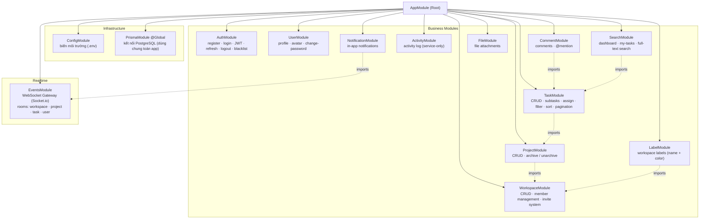

Sơ đồ thể hiện toàn bộ 14 module của hệ thống, phân thành ba nhóm: **Infrastructure** (cơ sở hạ tầng dùng chung), **Business Modules** (nghiệp vụ), và **Realtime** (xử lý kết nối thời gian thực). Mũi tên liền (`→`) thể hiện AppModule đăng ký module vào DI container; mũi tên đứt (`⇢ imports`) thể hiện quan hệ phụ thuộc giữa các module — ví dụ TaskModule cần import ProjectModule để kiểm tra quyền truy cập workspace.

Mỗi Feature Module tuân theo cấu trúc ba tầng nhất quán:

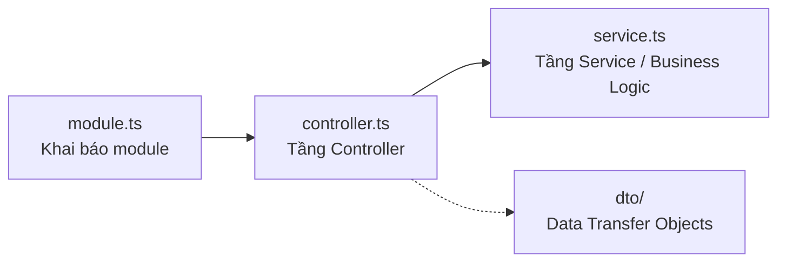

Cấu trúc ba tầng này phản ánh nguyên tắc **Separation of Concerns**: Controller chỉ tiếp nhận và phân phối request, Service chứa toàn bộ logic nghiệp vụ, DTO đảm bảo dữ liệu đầu vào hợp lệ. Khi cần thay đổi logic nghiệp vụ, chỉ cần sửa Service; khi thêm endpoint mới, chỉ cần sửa Controller. Các tầng hoàn toàn độc lập và có thể test riêng biệt.

### 8.2.2. Sơ đồ phụ thuộc giữa các module

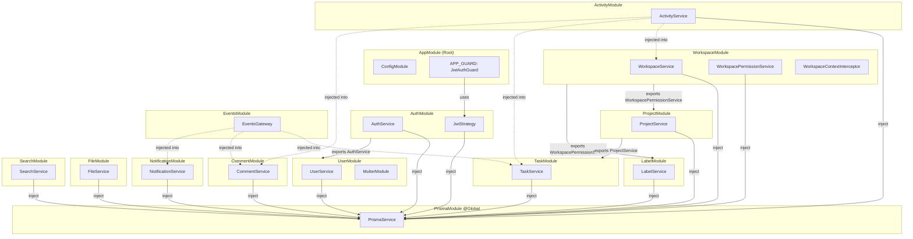

Sơ đồ cho thấy ba nhóm phụ thuộc chính trong hệ thống.

Nhóm thứ nhất là **PrismaService** — được đánh dấu `@Global()` nên mọi service đều inject trực tiếp mà không cần khai báo import trong từng module. Đây là node trung tâm mà toàn bộ tầng Service đều phụ thuộc vào để truy cập database.

Nhóm thứ hai là **module exports/imports** (mũi tên liền): `AuthModule` export `AuthService`; `WorkspaceModule` export `WorkspacePermissionService` để `ProjectModule` và `LabelModule` kiểm tra quyền theo workspace; `ProjectModule` export `ProjectService` để `TaskModule` xác minh task thuộc đúng project. Thứ tự phụ thuộc này phản ánh dependency chain nghiệp vụ: Workspace → Project → Task.

Nhóm thứ ba là **cross-module service injection** (mũi tên đứt): `ActivityService` được inject vào `WorkspaceService`, `TaskService`, và `CommentService` để ghi nhật ký hoạt động tự động mỗi khi có thao tác nghiệp vụ quan trọng. Tương tự, `EventsGateway` được inject vào `TaskService`, `CommentService`, và `NotificationService` để phát sự kiện realtime qua WebSocket ngay tại tầng Service — không cần controller gọi thêm.

`JwtAuthGuard` được đăng ký làm Global Guard tại `AppModule` thông qua `APP_GUARD`, bảo vệ mọi endpoint mặc định. Các endpoint công khai (register, login, accept-invite) phải được đánh dấu tường minh bằng decorator `@Public()` để bypass guard.

---

## 8.3. Thiết kế cơ sở dữ liệu

### 8.3.1. Tổng quan schema

Cơ sở dữ liệu được thiết kế trên PostgreSQL với 17 bảng (models), được định nghĩa thông qua Prisma Schema (đã giới thiệu ở **Chương 5**). Trong phạm vi hai module Auth và User, chúng ta làm việc trực tiếp với bốn bảng chính:

| Bảng | Mục đích | Quan hệ chính |
|------|----------|---------------|
| `users` | Lưu thông tin người dùng | 1-N với RefreshToken, PasswordReset |
| `refresh_tokens` | Lưu refresh token (có thể thu hồi) | N-1 với User |
| `password_resets` | Lưu token đặt lại mật khẩu | N-1 với User |
| `invalidated_tokens` | Danh sách đen access token đã thu hồi | Không có FK |

### 8.3.2. Biểu đồ quan hệ thực thể (ERD)

**ERD tổng quan hệ thống** — thể hiện quan hệ giữa 17 bảng trong cơ sở dữ liệu:

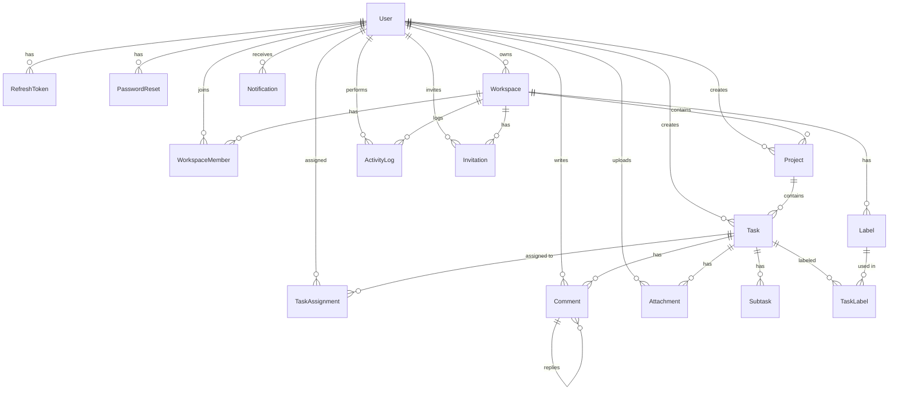

**ERD chi tiết — phạm vi Auth và User** (bốn bảng trực tiếp liên quan):

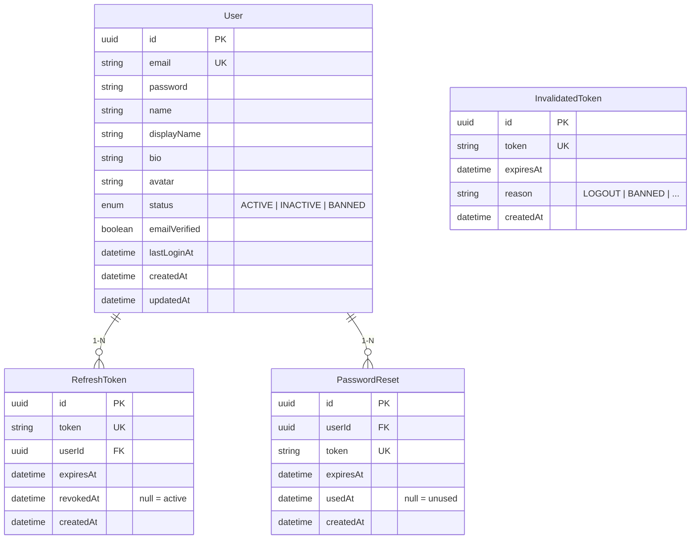

ERD tổng quan cho thấy bảng `User` là entity trung tâm — liên kết trực tiếp đến 12 bảng khác. Trong ERD chi tiết, bốn bảng phục vụ Auth/User được thể hiện đầy đủ với kiểu dữ liệu và constraint. Đáng chú ý, `InvalidatedToken` là bảng duy nhất không có foreign key — hoạt động độc lập như một "bộ lọc nhanh" cho cơ chế token blacklist.

### 8.3.3. Model User

Model User là entity trung tâm của toàn hệ thống, mọi module khác đều liên kết về đây:

```prisma
// prisma/schema.prisma
model User {
  id            String     @id @default(uuid())
  email         String     @unique
  password      String
  name          String
  displayName   String?
  bio           String?
  avatar        String?
  status        UserStatus @default(ACTIVE)
  emailVerified Boolean    @default(false)
  lastLoginAt   DateTime?
  createdAt     DateTime   @default(now())
  updatedAt     DateTime   @updatedAt

  // Relations
  refreshTokens  RefreshToken[]
  passwordResets  PasswordReset[]
  // ... các relations với Workspace, Task, Comment, ...

  @@index([email])
  @@map("users")
}
```

Một số quyết định thiết kế đáng chú ý. Field `id` sử dụng UUID (`@default(uuid())`) thay vì auto-increment integer — UUID không tiết lộ tổng số users trong hệ thống và không thể đoán trước, tăng cường bảo mật. Field `email` có constraint `@unique` đảm bảo không có hai tài khoản trùng email. Field `password` lưu chuỗi hash bcrypt, không bao giờ lưu plain text. Enum `UserStatus` với ba giá trị (ACTIVE, INACTIVE, BANNED) cho phép quản trị viên kiểm soát trạng thái tài khoản. Directive `@@map("users")` ánh xạ tên model PascalCase (`User`) sang tên bảng snake_case (`users`) trong PostgreSQL — tuân theo convention đặt tên của SQL.

### 8.3.4. Các model hỗ trợ Authentication

Ba model hỗ trợ phục vụ ba cơ chế bảo mật khác nhau:

```prisma
// Lưu refresh token — cho phép thu hồi khi logout
model RefreshToken {
  id        String    @id @default(uuid())
  token     String    @unique
  userId    String
  expiresAt DateTime
  revokedAt DateTime?    // null = đang hoạt động, có giá trị = đã thu hồi
  createdAt DateTime  @default(now())
  user      User      @relation(fields: [userId], references: [id], onDelete: Cascade)
  @@map("refresh_tokens")
}

// Lưu token đặt lại mật khẩu — sử dụng một lần
model PasswordReset {
  id        String    @id @default(uuid())
  userId    String
  token     String    @unique
  expiresAt DateTime
  usedAt    DateTime?    // null = chưa dùng, có giá trị = đã dùng
  createdAt DateTime  @default(now())
  user      User      @relation(fields: [userId], references: [id], onDelete: Cascade)
  @@map("password_resets")
}

// Danh sách đen access token — thu hồi tức thì khi logout
model InvalidatedToken {
  id        String   @id @default(uuid())
  token     String   @unique
  expiresAt DateTime    // Dùng để dọn dẹp records đã hết hạn
  reason    String?     // LOGOUT, BANNED, PASSWORD_CHANGED
  createdAt DateTime @default(now())
  @@map("invalidated_tokens")
}
```

Điểm thiết kế chung của cả `RefreshToken` và `PasswordReset` là kỹ thuật **soft invalidation**: thay vì xóa record khi không còn hợp lệ, chúng ta đặt timestamp vào field `revokedAt` hoặc `usedAt`. Cách tiếp cận này giữ lại lịch sử hoạt động, phục vụ cho việc kiểm tra bảo mật (audit) sau này — ví dụ phát hiện ai đó liên tục yêu cầu reset password.

`InvalidatedToken` không có foreign key đến bảng User vì access token đã chứa sẵn userId trong payload. Bảng này đóng vai trò như một "bộ lọc nhanh" — mỗi request chỉ cần kiểm tra token có nằm trong bảng này hay không (truy vấn bằng `@unique` index, tốc độ O(1)), không cần join với bảng khác.

---

## 8.4. Thiết kế API

### 8.4.1. Quy ước chung

Toàn bộ API tuân theo các quy ước RESTful nhất quán:

| Quy ước | Giá trị | Ví dụ |
|---------|---------|-------|
| Base URL | `/api/v1` | `http://localhost:3333/api/v1/auth/login` |
| Naming | Danh từ số nhiều, lowercase | `/users`, `/workspaces`, `/tasks` |
| HTTP Methods | GET (đọc), POST (tạo), PATCH (cập nhật), DELETE (xóa) | `PATCH /users/me` |
| Status Codes | 200 (OK), 201 (Created), 400 (Bad Request), 401 (Unauthorized), 404 (Not Found), 409 (Conflict) | |

Prefix `/api/v1` phục vụ API versioning — khi cần thay đổi breaking changes trong tương lai, chúng ta triển khai `/api/v2` song song mà không phá vỡ client đang dùng v1.

### 8.4.2. Danh sách API endpoints

**Auth Module — 6 endpoints:**

| Method | Endpoint | Auth | Mô tả |
|--------|----------|------|-------|
| `POST` | `/auth/register` | Public | Đăng ký tài khoản mới |
| `POST` | `/auth/login` | Public | Đăng nhập, nhận tokens |
| `POST` | `/auth/refresh` | Public | Làm mới access token |
| `POST` | `/auth/logout` | JWT | Đăng xuất, thu hồi tokens |
| `POST` | `/auth/forgot-password` | Public | Yêu cầu đặt lại mật khẩu |
| `POST` | `/auth/reset-password` | Public | Đặt lại mật khẩu bằng token |

**User Module — 4 endpoints:**

| Method | Endpoint | Auth | Mô tả |
|--------|----------|------|-------|
| `GET` | `/users/me` | JWT | Xem hồ sơ cá nhân |
| `PATCH` | `/users/me` | JWT | Cập nhật displayName, bio |
| `PATCH` | `/users/me/change-password` | JWT | Thay đổi mật khẩu |
| `POST` | `/users/me/avatar` | JWT | Upload ảnh đại diện |

Tất cả endpoints của User Module sử dụng đường dẫn `/me` thay vì `/:userId`. Thiết kế này ngăn chặn triệt để việc truy cập hồ sơ người khác — userId luôn được trích xuất từ JWT token đã xác thực, không phải từ URL do client cung cấp.

**Workspace Module — 11 endpoints:**

| Method | Endpoint | Quyền tối thiểu | Mô tả |
|--------|----------|-----------------|-------|
| `POST` | `/workspaces` | User | Tạo workspace mới |
| `GET` | `/workspaces` | User | Danh sách workspace của tôi |
| `GET` | `/workspaces/:id` | Member | Xem chi tiết workspace |
| `PATCH` | `/workspaces/:id` | Owner | Cập nhật tên/mô tả |
| `DELETE` | `/workspaces/:id` | Owner | Xóa workspace |
| `POST` | `/workspaces/:id/invite` | Admin | Mời thành viên qua email |
| `POST` | `/workspaces/accept-invite/:token` | Public | Chấp nhận lời mời |
| `GET` | `/workspaces/:id/members` | Member | Danh sách thành viên |
| `PATCH` | `/workspaces/:id/members/:userId` | Owner | Đổi vai trò thành viên |
| `DELETE` | `/workspaces/:id/members/:userId` | Admin | Xóa thành viên |
| `DELETE` | `/workspaces/:id/leave` | Member | Rời workspace |

**Project Module — 9 endpoints:**

| Method | Endpoint | Quyền tối thiểu | Mô tả |
|--------|----------|-----------------|-------|
| `POST` | `/workspaces/:wsId/projects` | Member | Tạo project trong workspace |
| `GET` | `/workspaces/:wsId/projects` | Member | Danh sách projects |
| `GET` | `/projects/:id` | Member | Xem chi tiết project |
| `PATCH` | `/projects/:id` | Member | Cập nhật project |
| `DELETE` | `/projects/:id` | Admin | Xóa project |
| `POST` | `/projects/:id/archive` | Admin | Archive project |
| `POST` | `/projects/:id/unarchive` | Admin | Unarchive project |
| `POST` | `/projects/:id/pin` | Member | Pin project |
| `POST` | `/projects/:id/unpin` | Member | Unpin project |

**Task Module — 8 endpoints (dự kiến):**

| Method | Endpoint | Quyền tối thiểu | Mô tả |
|--------|----------|-----------------|-------|
| `POST` | `/projects/:projId/tasks` | Member | Tạo task |
| `GET` | `/projects/:projId/tasks` | Member | Danh sách tasks (filter/sort) |
| `GET` | `/tasks/:id` | Member | Xem chi tiết task |
| `PATCH` | `/tasks/:id` | Member | Cập nhật task |
| `DELETE` | `/tasks/:id` | Admin | Xóa task |
| `PATCH` | `/tasks/:id/status` | Member | Thay đổi trạng thái (drag & drop) |
| `POST` | `/tasks/:id/assignees` | Member | Phân công thành viên |
| `DELETE` | `/tasks/:id/assignees/:userId` | Member | Hủy phân công |

**Comment Module — 4 endpoints (dự kiến):**

| Method | Endpoint | Quyền tối thiểu | Mô tả |
|--------|----------|-----------------|-------|
| `POST` | `/tasks/:taskId/comments` | Member | Thêm bình luận |
| `GET` | `/tasks/:taskId/comments` | Member | Danh sách bình luận |
| `PATCH` | `/comments/:id` | Người tạo | Sửa bình luận |
| `DELETE` | `/comments/:id` | Người tạo / Admin | Xóa bình luận |

**Label Module — 4 endpoints (dự kiến):**

| Method | Endpoint | Quyền tối thiểu | Mô tả |
|--------|----------|-----------------|-------|
| `POST` | `/workspaces/:wsId/labels` | Member | Tạo nhãn |
| `GET` | `/workspaces/:wsId/labels` | Member | Danh sách nhãn |
| `PATCH` | `/labels/:id` | Member | Cập nhật nhãn |
| `DELETE` | `/labels/:id` | Admin | Xóa nhãn |

Tổng cộng hệ thống có **46 endpoints** được phân chia rõ ràng theo domain. Mỗi nhóm endpoint bảo vệ bởi hai lớp: `JwtAuthGuard` kiểm tra token hợp lệ, và `WorkspacePermissionGuard` kiểm tra vai trò của người dùng trong workspace cụ thể.

### 8.4.3. Chuẩn hóa Response

Mọi response trong hệ thống đều tuân theo một cấu trúc thống nhất, nhờ hai thành phần hoạt động ở tầng global:

**Response thành công** (qua `TransformResponseInterceptor`):

```json
{
  "success": true,
  "data": { /* dữ liệu thực tế */ },
  "timestamp": "2026-03-17T09:00:00.000Z"
}
```

**Response lỗi** (qua `HttpExceptionFilter`):

```json
{
  "success": false,
  "statusCode": 400,
  "message": "Email should not be empty",
  "path": "/api/v1/auth/register",
  "timestamp": "2026-03-17T09:00:00.000Z"
}
```

Sự phối hợp giữa Interceptor (bọc response thành công) và Filter (bắt và format lỗi) tạo ra một "khế ước" rõ ràng: client chỉ cần kiểm tra field `success` để phân biệt thành công và thất bại, thay vì phải phân tích HTTP status code. Đây là nền tảng giúp frontend xử lý response một cách nhất quán cho mọi API call.

### 8.4.4. Validation dữ liệu đầu vào

Mọi dữ liệu từ client đều được validate bởi `ValidationPipe` toàn cục với ba tùy chọn bảo mật:

| Tùy chọn | Tác dụng | Ví dụ |
|----------|---------|-------|
| `whitelist: true` | Loại bỏ field không khai báo trong DTO | `{ email, password, isAdmin }` → `isAdmin` bị xóa |
| `forbidNonWhitelisted: true` | Trả lỗi 400 nếu có field lạ | `{ email, password, isAdmin }` → lỗi 400 |
| `transform: true` | Tự động chuyển kiểu dữ liệu | `?page="1"` → `page = 1` (number) |

Kết hợp với DTO classes sử dụng decorators từ `class-validator`, hệ thống đảm bảo rằng mọi request đến controller đều đã được validate đầy đủ — controller không cần kiểm tra lại dữ liệu đầu vào.

---

## 8.5. Biểu đồ tuần tự các chức năng chính

Biểu đồ tuần tự (Sequence Diagram) mô tả trình tự tương tác giữa các thành phần trong hệ thống khi xử lý một request. Dưới đây là các luồng chính của hai module Auth và User.

### 8.5.1. Đăng ký tài khoản (Register)

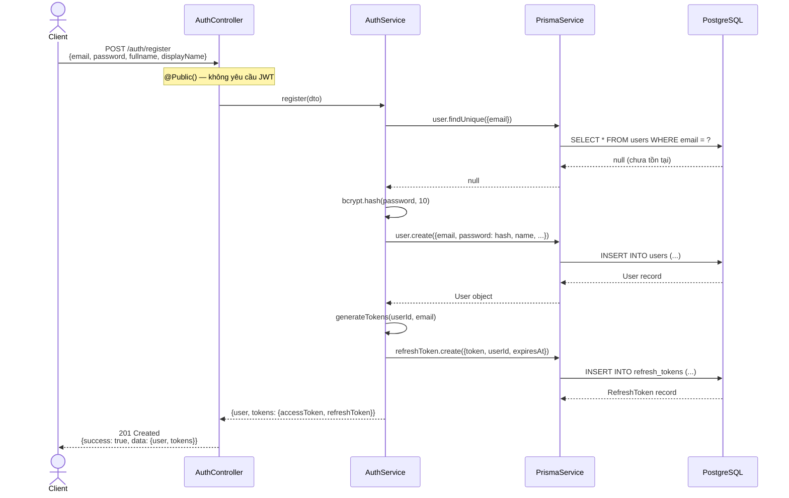

### 8.5.2. Đăng nhập (Login)

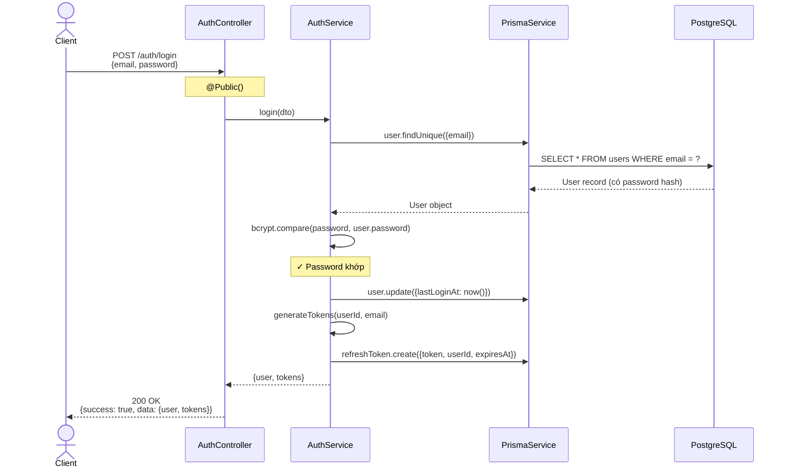

### 8.5.3. Làm mới token (Refresh — Token Rotation)

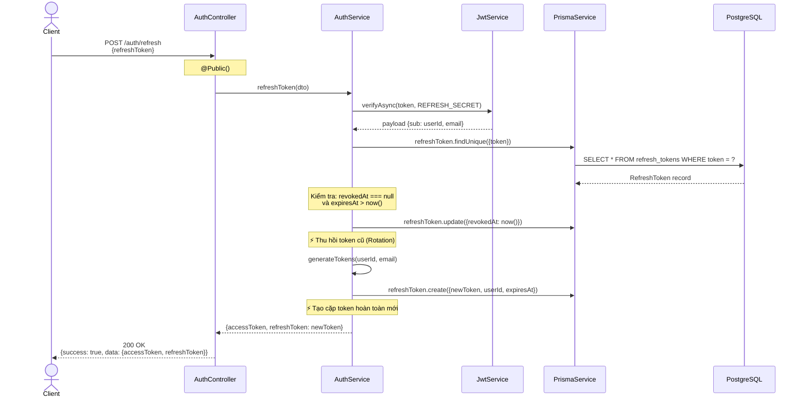

### 8.5.4. Đăng xuất (Logout — Token Blacklist)

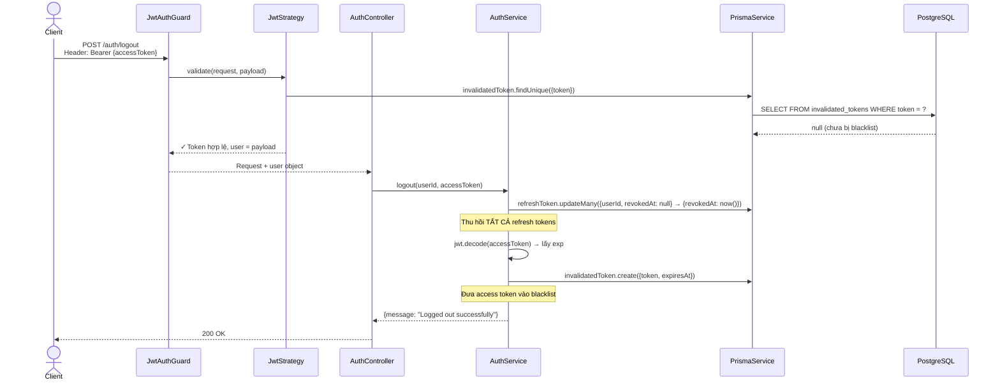

### 8.5.5. Xem hồ sơ cá nhân (Get Profile — Luồng Authenticated)

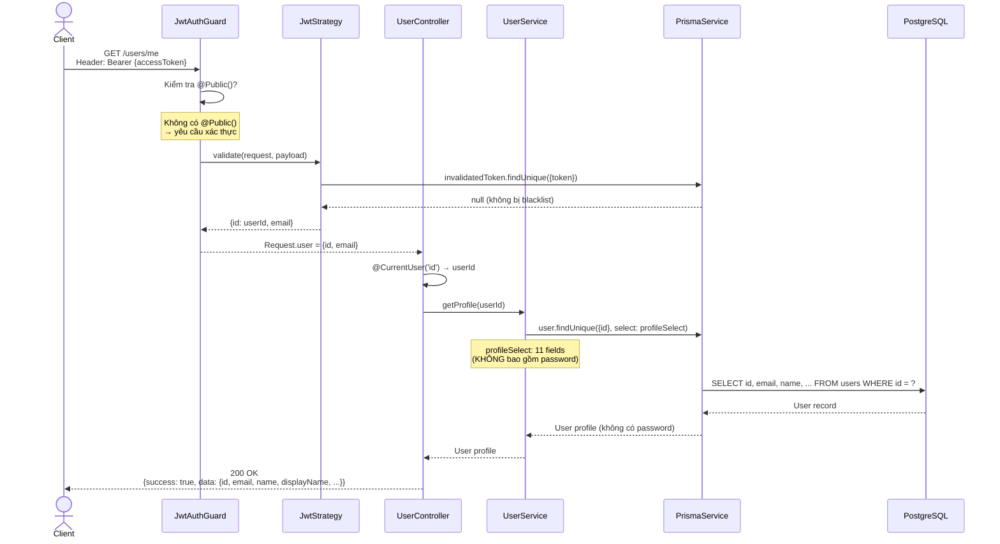

### 8.5.6. Đổi mật khẩu (Change Password — Transaction)

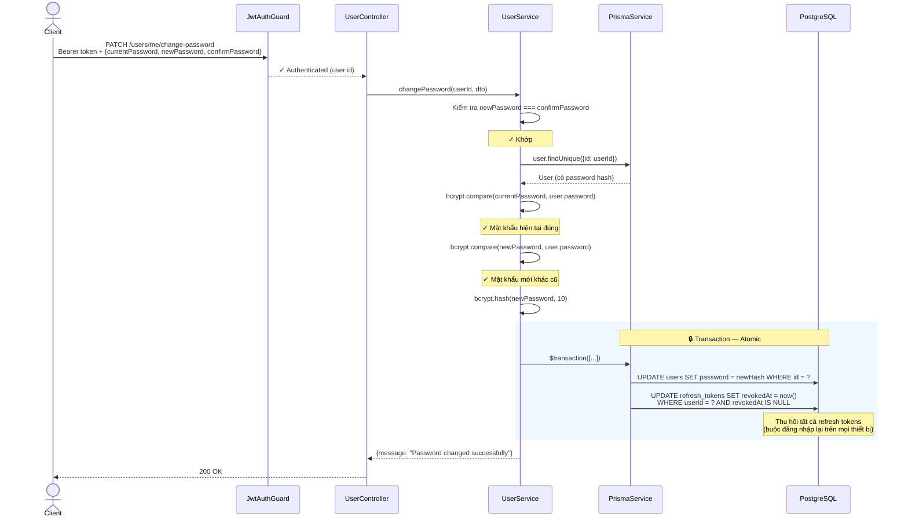

### 8.5.7. Upload Avatar (File Upload)

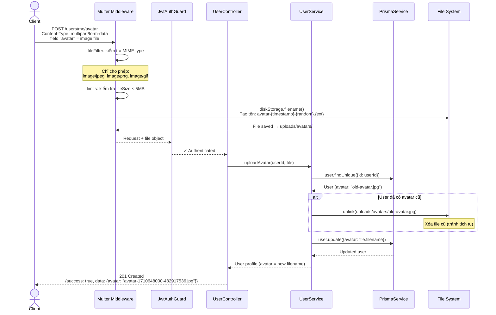

### 8.5.8. Tạo Workspace

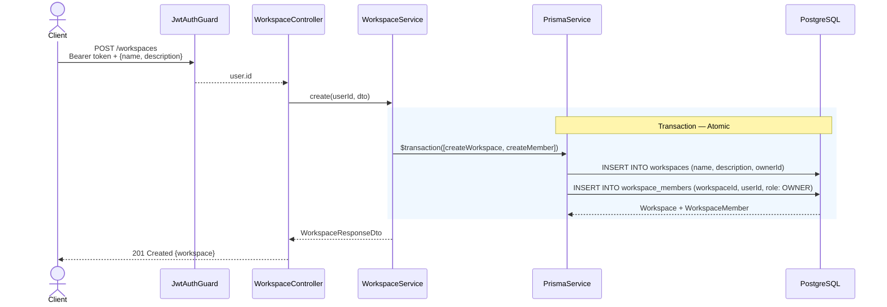

Đáng chú ý: tạo workspace dùng **Prisma Transaction** để đảm bảo tính nguyên tử — hoặc cả workspace lẫn record thành viên Owner đều được tạo, hoặc cả hai đều thất bại. Điều này ngăn trường hợp workspace được tạo nhưng không có owner.

### 8.5.9. Mời thành viên (Invite Member)

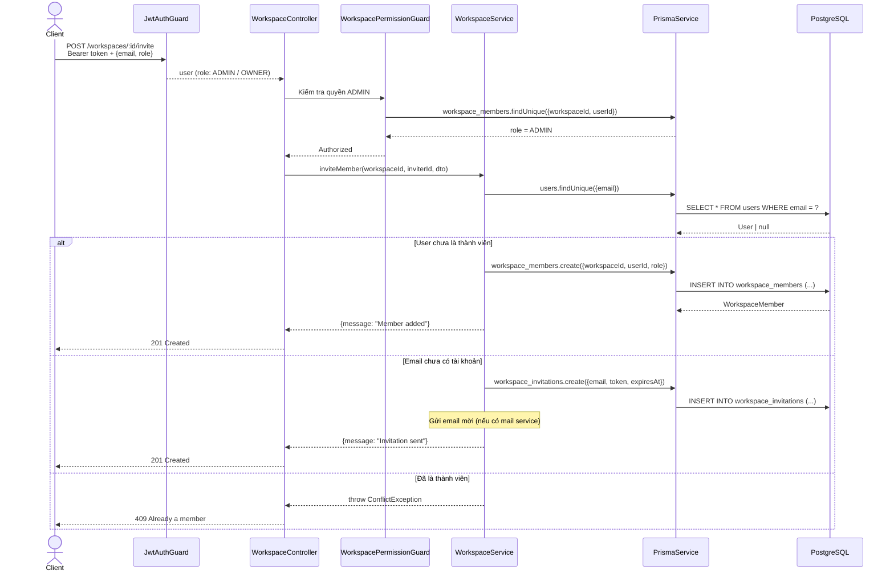

### 8.5.10. Tạo Project

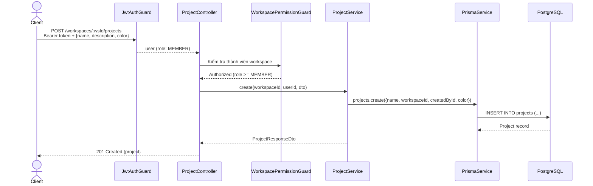

### 8.5.11. Tạo Task

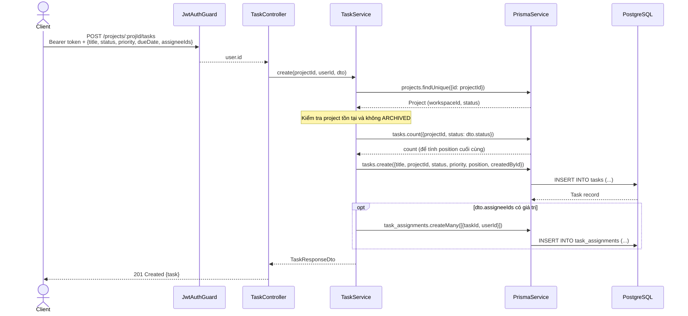

### 8.5.12. Thay đổi trạng thái Task (Drag & Drop)

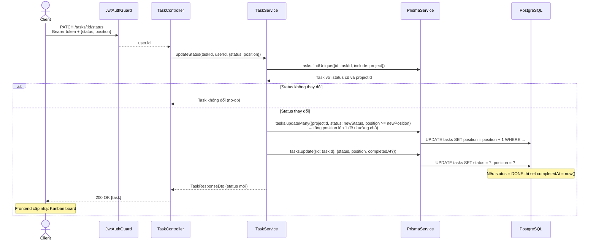

Sequence diagram này thể hiện cơ chế **position reordering**: khi task được kéo vào vị trí mới trong column, các task phía sau được dịch chuyển trước, sau đó mới cập nhật task đang di chuyển. Điều này đảm bảo không có hai task cùng position trong một column.

### 8.5.13. Thêm bình luận (Add Comment)

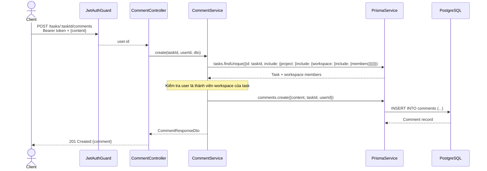

---

## 8.6. Thiết kế bảo mật

### 8.6.1. Chiến lược xác thực — Dual Token

Hệ thống sử dụng chiến lược dual-token, kết hợp hai loại JWT token phục vụ hai mục đích khác nhau:

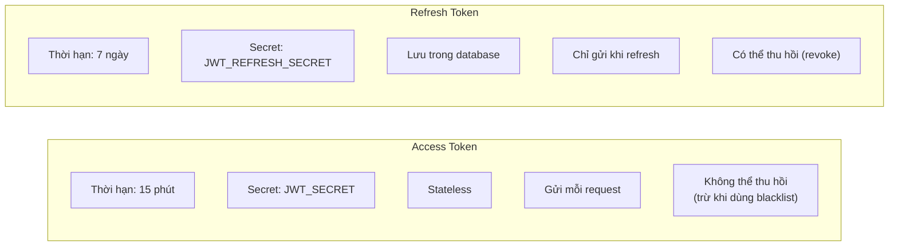

Access Token có thời hạn ngắn (15 phút) để giảm thiểu rủi ro khi bị lộ — kẻ tấn công chỉ có cửa sổ 15 phút để khai thác. Refresh Token có thời hạn dài hơn (7 ngày) nhưng được lưu trong database, cho phép server thu hồi bất kỳ lúc nào. Hai token sử dụng **secret key riêng biệt** — ngăn chặn việc dùng refresh token (dễ bị lộ vì lưu lâu) để giả mạo access token.

### 8.6.2. Token Blacklist — Thu hồi tức thì

Bản chất JWT là stateless — server không lưu trạng thái, nên không thể "hủy" một token đã cấp. Khi user đăng xuất, access token vẫn hợp lệ cho đến khi hết hạn. Để giải quyết, hệ thống triển khai cơ chế **Token Blacklist**:

```mermaid
flowchart TD
    A["User Logout"] --> B["1. Thu hồi tất cả Refresh Tokens<br/>(updateMany → revokedAt = now)"]
    A --> C["2. Đưa Access Token vào<br/>bảng InvalidatedToken"]
    C --> D["Mỗi request sau đó"]
    D --> E{"JwtStrategy.validate()<br/>Token có trong blacklist?"}
    E -->|Có| F["401 Unauthorized"]
    E -->|Không| G["Cho phép truy cập"]
```

Bảng `InvalidatedToken` đóng vai trò "danh sách đen" nhỏ gọn. Mỗi record chứa token đã thu hồi kèm `expiresAt` — cho phép cron job định kỳ dọn dẹp các records đã hết hạn, giữ bảng luôn gọn nhẹ. Chi phí kiểm tra blacklist là một query `findUnique` theo `@unique` index — tốc độ O(1), không ảnh hưởng đáng kể đến hiệu năng.

### 8.6.3. Token Rotation

Mỗi lần client gọi `/auth/refresh` để lấy access token mới, refresh token cũ bị thu hồi và cặp token hoàn toàn mới được tạo ra. Kỹ thuật **Token Rotation** này ngăn chặn việc tái sử dụng refresh token bị đánh cắp — kẻ tấn công chỉ có thể dùng token đó đúng một lần.

### 8.6.4. Chiến lược Global Guard + @Public()

Thay vì đặt `@UseGuards(JwtAuthGuard)` trên từng controller, hệ thống đăng ký guard toàn cục qua `APP_GUARD` — triết lý **"secure by default"**:

```mermaid
flowchart LR
    A["Mọi endpoint"] --> B{"JwtAuthGuard"}
    B -->|"Có @Public()?"| C["Bỏ qua JWT, cho qua"]
    B -->|"Không có @Public()"| D{"Token hợp lệ?"}
    D -->|Có| E["Cho phép truy cập"]
    D -->|Không| F["401 Unauthorized"]
```

Với thiết kế này, nếu developer quên gắn guard khi tạo endpoint mới, endpoint đó vẫn được bảo vệ. Chỉ khi cố ý đánh dấu `@Public()` thì endpoint mới được truy cập công khai. Cách tiếp cận này an toàn hơn nhiều so với mô hình ngược lại (mặc định mở, phải gắn guard để bảo vệ).

### 8.6.5. Hash mật khẩu

Mật khẩu được hash bằng bcrypt với 10 salt rounds trước khi lưu vào database. Bcrypt tự động tích hợp giá trị salt ngẫu nhiên vào quá trình hash — hai user có cùng mật khẩu sẽ cho ra hai chuỗi hash hoàn toàn khác nhau, chống tấn công Rainbow Table. Tham số 10 salt rounds tạo ra khoảng 2^10 = 1024 vòng lặp tính toán, cân bằng giữa bảo mật và hiệu năng.

### 8.6.6. Validate mật khẩu

Mật khẩu đầu vào phải thỏa mãn năm điều kiện: tối thiểu 8 ký tự, có ít nhất một chữ hoa, một chữ thường, một chữ số, và một ký tự đặc biệt. Quy tắc này tuân theo khuyến nghị của OWASP (Open Web Application Security Project), đảm bảo mật khẩu có đủ entropy để chống lại tấn công từ điển (dictionary attack) và brute-force.

---

## 8.7. Thiết kế File Upload

### 8.7.1. Chiến lược lưu trữ

Avatar upload sử dụng Multer — middleware xử lý multipart/form-data — với chiến lược `diskStorage` lưu file trực tiếp lên ổ đĩa:

```
uploads/
└── avatars/
    ├── avatar-1710648000000-482917536.jpg
    ├── avatar-1710648001000-193847562.png
    └── ...
```

Tên file được tạo theo format `{fieldname}-{timestamp}-{random}.{ext}`, đảm bảo tính duy nhất và ngăn chặn tấn công path traversal — original filename từ client bị loại bỏ hoàn toàn, chỉ giữ lại phần extension.

### 8.7.2. Quy tắc bảo mật file upload

| Quy tắc | Giá trị | Mục đích |
|---------|---------|----------|
| MIME type | Chỉ `image/jpeg`, `image/png`, `image/gif` | Chặn file thực thi (PHP, EXE), SVG chứa script |
| Kích thước | Tối đa 5MB | Tránh DoS qua file cực lớn |
| Tên file | Random (timestamp + Math.random) | Chống path traversal, trùng tên |
| Xóa file cũ | Tự động khi upload avatar mới | Tránh tích tụ file rác |

### 8.7.3. Phục vụ Static File

File đã upload được phục vụ qua NestJS static assets với prefix `/uploads/`. Client truy cập avatar qua URL: `GET /uploads/avatars/{filename}`. Cấu hình prefix giới hạn phạm vi truy cập — chỉ file trong thư mục `uploads/` được serve, các file nhạy cảm khác của dự án không bị lộ.

---

## 8.8. Cấu hình Global — File main.ts

File `main.ts` là nơi thiết lập tất cả các thành phần hoạt động ở cấp toàn cục, áp dụng các khái niệm đã học ở **Chương 6** (Pipes, Interceptors, Filters) vào thực tế:

```typescript
// src/main.ts
async function bootstrap() {
  const app = await NestFactory.create<NestExpressApplication>(AppModule);

  app.setGlobalPrefix('api/v1');                          // API versioning

  app.useGlobalPipes(new ValidationPipe({                 // Validate đầu vào
    whitelist: true,
    forbidNonWhitelisted: true,
    transform: true,
  }));

  app.useGlobalInterceptors(
    new LoggingInterceptor(),                             // Log mọi request
    new TransformResponseInterceptor(),                   // Bọc response chuẩn
  );

  app.useGlobalFilters(new HttpExceptionFilter());        // Format lỗi chuẩn

  app.useStaticAssets(join(process.cwd(), 'uploads'), {   // Serve file upload
    prefix: '/uploads/',
  });

  await app.listen(process.env.PORT ?? 3333);
}
```

Năm lớp cấu hình này hoạt động như một pipeline xử lý mọi request đi qua ứng dụng. Request đầu tiên được định tuyến bởi Global Prefix, sau đó được validate bởi ValidationPipe, đi qua các Guards (đăng ký ở AppModule), rồi đến Interceptors (logging + transform response). Nếu có lỗi xảy ra ở bất kỳ tầng nào, HttpExceptionFilter bắt và format thành response lỗi chuẩn. Nhờ thiết kế tập trung này, mỗi module chỉ cần tập trung vào business logic — phần cross-cutting concerns (logging, validation, error handling) đã được xử lý ở tầng global.

---

## 8.9. Tổng kết

Chương này đã phân tích và thiết kế toàn hệ thống TodoList Collaboration từ góc nhìn kiến trúc, bao gồm sáu khía cạnh chính:

**Kiến trúc module** — Hệ thống gồm 14 module theo nguyên tắc phân tách trách nhiệm, với `PrismaModule @Global` làm hạ tầng dùng chung và dependency chain rõ ràng: Workspace → Project → Task. Mỗi module tuân theo cấu trúc ba tầng Controller → Service → Database.

**Use Case và phân quyền** — Năm loại actor (Guest, User, Member, Admin, Owner) theo thứ bậc kế thừa, phủ toàn bộ 41+ use case của 7 module. Hệ thống phân quyền theo nguyên tắc Least Privilege: mỗi actor chỉ có đúng quyền cần thiết cho vai trò của mình.

**Thiết kế CSDL** — PostgreSQL với 17 bảng, trong đó `users` là entity trung tâm liên kết đến 12 bảng. Các bảng hỗ trợ bảo mật (`refresh_tokens`, `password_resets`, `invalidated_tokens`) sử dụng kỹ thuật soft invalidation để lưu lịch sử cho audit.

**Thiết kế API** — 46 endpoints RESTful chia thành 7 module, bảo vệ hai lớp (JWT + WorkspacePermission). Response được chuẩn hóa thống nhất qua `TransformResponseInterceptor` và `HttpExceptionFilter`.

**Biểu đồ tuần tự** — 13 sequence diagram minh họa luồng xử lý cho các chức năng chính: xác thực (register, login, refresh, logout), quản lý người dùng (profile, change password, avatar), cộng tác workspace (tạo workspace, mời thành viên), quản lý project, task (tạo, drag & drop status), và bình luận.

**Bảo mật** — Chiến lược dual-token với Token Blacklist + Token Rotation, Global Guard theo "secure by default", bcrypt hash mật khẩu với 10 salt rounds, và file upload được kiểm soát chặt chẽ về MIME type, kích thước, và tên file.

Với nền tảng thiết kế này, các chương tiếp theo sẽ triển khai chi tiết từng module — từ Auth, User đến Workspace và Project — kèm theo mã nguồn đầy đủ và giải thích kỹ thuật.
