# Chương 9: Phân tích và thiết kế hệ thống

> **Mục tiêu chương học:** Sau khi hoàn thành chương này, bạn sẽ nắm được toàn cảnh dự án TodoList Collaboration — từ yêu cầu chức năng và phi chức năng, biểu đồ use case, kiến trúc module, thiết kế cơ sở dữ liệu, đến các quyết định thiết kế quan trọng về API, bảo mật, và luồng xử lý nghiệp vụ. Đây là nền tảng phân tích và thiết kế để chương tiếp theo triển khai chi tiết từng module.

---

# PHẦN A — PHÂN TÍCH YÊU CẦU

---

## 9.1. Tổng quan dự án

### 9.1.1. Mô tả bài toán

TodoList Collaboration là ứng dụng quản lý công việc cộng tác, cho phép nhiều người dùng cùng làm việc trong các workspace chung. Dự án được xây dựng bằng NestJS (backend) và React (frontend), sử dụng PostgreSQL làm hệ quản trị cơ sở dữ liệu và Prisma làm ORM.

Ứng dụng hướng đến việc giải quyết bài toán quản lý task trong môi trường nhóm — nơi mỗi thành viên cần theo dõi tiến độ công việc, phân công nhiệm vụ, và trao đổi thông qua bình luận. Khác với các ứng dụng todo đơn giản chỉ phục vụ cá nhân, TodoList Collaboration được thiết k�� với hệ thống phân quyền đa cấp (Owner, Admin, Member) để phù hợp với quy trình làm việc thực tế của các nhóm dự án.

### 9.1.2. Phạm vi hệ thống

Hệ thống TodoList Collaboration được chia thành c��c module chức năng độc lập theo nguyên tắc phân tách trách nhiệm, mỗi module đóng gói một domain nghiệp vụ riêng biệt. Tính đến thời điểm hiện tại, hệ thống bao gồm các module sau:

| Module | Số endpoints | Chức năng chính | Trạng thái |
|--------|-------------|----------------|-----------|
| **Auth** | 6 | Đăng ký, đăng nhập, refresh token, logout, quên/đặt lại mật khẩu | Hoàn thành |
| **User** | 4 | Xem/cập nhật profile, đổi mật khẩu, upload avatar | Hoàn thành |
| **Workspace** | 11 | Tạo/quản lý workspace, mời thành viên, phân quyền (Owner/Admin/Member) | Hoàn thành |
| **Project** | 9 | Tạo/quản lý project, archive, pin project trong workspace | Hoàn thành |
| **Task** | 14 | CRUD task, phân công thành viên, subtask, nhãn, đổi trạng thái, filter | Hoàn thành |
| **Comment** | 2 | Bình luận trên task, reply | Hoàn thành |
| **Notification** | 1 | Thông báo realtime (WebSocket) | Hoàn thành |
| **Mail** | — | Gửi email reset mật khẩu (SendGrid + Mock mode) | Hoàn thành |

Tổng cộng, hệ thống cung cấp 47 endpoints hoàn chỉnh, tất cả đều được trang bị đầy đủ validation đầu vào và cơ chế authentication thông qua JWT. Chương này phân tích yêu cầu và thiết kế toàn hệ thống, bao gồm: yêu cầu chức năng/phi chức năng, biểu đồ use case, kiến trúc module, ERD, thiết kế API, bảo mật, và biểu đồ tuần tự cho các chức năng tiêu biểu.

---

## 9.2. Phân tích yêu cầu

### 9.2.1. Yêu cầu chức năng

Yêu cầu chức năng mô tả những gì hệ thống phải làm được. Dựa trên phân tích bài toán quản lý công việc cộng tác, các yêu cầu chức năng được phân nhóm theo module:

| Nhóm | Yêu cầu chức năng |
|------|-------------------|
| **Xác thực** | Người dùng có thể đăng ký tài khoản bằng email và mật khẩu |
| | Người dùng có thể đăng nhập và nhận cặp access/refresh token |
| | Hệ thống tự động làm mới access token khi hết hạn (Token Rotation) |
| | Người dùng có thể đăng xuất, hệ thống thu hồi token ngay lập tức |
| | Người dùng có thể yêu cầu đặt lại mật khẩu qua email |
| **Hồ sơ** | Người dùng có thể xem và cập nhật thông tin cá nhân (displayName, bio) |
| | Người dùng có thể đổi mật khẩu (xác minh mật khẩu cũ) |
| | Người dùng có thể upload ảnh đại diện (avatar) |
| **Workspace** | Người dùng có thể tạo workspace mới (tự động trở thành Owner) |
| | Admin/Owner có thể mời thành viên qua email với token mời có hạn 7 ngày |
| | Owner có thể thay đổi vai trò thành viên (Member ↔ Admin) |
| | Admin có thể xóa thành viên khỏi workspace |
| | Thành viên có thể tự rời workspace (trừ Owner) |
| **Project** | Thành viên có thể tạo project trong workspace |
| | Admin/Owner có thể archive/unarchive và xóa project |
| | Thành viên có thể pin/unpin project để đánh dấu ưu tiên |
| **Task** | Thành viên có thể tạo, sửa, xóa task trong project |
| | Thành viên có thể chuyển trạng thái task (TODO → IN_PROGRESS → REVIEW → DONE) |
| | Thành viên có thể phân công/hủy phân công task cho thành viên khác |
| | Task có thể chia nhỏ thành subtask, toggle hoàn thành từng subtask |
| | Thành viên có thể gắn/gỡ nhãn (label) cho task |
| | Hệ thống hỗ trợ lọc task theo status, priority, assignee, label, due date và tìm kiếm theo keyword |
| **Bình luận** | Thành viên có thể bình luận trên task |
| | Thành viên có thể reply bình luận (nested comment) |
| **Thông báo** | Hệ thống gửi thông báo realtime khi có sự kiện quan trọng (assign task, comment mới, v.v.) |

### 9.2.2. Yêu cầu phi chức năng

Yêu cầu phi chức năng xác định các thuộc tính chất lượng mà hệ thống phải đáp ứng. Đây là các ràng buộc kỹ thuật ảnh hưởng đến quyết định thiết kế kiến trúc và công nghệ.

| Nhóm | Yêu cầu phi chức năng | Giải pháp thiết kế |
|------|------------------------|-------------------|
| **Bảo mật** | Mật khẩu phải được mã hóa, không lưu plain text | Hash bcrypt với 10 salt rounds |
| | Token phải có thời hạn ngắn và có thể thu hồi tức thì | Dual token (access 15 phút + refresh 7 ngày) + Token Blacklist |
| | Mọi endpoint phải được bảo vệ mặc định | Global Guard (secure by default) + decorator `@Public()` |
| | Mật khẩu phải đủ mạnh | Tối thiểu 8 ký tự, chữ hoa/thường, số, ký tự đặc biệt (OWASP) |
| | File upload phải được kiểm soát | Giới hạn MIME type, kích thước ≤ 5MB, tên file ngẫu nhiên |
| **Hiệu năng** | API phải phản hồi nhanh cho các truy vấn phổ biến | Database index trên các trường filter (projectId, status, dueDate) |
| | Hệ thống phải hỗ trợ phân trang cho danh sách dữ liệu lớn | Pagination với `skip/take` cho tất cả list endpoints |
| **Khả năng bảo trì** | Code phải được tổ chức module hóa, dễ mở rộng | Kiến trúc NestJS Module, mỗi module một domain |
| | API response phải nhất quán | Chuẩn hóa qua TransformResponseInterceptor + HttpExceptionFilter |
| | Mọi dữ liệu đầu vào phải được validate | ValidationPipe toàn cục + DTO với class-validator |
| **Khả năng mở rộng** | Hệ thống phải hỗ trợ thông báo realtime | WebSocket Gateway (Socket.io) với cơ chế room |
| | Kiến trúc phải cho phép thêm module mới mà không ảnh hưởng module cũ | Dependency Injection + module isolation |

### 9.2.3. Phân loại tác nhân và ma trận phân quyền

Hệ thống có năm loại tác nhân (actor) theo thứ bậc kế thừa: **Guest** → **User** → **Member** → **Admin** → **Owner**. Actor cấp cao kế thừa mọi quyền của actor cấp thấp.

**Bảng 9.1 — Mô tả các tác nhân:**

| Actor | Điều kiện | Mô tả |
|-------|-----------|-------|
| **Guest** | Chưa đăng nhập | Chỉ truy cập được các endpoint công khai: đăng ký, đăng nhập, reset mật khẩu |
| **User** | Đã đăng nhập (có JWT hợp lệ) | Quản lý hồ sơ cá nhân, tạo workspace mới, chấp nhận lời mời |
| **Member** | Là thành viên của workspace | Xem/tạo/sửa project, task, comment trong workspace đó |
| **Admin** | Được Owner gán vai trò Admin | Mời/xóa thành viên, archive project, quản lý nội dung workspace |
| **Owner** | Người tạo workspace | Toàn quyền: phân quyền, xóa workspace, thay đổi vai trò thành viên |

**Bảng 9.2 — Ma trận phân quyền Actor × Chức năng:**

Ký hiệu: ✓ = có quyền, — = không có quyền. Actor cấp cao kế thừa toàn bộ quyền của cấp thấp hơn.

| Chức năng | Guest | User | Member | Admin | Owner |
|-----------|:-----:|:----:|:------:|:-----:|:-----:|
| **Auth** | | | | | |
| Đăng ký / Đăng nhập | ✓ | ✓ | ✓ | ✓ | ✓ |
| Refresh token / Đăng xuất | — | ✓ | ✓ | ✓ | ✓ |
| Quên / Đặt lại mật khẩu | ✓ | ✓ | ✓ | ✓ | ✓ |
| **User** | | | | | |
| Xem / Cập nhật hồ sơ | — | ✓ | ✓ | ✓ | ✓ |
| Đổi mật khẩu / Upload avatar | — | ✓ | ✓ | ✓ | ✓ |
| **Workspace** | | | | | |
| Tạo workspace | — | ✓ | ✓ | ✓ | ✓ |
| Xem danh sách workspace | — | ✓ | ✓ | ✓ | ✓ |
| Chấp nhận lời mời | — | ✓ | ✓ | ✓ | ✓ |
| Xem danh sách thành viên | — | — | ✓ | ✓ | ✓ |
| Rời workspace | — | — | ✓ | ✓ | — |
| Mời thành viên | — | — | — | ✓ | ✓ |
| Xóa thành viên | — | — | — | ✓ | ✓ |
| Cập nhật thông tin workspace | — | — | — | — | ✓ |
| Xóa workspace | — | — | — | — | ✓ |
| Thay đổi vai trò thành viên | — | — | — | — | ✓ |
| **Project** | | | | | |
| Tạo project | — | — | ✓ | ✓ | ✓ |
| Xem danh sách / chi tiết project | — | — | ✓ | ✓ | ✓ |
| Cập nhật project | — | — | ✓ | ✓ | ✓ |
| Pin / Unpin project | — | — | ✓ | ✓ | ✓ |
| Archive / Unarchive project | — | — | — | ✓ | ✓ |
| Xóa project | — | — | — | ✓ | ✓ |
| **Task** | | | | | |
| Tạo / Sửa / Xóa task | — | — | ✓ | ✓ | ✓ |
| Xem danh sách / chi tiết task | — | — | ✓ | ✓ | ✓ |
| Thay đổi trạng thái task | — | — | ✓ | ✓ | ✓ |
| Phân công / Hủy phân công | — | — | ✓ | ✓ | ✓ |
| Tạo / Xóa subtask | — | — | ✓ | ✓ | ✓ |
| Gắn / Gỡ nhãn (label) | — | — | ✓ | ✓ | ✓ |
| Filter / Sort task | — | — | ✓ | ✓ | ✓ |
| **Comment** | | | | | |
| Thêm / Reply bình luận | — | — | ✓ | ✓ | ✓ |
| **Notification** | | | | | |
| Nhận thông báo realtime | — | — | ✓ | ✓ | ✓ |

Thiết kế phân quyền tuân theo nguyên tắc **Principle of Least Privilege**: mỗi actor chỉ có đúng quyền cần thiết cho vai trò của mình. Ví dụ, Member có thể tạo task nhưng không thể xóa project — chỉ Admin/Owner mới có quyền đó. Owner là actor duy nhất không thể rời workspace và không thể bị xóa bởi bất kỳ ai khác.

### 9.2.4. Đặc tả Use Case tiêu biểu

Phần này đặc tả chi tiết một số use case tiêu biểu nhất, đại diện cho các luồng nghiệp vụ quan trọng của hệ thống.

**UC-02: Đăng nhập**

| Thuộc tính | Mô tả |
|------------|-------|
| **Tác nhân** | Guest |
| **Mô tả** | Người dùng đăng nhập vào hệ thống bằng email và mật khẩu để nhận cặp token xác thực |
| **Điều kiện tiên quyết** | Đã có tài khoản đăng ký |
| **Luồng chính** | 1. Guest gửi email và mật khẩu |
| | 2. Hệ thống tìm user theo email |
| | 3. Hệ thống so khớp mật khẩu với hash đã lưu (bcrypt.compare) |
| | 4. Hệ thống tạo cặp accessToken (15 phút) và refreshToken (7 ngày) |
| | 5. Hệ thống cập nhật `lastLoginAt` và trả về thông tin user kèm tokens |
| **Luồng ngoại lệ** | 2a. Email không tồn tại → `401 Unauthorized` |
| | 3a. Mật khẩu không khớp → `401 Unauthorized` |
| **Kết quả** | User nhận được accessToken và refreshToken để truy cập các API được bảo vệ |

**UC-15: Mời thành viên vào workspace**

| Thuộc tính | Mô tả |
|------------|-------|
| **Tác nhân** | Admin / Owner |
| **Mô tả** | Mời người dùng vào workspace qua email, hệ thống tạo lời mời có token hết hạn sau 7 ngày |
| **Điều kiện tiên quyết** | Tác nhân là Admin hoặc Owner của workspace |
| **Luồng chính** | 1. Admin/Owner gửi email và vai trò mong muốn (MEMBER/ADMIN) |
| | 2. Hệ thống kiểm tra email đã là thành viên chưa |
| | 3. Nếu email đã có tài khoản → thêm trực tiếp vào workspace |
| | 4. Nếu email chưa có tài khoản → tạo lời mời với token ngẫu nhiên, hết hạn 7 ngày |
| | 5. Hệ thống gửi email thông báo (nếu có mail service) |
| **Luồng ngoại lệ** | 2a. Email đã là thành viên → `409 Conflict` |
| | 1a. Tác nhân không phải Admin/Owner → `403 Forbidden` |
| **Kết quả** | Người được mời trở thành thành viên hoặc nhận email mời với link chấp nhận |

**UC-18: Thay đổi trạng thái task (Drag & Drop)**

| Thuộc tính | Mô tả |
|------------|-------|
| **Tác nhân** | Member |
| **Mô tả** | Thành viên kéo thả task giữa các cột trên Kanban board để thay đổi trạng thái |
| **Điều kiện tiên quyết** | Tác nhân là thành viên workspace chứa project |
| **Luồng chính** | 1. Member gửi taskId, status mới |
| | 2. Hệ thống kiểm tra task tồn tại và user có quyền truy cập |
| | 3. Hệ thống cập nhật status (TODO → IN_PROGRESS → REVIEW → DONE) |
| | 4. Nếu status = DONE → tự động set `completedAt = now()` |
| | 5. Nếu status khác DONE → xóa `completedAt` (set null) |
| | 6. Hệ thống phát sự kiện realtime qua WebSocket |
| **Luồng ngoại lệ** | 2a. Task không tồn tại → `404 Not Found` |
| | 2b. User không phải member → `403 Forbidden` |
| **Kết quả** | Task được cập nhật trạng thái, các thành viên khác nhận thông báo realtime |

**UC-38: Thêm bình luận trên task**

| Thuộc tính | Mô tả |
|------------|-------|
| **Tác nhân** | Member |
| **Mô tả** | Thành viên thêm bình luận vào task, có thể reply bình luận khác (nested comment) |
| **Điều kiện tiên quyết** | Tác nhân là thành viên workspace chứa project của task |
| **Luồng chính** | 1. Member gửi nội dung bình luận và taskId |
| | 2. Hệ thống kiểm tra task tồn tại |
| | 3. Hệ thống tạo comment với `authorId` = userId |
| | 4. Hệ thống phát sự kiện realtime `comment:created` qua WebSocket |
| | 5. Hệ thống tạo thông báo cho người tạo task |
| **Luồng ngoại lệ** | 2a. Task không tồn tại → `404 Not Found` |
| **Kết quả** | Bình luận được lưu, phát realtime event, và gửi notification |

---

# PHẦN B — THIẾT KẾ HỆ THỐNG

---

## 9.3. Thiết kế kiến trúc

### 9.3.1. Kiến trúc module tổng quan

Ứng dụng tuân theo kiến trúc module hóa của NestJS (đã trình bày ở **Chương 4**), với `AppModule` đóng vai trò Root Module điều phối toàn bộ:

```
                            ┌──────────────────┐
                            │  AppModule (Root) │
                            └────────┬─────────┘
                                     │ registers
           ┌─────────────────────────┼─────────────────────────┐
           │                         │                         │
           ▼                         ▼                         ▼
┌─────────────────────┐  ┌───────────────────────┐  ┌──────────────────────┐
│   Infrastructure    │  │   Business Modules    │  │      Realtime        │
├─────────────────────┤  ├───────────────────────┤  ├──────────────────────┤
│ ConfigModule        │  │ AuthModule            │  │ EventsModule         │
│  └ biến môi trường  │  │  └ register, login,   │  │  └ WebSocket Gateway │
│    (.env)           │  │    JWT, refresh,      │  │    (Socket.io)       │
│                     │  │    logout, blacklist  │  │    rooms: workspace, │
│ PrismaModule        │  │                       │  │    project, task,    │
│  @Global            │  │ UserModule            │  │    user              │
│  └ kết nối          │  │  └ profile, avatar,   │  └──────────────────────┘
│    PostgreSQL       │  │    change-password    │
│    (dùng chung      │  │                       │
│    toàn app)        │  │ WorkspaceModule       │
└─────────────────────┘  │  └ CRUD, member       │
                         │    management, invite  │
                         │                       │
                         │ ProjectModule         │
                         │  └ CRUD, archive      │
                         │                       │
                         │ LabelModule           │
                         │  └ workspace labels   │
                         │    (name + color)     │
                         │                       │
                         │ TaskModule            │
                         │  └ CRUD, subtasks,    │
                         │    assign, filter,    │
                         │    sort, pagination   │
                         │                       │
                         │ CommentModule         │
                         │  └ comments, reply    │
                         │                       │
                         │ ActivityModule        │
                         │  └ activity log       │
                         │    (service-only)     │
                         │                       │
                         │ NotificationModule    │
                         │  └ in-app notifs      │
                         │                       │
                         │ FileModule            │
                         │  └ file attachments   │
                         │                       │
                         │ SearchModule          │
                         │  └ dashboard, my-tasks│
                         │    full-text search   │
                         └───────────────────────┘

Quan hệ phụ thuộc giữa Business Modules (- - -> imports):

  WorkspaceModule ◄- - - ProjectModule
  WorkspaceModule ◄- - - LabelModule
  ProjectModule   ◄- - - TaskModule
  TaskModule      ◄- - - CommentModule
  TaskModule      ◄- - - SearchModule
  EventsModule    ◄- - - NotificationModule
```

Sơ đồ thể hiện toàn bộ 14 module của hệ thống, phân thành ba nhóm: **Infrastructure** (cơ sở hạ tầng dùng chung), **Business Modules** (nghiệp vụ), và **Realtime** (xử lý kết nối thời gian thực). Mũi tên liền (`→`) thể hiện AppModule đăng ký module vào DI container; mũi tên đứt (`- - ->`) thể hiện quan hệ phụ thuộc giữa các module — ví dụ TaskModule cần import ProjectModule để kiểm tra quyền truy cập workspace.

Mỗi Feature Module tuân theo cấu trúc ba tầng nhất quán:

```
  ┌──────────────┐       ┌──────────────────┐       ┌──────────────────────┐
  │  module.ts   │──────▶│  controller.ts   │──────▶│     service.ts       │
  │  Khai báo    │       │  Tầng Controller │       │  Tầng Service /      │
  │  module      │       │                  │- - - ▶│  Business Logic      │
  └──────────────┘       └──────────────────┘  DTO  └──────────────────────┘
                                │
                                │ validates input via
                                ▼
                         ┌──────────────────┐
                         │     dto/         │
                         │  Data Transfer   │
                         │  Objects         │
                         └──────────────────┘
```

Cấu trúc ba tầng này phản ánh nguyên tắc **Separation of Concerns**: Controller chỉ tiếp nhận và phân phối request, Service chứa toàn bộ logic nghiệp vụ, DTO đảm bảo dữ liệu đầu vào hợp lệ. Khi cần thay đổi logic nghiệp vụ, chỉ cần sửa Service; khi thêm endpoint mới, chỉ cần sửa Controller. Các tầng hoàn toàn độc lập và có thể test riêng biệt.

### 9.3.2. Sơ đồ phụ thuộc giữa các module

```
┌─────────────────────────────────────────────────────────────────────────────┐
│                          AppModule (Root)                                   │
│   ConfigModule    APP_GUARD: JwtAuthGuard ──uses──▶ JwtStrategy            │
└─────────────────────────────────────────────────────────────────────────────┘

                    ┌─────────────────────────┐
                    │  PrismaModule @Global   │
                    │     PrismaService       │◀── inject ── (mọi Service)
                    └─────────────────────────┘

═══════════════════════════════════════════════════════════════════════════════
  NHÓM 1: Module Exports / Imports (dependency chain nghiệp vụ)
═══════════════════════════════════════════════════════════════════════════════

  ┌──────────────┐  exports   ┌──────────────┐
  │  AuthModule  │───────────▶│  UserModule  │
  │  AuthService │ AuthService│  UserService │
  │  JwtStrategy │            │  MulterModule│
  └──────────────┘            └──────────────┘

  ┌─────────────────────────┐  exports WS   ┌────────────────┐
  │    WorkspaceModule      │──PermService─▶│ ProjectModule  │
  │  WorkspaceService       │               │ ProjectService │
  │  WorkspacePermService   │               └───────┬────────┘
  │  WSContextInterceptor   │                       │ exports
  └────────────┬────────────┘                       │ ProjectService
               │ exports WSPermService              ▼
               │                            ┌────────────────┐
               ▼                            │   TaskModule   │
       ┌──────────────┐                    │  TaskService   │
       │ LabelModule  │                    └────────────────┘
       │ LabelService │
       └──────────────┘

═══════════════════════════════════════════════════════════════════════════════
  NHÓM 2: Cross-module Service Injection (mũi tên đứt)
═══════════════════════════════════════════════════════════════════════════════

  ┌──────────────────┐           ┌──────────────────┐
  │ ActivityModule   │           │  EventsModule    │
  │ ActivityService ─┼─ - - ─▶  │  EventsGateway ──┼─ - - ─▶ TaskService
  │                  │    │      │                  │    │
  └──────────────────┘    │      └──────────────────┘    ├─ - ─▶ CommentService
     injected into:       │         injected into:       └─ - ─▶ NotificationService
     ├─ - ─▶ WorkspaceService
     ├─ - ─▶ TaskService
     └─ - ─▶ CommentService

═══════════════════════════════════════════════════════════════════════════════
  NHÓM 3: Các module độc lập (chỉ inject PrismaService)
═══════════════════════════════════════════════════════════════════════════════

  ┌──────────────────┐  ┌──────────────────┐  ┌──────────────────┐
  │ CommentModule    │  │ NotificationModule│  │  SearchModule    │
  │ CommentService   │  │ NotifService      │  │  SearchService   │
  └──────────────────┘  └──────────────────┘  └──────────────────┘

  ┌──────────────────┐
  │   FileModule     │
  │   FileService    │
  └──────────────────┘
```

Sơ đồ cho thấy ba nhóm phụ thuộc chính trong hệ thống.

Nhóm thứ nhất là **PrismaService** — được đánh dấu `@Global()` nên mọi service đều inject trực tiếp mà không cần khai báo import trong từng module. Đây là node trung tâm mà toàn bộ tầng Service đều phụ thuộc vào để truy cập database.

Nhóm thứ hai là **module exports/imports** (mũi tên liền): `AuthModule` export `AuthService`; `WorkspaceModule` export `WorkspacePermissionService` để `ProjectModule` và `LabelModule` kiểm tra quyền theo workspace; `ProjectModule` export `ProjectService` để `TaskModule` xác minh task thuộc đúng project. Thứ tự phụ thuộc này phản ánh dependency chain nghiệp vụ: Workspace → Project → Task.

Nhóm thứ ba là **cross-module service injection** (mũi tên đứt): `ActivityService` được inject vào `WorkspaceService`, `TaskService`, và `CommentService` để ghi nhật ký hoạt động tự động mỗi khi có thao tác nghiệp vụ quan trọng. Tương tự, `EventsGateway` được inject vào `TaskService`, `CommentService`, và `NotificationService` để phát sự kiện realtime qua WebSocket ngay tại tầng Service — không cần controller gọi thêm.

### 9.3.3. Pipeline xử lý request

File `main.ts` là nơi thiết lập tất cả các thành phần hoạt động ở cấp toàn cục, áp dụng các khái niệm đã học ở **Chương 6** (Pipes, Interceptors, Filters) vào thực tế:

```typescript
// src/main.ts
async function bootstrap() {
  const app = await NestFactory.create<NestExpressApplication>(AppModule);

  app.setGlobalPrefix('api/v1');                          // API versioning

  app.useGlobalPipes(new ValidationPipe({                 // Validate đầu vào
    whitelist: true,
    forbidNonWhitelisted: true,
    transform: true,
  }));

  app.useGlobalInterceptors(
    new LoggingInterceptor(),                             // Log mọi request
    new TransformResponseInterceptor(),                   // Bọc response chuẩn
  );

  app.useGlobalFilters(new HttpExceptionFilter());        // Format lỗi chuẩn

  app.useStaticAssets(join(process.cwd(), 'uploads'), {   // Serve file upload
    prefix: '/uploads/',
  });

  await app.listen(process.env.PORT ?? 3333);
}
```

Năm lớp cấu hình này hoạt động như một pipeline xử lý mọi request đi qua ứng dụng:

```
                          REQUEST PIPELINE
                          ═══════════════

  Client                                                        Server
    │                                                             │
    │  HTTP Request                                               │
    ▼                                                             │
┌─────────────────────────────────────────────────────────────────┐
│ 1. Global Prefix (/api/v1)                                      │
│    Định tuyến URL → đúng version API                            │
└────────────────────────────┬────────────────────────────────────┘
                             ▼
┌─────────────────────────────────────────────────────────────────┐
│ 2. ValidationPipe                                               │
│    whitelist: true → loại bỏ field lạ                           │
│    transform: true → tự động ép kiểu DTO                       │
│    ✗ Validation fail → 400 Bad Request ──────────────────┐      │
└────────────────────────────┬─────────────────────────────│──────┘
                             ▼                             │
┌─────────────────────────────────────────────────────┐    │
│ 3. JwtAuthGuard (Global Guard)                      │    │
│    Kiểm tra JWT token trong header Authorization    │    │
│    @Public() endpoints → bypass                     │    │
│    ✗ Token invalid → 401 Unauthorized ──────────────│──┐ │
└────────────────────────────┬────────────────────────┘  │ │
                             ▼                           │ │
┌─────────────────────────────────────────────────────┐  │ │
│ 4. Interceptors (PRE)                               │  │ │
│    LoggingInterceptor → ghi log request đến         │  │ │
└────────────────────────────┬────────────────────────┘  │ │
                             ▼                           │ │
┌─────────────────────────────────────────────────────┐  │ │
│ 5. Controller → Service → Database                  │  │ │
│    Business logic thực thi                          │  │ │
│    ✗ Lỗi nghiệp vụ (404, 403, 409...) ─────────────│──│─│─┐
└────────────────────────────┬────────────────────────┘  │ │ │
                             ▼                           │ │ │
┌─────────────────────────────────────────────────────┐  │ │ │
│ 6. Interceptors (POST)                              │  │ │ │
│    TransformResponseInterceptor                     │  │ │ │
│    → bọc response: { success, data, timestamp }     │  │ │ │
└────────────────────────────┬────────────────────────┘  │ │ │
                             ▼                           │ │ │
                      HTTP Response ◀────────────────────┘ │ │
                       (success)                           │ │
                                                           ▼ ▼ ▼
                                                ┌──────────────────────┐
                                                │ HttpExceptionFilter  │
                                                │ Format lỗi chuẩn:   │
                                                │ { success: false,    │
                                                │   error, statusCode, │
                                                │   timestamp }        │
                                                └──────────┬───────────┘
                                                           ▼
                                                    HTTP Response
                                                     (error)
```

Request đầu tiên được định tuyến bởi Global Prefix, sau đó được validate bởi ValidationPipe, đi qua Guards (JwtAuthGuard), rồi đến Interceptors (logging + transform response). Nếu có lỗi xảy ra ở bất kỳ tầng nào, HttpExceptionFilter bắt và format thành response lỗi chuẩn. Nhờ thiết kế tập trung này, mỗi module chỉ cần tập trung vào business logic — phần cross-cutting concerns (logging, validation, error handling) đã được xử lý ở tầng global.

`JwtAuthGuard` được đăng ký l��m Global Guard tại `AppModule` thông qua `APP_GUARD`, bảo vệ mọi endpoint mặc định. Các endpoint công khai (register, login, accept-invite) phải được đánh dấu tường minh bằng decorator `@Public()` để bypass guard.

---

## 9.4. Thiết kế cơ sở dữ liệu

### 9.4.1. ERD tổng quan

Cơ sở dữ liệu được thiết kế trên PostgreSQL với 17 bảng (models), được định nghĩa thông qua Prisma Schema (đã trình bày ở **Chương 5**). ERD dưới đây thể hiện quan hệ giữa toàn bộ 17 bảng:

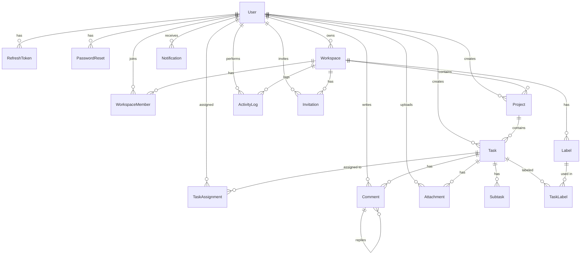

### 9.4.2. Nhóm Identity & Security

Nhóm entity này quản lý danh tính người dùng và các cơ chế bảo mật xác thực. Bảng `User` là entity trung tâm — liên kết trực tiếp đến 12 bảng khác trong hệ thống.

**User** — Entity trung tâm của toàn hệ thống

| Trư��ng | Kiểu | Ghi chú |
|--------|------|---------|
| `id` | `String (UUID)` | PK, auto-generated |
| `email` | `String` | Unique, đăng nhập |
| `password` | `String` | Bcrypt hash, không lưu plain text |
| `name` | `String` | Tên hiển thị bắt buộc |
| `displayName` | `String?` | Tên tùy chỉnh |
| `bio` | `String?` | Giới thiệu bản thân |
| `avatar` | `String?` | Tên file ảnh đại diện |
| `status` | `UserStatus` | ACTIVE / INACTIVE / BANNED |
| `emailVerified` | `Boolean` | Mặc định `false` |
| `lastLoginAt` | `DateTime?` | Lần đăng nhập gần nhất |
| `createdAt` | `DateTime` | Thời điểm tạo |
| `updatedAt` | `DateTime` | Tự động cập nhật |

UUID làm primary key thay vì auto-increment integer — UUID không tiết lộ tổng số users và không thể đoán trước, tăng cường bảo mật. Directive `@@map("users")` ánh xạ tên model PascalCase sang tên bảng snake_case theo convention SQL.

**RefreshToken** — Lưu refresh token (có thể thu hồi)

| Trường | Kiểu | Ghi chú |
|--------|------|---------|
| `id` | `String (UUID)` | PK |
| `token` | `String` | Unique |
| `userId` | `String` | FK → User |
| `expiresAt` | `DateTime` | Thời điểm hết hạn |
| `revokedAt` | `DateTime?` | null = active, có giá trị = đã thu hồi |
| `createdAt` | `DateTime` | Thời điểm tạo |

**PasswordReset** — Token đặt lại mật khẩu (sử dụng một lần)

| Trường | Kiểu | Ghi chú |
|--------|------|---------|
| `id` | `String (UUID)` | PK |
| `userId` | `String` | FK → User |
| `token` | `String` | Unique |
| `expiresAt` | `DateTime` | Thời điểm hết hạn |
| `usedAt` | `DateTime?` | null = chưa dùng, có giá trị = đã dùng |
| `createdAt` | `DateTime` | Thời điểm tạo |

**InvalidatedToken** — Danh sách đen access token

| Trường | Kiểu | Ghi chú |
|--------|------|---------|
| `id` | `String (UUID)` | PK |
| `token` | `String` | Unique |
| `expiresAt` | `DateTime` | Dùng để dọn dẹp records hết hạn |
| `reason` | `String?` | LOGOUT, BANNED, PASSWORD_CHANGED |
| `createdAt` | `DateTime` | Thời điểm tạo |

Điểm thiết kế chung của `RefreshToken` và `PasswordReset` là kỹ thuật **soft invalidation**: thay vì xóa record khi không còn hợp lệ, chúng ta đặt timestamp vào `revokedAt` / `usedAt` — giữ lại lịch sử phục vụ kiểm tra bảo mật (audit). `InvalidatedToken` không có FK đến User vì token đã chứa sẵn userId trong payload, đóng vai trò "bộ lọc nhanh" với truy vấn O(1) qua `@unique` index.

**ERD chi tiết nhóm Identity & Security:**

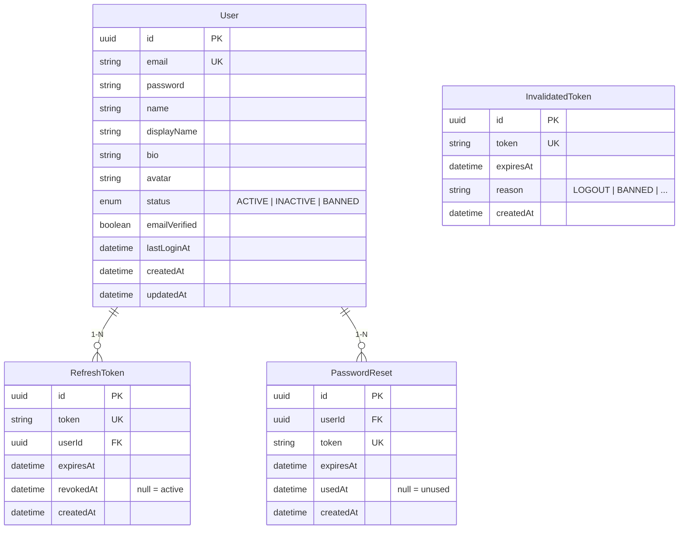

### 9.4.3. Nhóm Workspace & Collaboration

Nhóm entity này mô hình hóa "không gian làm việc chung" — nơi nhiều người dùng cộng tác thông qua cơ chế thành viên và lời mời. Chuỗi quan hệ: User tạo Workspace → mời thành viên qua WorkspaceInvite → thành viên ghi nhận trong WorkspaceMember → sử dụng Label để phân loại tasks.

**Workspace**

| Trường | Kiểu | Ghi chú |
|--------|------|---------|
| `id` | `String (UUID)` | PK |
| `name` | `String` | Tên workspace |
| `description` | `String?` | Mô tả tùy chọn |
| `ownerId` | `String` | FK → User, người sở hữu |
| `createdAt` | `DateTime` | Thời điểm tạo |
| `updatedAt` | `DateTime` | Tự động cập nhật |

**WorkspaceMember** — Bảng trung gian User ↔ Workspace (M-N)

| Trường | Kiểu | Ghi chú |
|--------|------|---------|
| `id` | `String (UUID)` | PK |
| `workspaceId` | `String` | FK → Workspace |
| `userId` | `String` | FK → User |
| `role` | `WorkspaceRole` | OWNER / ADMIN / MEMBER |
| `joinedAt` | `DateTime` | Thời điểm tham gia |

Constraint `@@unique([workspaceId, userId])` ngăn chặn một user tham gia cùng workspace hai lần. Enum `WorkspaceRole` với ba giá trị phản ánh mô hình phân quyền ba cấp.

**WorkspaceInvite** — Lời mời tham gia workspace

| Trường | Kiểu | Ghi chú |
|--------|------|---------|
| `id` | `String (UUID)` | PK |
| `workspaceId` | `String` | FK → Workspace |
| `email` | `String` | Email người được mời |
| `role` | `WorkspaceRole` | Vai trò khi chấp nhận |
| `token` | `String` | Unique, token ngẫu nhiên |
| `invitedById` | `String` | FK → User, người mời |
| `status` | `InvitationStatus` | PENDING / ACCEPTED / EXPIRED / REVOKED |
| `expiresAt` | `DateTime` | Hết hạn sau 7 ngày |
| `createdAt` | `DateTime` | Thời điểm tạo |

**Label** — Nhãn phân loại (thuộc workspace)

| Trường | Kiểu | Ghi chú |
|--------|------|---------|
| `id` | `String (UUID)` | PK |
| `name` | `String` | Tên nhãn |
| `color` | `String` | Mã màu hex (#FF0000) |
| `workspaceId` | `String` | FK → Workspace |
| `createdAt` | `DateTime` | Thời điểm tạo |

Label thuộc cấp workspace (không phải project) để có thể dùng chung cho mọi task trong workspace.

### 9.4.4. Nhóm Project & Task Execution

Đây là nhóm entity cốt lõi của ứng dụng, mô hình hóa quy trình quản lý công việc. Chuỗi quan hệ phân cấp Workspace → Project → Task → Subtask phản ánh cách nhóm dự án tổ chức công việc trong thực tế.

**Project**

| Trường | Kiểu | Ghi chú |
|--------|------|---------|
| `id` | `String (UUID)` | PK |
| `name` | `String` | Tên project |
| `description` | `String?` | Mô tả tùy chọn |
| `workspaceId` | `String` | FK → Workspace |
| `createdById` | `String` | FK → User, người tạo |
| `status` | `ProjectStatus` | ACTIVE / ARCHIVED |
| `isPinned` | `Boolean` | Ghim project lên đầu, mặc định `false` |
| `color` | `String` | Mã màu hiển thị, mặc định `#3B82F6` |
| `createdAt` | `DateTime` | Thời điểm tạo |
| `updatedAt` | `DateTime` | Tự động cập nhật |

Enum `ProjectStatus` chỉ có hai giá trị ACTIVE và ARCHIVED — project không bị xóa mà được archive, giữ lại lịch sử làm việc. Field `isPinned` cho phép user đánh dấu project quan trọng để hiển thị ưu tiên trên giao diện. Field `color` phục vụ UX — mỗi project có màu riêng giúp phân biệt trực quan.

**Task**

| Trường | Kiểu | Ghi chú |
|--------|------|---------|
| `id` | `String (UUID)` | PK |
| `title` | `String` | Tiêu đề task |
| `description` | `String?` | Mô tả chi tiết |
| `projectId` | `String` | FK → Project |
| `createdById` | `String` | FK → User, người tạo |
| `status` | `TaskStatus` | TODO / IN_PROGRESS / REVIEW / DONE |
| `priority` | `TaskPriority` | LOW / NORMAL / HIGH / URGENT |
| `dueDate` | `DateTime?` | Hạn hoàn thành |
| `startDate` | `DateTime?` | Ngày bắt đầu |
| `completedAt` | `DateTime?` | Thời điểm hoàn thành thực tế |
| `position` | `Int` | Thứ tự sắp xếp trong project |
| `estimatedHours` | `Decimal(5,2)?` | Thời gian ước lượng (giờ) |
| `actualHours` | `Decimal(5,2)?` | Thời gian thực tế (giờ) |
| `createdAt` | `DateTime` | Thời điểm tạo |
| `updatedAt` | `DateTime` | Tự động cập nhật |

Task là entity giàu field nhất trong schema với 14 cột, phản ánh sự phức tạp của quản lý công việc thực tế. Enum `TaskStatus` với bốn giá trị mô hình hóa workflow Kanban: TODO → IN_PROGRESS → REVIEW → DONE. Field `position` hỗ trợ sắp xếp drag-and-drop. Hệ thống index: `@@index([projectId])`, `@@index([status])`, `@@index([dueDate])` tối ưu các truy vấn phổ biến nhất.

**Subtask**

| Trường | Kiểu | Ghi chú |
|--------|------|---------|
| `id` | `String (UUID)` | PK |
| `taskId` | `String` | FK → Task |
| `title` | `String` | Tiêu đề subtask |
| `isCompleted` | `Boolean` | Mặc định `false` |
| `position` | `Int` | Thứ tự sắp xếp |
| `createdAt` | `DateTime` | Thời điểm tạo |

Subtask đơn giản hơn Task — chỉ có title và trạng thái boolean. Cascade delete đảm bảo xóa task cha thì subtask cũng bị xóa.

**TaskAssignment** — Bảng trung gian Task ↔ User (M-N)

| Trường | Kiểu | Ghi chú |
|--------|------|---------|
| `id` | `String (UUID)` | PK |
| `taskId` | `String` | FK → Task |
| `userId` | `String` | FK → User |
| `assignedAt` | `DateTime` | Thời điểm phân công |

Constraint `@@unique([taskId, userId])` ngăn phân công trùng lặp.

**TaskLabel** — Bảng trung gian Task ↔ Label (M-N)

| Trường | Kiểu | Ghi chú |
|--------|------|---------|
| `id` | `String (UUID)` | PK |
| `taskId` | `String` | FK → Task |
| `labelId` | `String` | FK → Label |

Constraint `@@unique([taskId, labelId])` đảm bảo mỗi nhãn chỉ gắn một lần cho một task. Dual index trên cả `taskId` và `labelId` tối ưu truy vấn theo cả hai chiều.

### 9.4.5. Nhóm Communication & Activity

Nhóm entity cuối cùng hỗ trợ giao tiếp và theo dõi hoạt động — bình luận trên task, đính kèm file, gửi thông báo, và ghi log mọi thay đổi quan trọng.

**Comment**

| Trường | Kiểu | Ghi chú |
|--------|------|---------|
| `id` | `String (UUID)` | PK |
| `content` | `String` | Nội dung bình luận |
| `taskId` | `String` | FK → Task |
| `authorId` | `String` | FK → User |
| `parentId` | `String?` | FK → Comment (self-relation), `null` = comment gốc |
| `isEdited` | `Boolean` | Mặc định `false`, đánh dấu đã chỉnh sửa |
| `createdAt` | `DateTime` | Thời điểm tạo |
| `updatedAt` | `DateTime` | Tự động cập nhật |

Comment sử dụng kỹ thuật **self-relation** qua `parentId` để hỗ trợ nested reply. Cascade delete trên parent relation đảm bảo xóa comment cha thì toàn bộ cây reply cũng bị xóa.

**Attachment**

| Trường | Kiểu | Ghi chú |
|--------|------|---------|
| `id` | `String (UUID)` | PK |
| `fileName` | `String` | Tên file gốc |
| `fileUrl` | `String` | Đường dẫn truy cập file |
| `fileSize` | `Int` | Kích thước file (bytes) |
| `mimeType` | `String` | Loại file (image/png, application/pdf, ...) |
| `taskId` | `String` | FK → Task |
| `uploadedById` | `String` | FK → User, người upload |
| `createdAt` | `DateTime` | Thời điểm upload |

Attachment lưu metadata, không lưu nội dung file trong database. File thực tế lưu trên disk — tách biệt binary storage khỏi relational database.

**Notification**

| Trường | Kiểu | Ghi chú |
|--------|------|---------|
| `id` | `String (UUID)` | PK |
| `type` | `NotificationType` | Loại thông báo (10 giá trị enum) |
| `title` | `String` | Tiêu đề thông báo |
| `message` | `String?` | Nội dung chi tiết |
| `userId` | `String` | FK → User, người nhận |
| `actorId` | `String?` | FK → User, người gây ra sự kiện |
| `referenceId` | `String?` | ID của entity liên quan |
| `referenceType` | `String?` | Loại entity (task, workspace, project) |
| `isRead` | `Boolean` | Mặc định `false` |
| `createdAt` | `DateTime` | Thời điểm tạo |

Notification sử dụng thiết kế **polymorphic reference**: `referenceId` + `referenceType` cho phép tham chiếu linh hoạt đến bất kỳ entity nào. Composite index `@@index([userId, isRead])` tối ưu truy vấn "danh sách thông báo chưa đọc của user".

**ActivityLog**

| Trường | Kiểu | Ghi chú |
|--------|------|---------|
| `id` | `String (UUID)` | PK |
| `entityType` | `String` | Loại entity bị thay đổi |
| `entityId` | `String` | ID của entity bị thay đổi |
| `userId` | `String` | FK → User, người thực hiện |
| `workspaceId` | `String` | FK → Workspace |
| `action` | `ActivityLogAction` | Hành động (10 giá trị enum) |
| `oldValue` | `Json?` | Giá trị trước khi thay đổi |
| `newValue` | `Json?` | Giá trị sau khi thay đổi |
| `createdAt` | `DateTime` | Thời điểm thực hiện |

ActivityLog là bảng audit trail — ghi lại mọi thay đổi quan trọng. Field `oldValue`/`newValue` sử dụng kiểu `Json` để lưu trữ linh hoạt. Composite index `@@index([workspaceId, createdAt])` tối ưu truy vấn activity feed.

### 9.4.6. Bảng tổng hợp entities

Schema database hoàn chỉnh gồm 17 entities được phân thành 5 nhóm chức năng:

| Nhóm | Entities | Vai trò |
|------|----------|---------|
| Identity | User | Danh tính người dùng |
| Security | RefreshToken, PasswordReset, InvalidatedToken | Bảo mật và xác thực |
| Workspace & Collaboration | Workspace, WorkspaceMember, WorkspaceInvite, Label | Không gian làm việc và cộng tác |
| Project & Task Execution | Project, Task, Subtask, TaskAssignment, TaskLabel | Quản lý công việc |
| Communication & Activity | Comment, Attachment, Notification, ActivityLog | Giao tiếp và theo dõi |

Toàn bộ schema sử dụng UUID làm primary key, áp dụng `@@map()` để chuyển đổi naming convention từ PascalCase (Prisma) sang snake_case (PostgreSQL), và thiết lập cascade delete cho các quan hệ phụ thuộc. Hệ thống index được đặt có chủ đích cho các truy vấn nghiệp vụ phổ biến nhất, đảm bảo hiệu năng truy vấn ngay cả khi dữ liệu tăng trưởng.

---

## 9.5. Thiết kế API

### 9.5.1. Quy ước RESTful

Toàn bộ API tuân theo các quy ước RESTful nhất quán:

| Quy ước | Giá trị | Ví dụ |
|---------|---------|-------|
| Base URL | `/api/v1` | `http://localhost:3333/api/v1/auth/login` |
| Naming | Danh từ số nhiều, lowercase | `/users`, `/workspaces`, `/tasks` |
| HTTP Methods | GET (đọc), POST (tạo), PATCH (cập nhật), DELETE (xóa) | `PATCH /users/me` |
| Status Codes | 200 (OK), 201 (Created), 400 (Bad Request), 401 (Unauthorized), 404 (Not Found), 409 (Conflict) | |

Prefix `/api/v1` phục vụ API versioning — khi cần thay đổi breaking changes trong tương lai, chúng ta triển khai `/api/v2` song song mà không phá vỡ client đang dùng v1.

### 9.5.2. Danh sách endpoints

**Auth Module — 6 endpoints:**

| Method | Endpoint | Auth | Mô tả |
|--------|----------|------|-------|
| `POST` | `/auth/register` | Public | Đăng ký tài khoản mới |
| `POST` | `/auth/login` | Public | Đăng nhập, nhận tokens |
| `POST` | `/auth/refresh` | Public | Làm mới access token |
| `POST` | `/auth/logout` | JWT | Đăng xuất, thu hồi tokens |
| `POST` | `/auth/forgot-password` | Public | Yêu cầu đặt lại mật khẩu |
| `POST` | `/auth/reset-password` | Public | Đặt lại mật khẩu bằng token |

**User Module — 4 endpoints:**

| Method | Endpoint | Auth | Mô tả |
|--------|----------|------|-------|
| `GET` | `/users/me` | JWT | Xem hồ sơ cá nhân |
| `PATCH` | `/users/me` | JWT | Cập nhật displayName, bio |
| `PATCH` | `/users/me/change-password` | JWT | Thay đổi mật khẩu |
| `POST` | `/users/me/avatar` | JWT | Upload ảnh đại diện |

Tất cả endpoints của User Module sử dụng đường dẫn `/me` thay vì `/:userId`. Thiết kế này ngăn chặn triệt để việc truy cập hồ sơ người khác — userId luôn được trích xuất từ JWT token đã xác thực, không phải từ URL do client cung cấp.

**Workspace Module — 11 endpoints:**

| Method | Endpoint | Quyền tối thiểu | Mô tả |
|--------|----------|-----------------|-------|
| `POST` | `/workspaces` | User | Tạo workspace mới |
| `GET` | `/workspaces` | User | Danh sách workspace của tôi |
| `GET` | `/workspaces/:id` | Member | Xem chi tiết workspace |
| `PATCH` | `/workspaces/:id` | Owner | Cập nhật tên/mô tả |
| `DELETE` | `/workspaces/:id` | Owner | Xóa workspace |
| `POST` | `/workspaces/:id/invite` | Admin | Mời thành viên qua email |
| `POST` | `/workspaces/accept-invite/:token` | Public | Chấp nhận lời mời |
| `GET` | `/workspaces/:id/members` | Member | Danh sách thành viên |
| `PATCH` | `/workspaces/:id/members/:userId` | Owner | Đổi vai trò thành viên |
| `DELETE` | `/workspaces/:id/members/:userId` | Admin | Xóa thành viên |
| `DELETE` | `/workspaces/:id/leave` | Member | Rời workspace |

**Project Module — 9 endpoints:**

| Method | Endpoint | Quyền tối thiểu | Mô tả |
|--------|----------|-----------------|-------|
| `POST` | `/workspaces/:wsId/projects` | Member | Tạo project trong workspace |
| `GET` | `/workspaces/:wsId/projects` | Member | Danh sách projects |
| `GET` | `/projects/:id` | Member | Xem chi tiết project |
| `PATCH` | `/projects/:id` | Member | Cập nhật project |
| `DELETE` | `/projects/:id` | Admin | Xóa project |
| `POST` | `/projects/:id/archive` | Admin | Archive project |
| `POST` | `/projects/:id/unarchive` | Admin | Unarchive project |
| `POST` | `/projects/:id/pin` | Member | Pin project |
| `POST` | `/projects/:id/unpin` | Member | Unpin project |

**Task Module — 14 endpoints:**

| Method | Endpoint | Quyền tối thiểu | Mô tả |
|--------|----------|-----------------|-------|
| `POST` | `/projects/:projId/tasks` | Member | Tạo task |
| `GET` | `/projects/:projId/tasks` | Member | Danh sách tasks (filter/sort/pagination) |
| `GET` | `/tasks/:id` | Member | Xem chi tiết task |
| `PATCH` | `/tasks/:id` | Member | Cập nhật task |
| `DELETE` | `/tasks/:id` | Member | Xóa task |
| `PATCH` | `/tasks/:id/status` | Member | Thay đổi trạng thái |
| `POST` | `/tasks/:id/assign` | Member | Phân công thành viên |
| `DELETE` | `/tasks/:id/assign/:userId` | Member | Hủy phân công |
| `POST` | `/tasks/:id/labels` | Member | Gắn nhãn vào task |
| `DELETE` | `/tasks/:id/labels/:labelId` | Member | Gỡ nhãn |
| `POST` | `/tasks/:id/subtasks` | Member | Tạo subtask |
| `GET` | `/tasks/:id/subtasks` | Member | Danh sách subtask |
| `PATCH` | `/subtasks/:id/complete` | Member | Toggle hoàn thành subtask |
| `DELETE` | `/subtasks/:id` | Member | Xóa subtask |

**Comment Module — 2 endpoints:**

| Method | Endpoint | Quyền tối thiểu | Mô tả |
|--------|----------|-----------------|-------|
| `POST` | `/tasks/:taskId/comments` | Member | Thêm bình luận |
| `POST` | `/tasks/:taskId/comments/:parentId/reply` | Member | Reply bình luận |

**Notification Module — 1 endpoint:**

| Method | Endpoint | Auth | Mô tả |
|--------|----------|------|-------|
| `POST` | `/notifications` | JWT | Tạo thông báo |

Tổng cộng hệ thống có **47 endpoints** được phân chia rõ ràng theo domain. Mỗi nhóm endpoint bảo vệ bởi hai lớp: `JwtAuthGuard` kiểm tra token hợp lệ, và kiểm tra membership workspace tại tầng Service.

### 9.5.3. Chuẩn hóa Response & Error Handling

Mọi response trong hệ thống đều tuân theo một cấu trúc thống nhất, nhờ hai thành phần hoạt động ở tầng global:

**Response thành công** (qua `TransformResponseInterceptor`):

```json
{
  "success": true,
  "data": { /* dữ liệu thực tế */ },
  "timestamp": "2026-03-17T09:00:00.000Z"
}
```

**Response lỗi** (qua `HttpExceptionFilter`):

```json
{
  "success": false,
  "statusCode": 400,
  "message": "Email should not be empty",
  "path": "/api/v1/auth/register",
  "timestamp": "2026-03-17T09:00:00.000Z"
}
```

Sự phối hợp giữa Interceptor (bọc response thành công) và Filter (bắt và format lỗi) tạo ra một "khế ước" rõ ràng: client chỉ cần kiểm tra field `success` để phân biệt thành công và thất bại, thay vì phải phân tích HTTP status code. Đây là nền tảng giúp frontend xử lý response một cách nhất quán cho mọi API call.

### 9.5.4. Validation đầu vào

Mọi dữ liệu từ client đều được validate bởi `ValidationPipe` toàn cục với ba tùy chọn bảo mật:

| Tùy chọn | Tác dụng | Ví dụ |
|----------|---------|-------|
| `whitelist: true` | Loại bỏ field không khai báo trong DTO | `{ email, password, isAdmin }` → `isAdmin` bị xóa |
| `forbidNonWhitelisted: true` | Trả lỗi 400 nếu có field lạ | `{ email, password, isAdmin }` → lỗi 400 |
| `transform: true` | Tự động chuyển kiểu dữ liệu | `?page="1"` → `page = 1` (number) |

Kết hợp với DTO classes sử dụng decorators từ `class-validator`, hệ thống đảm bảo rằng mọi request đến controller đều đã được validate đầy đủ — controller không cần kiểm tra lại dữ liệu đầu vào.

---

## 9.6. Thiết kế bảo mật

### 9.6.1. Chiến lược xác thực Dual Token

Hệ thống sử dụng chiến lược dual-token, kết hợp hai loại JWT token phục vụ hai mục đích khác nhau:

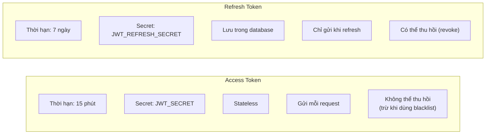

Access Token có thời hạn ngắn (15 phút) để giảm thiểu rủi ro khi bị lộ — kẻ tấn công chỉ có cửa sổ 15 phút để khai thác. Refresh Token có thời hạn dài hơn (7 ngày) nhưng được lưu trong database, cho phép server thu hồi bất kỳ lúc nào. Hai token sử dụng **secret key riêng biệt** — ngăn chặn việc dùng refresh token (dễ bị lộ vì lưu lâu) để giả mạo access token.

### 9.6.2. Token Blacklist & Token Rotation

Bản chất JWT là stateless — server không lưu trạng th��i, nên không thể "hủy" một token đã cấp. Khi user đăng xuất, access token vẫn hợp lệ cho đến khi hết hạn. Để giải quyết, hệ thống triển khai cơ chế **Token Blacklist**:

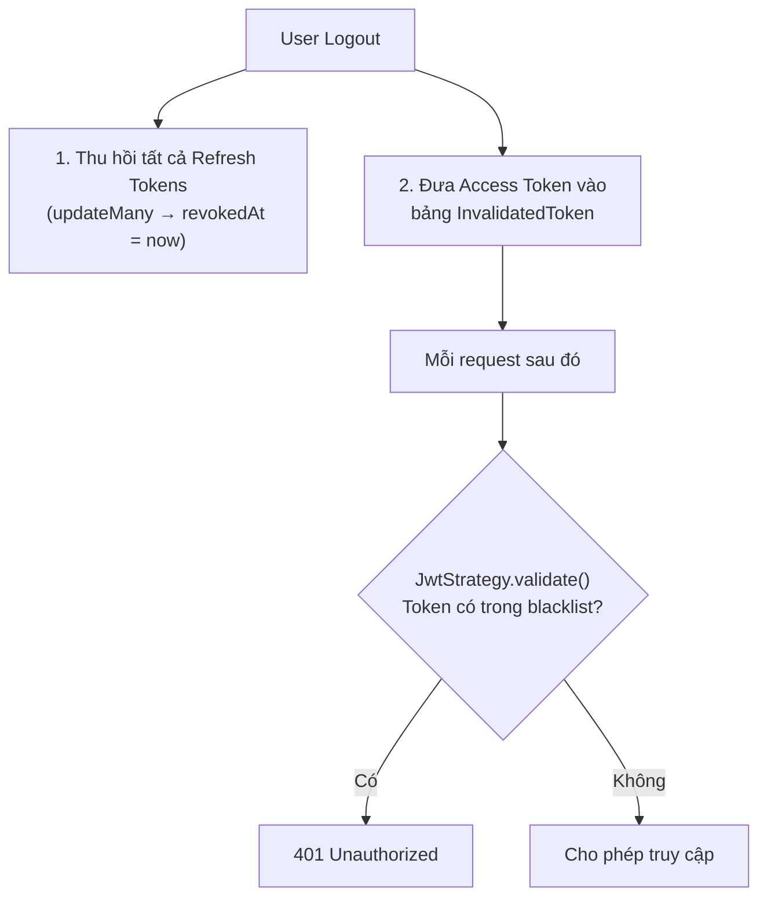

Bảng `InvalidatedToken` đóng vai trò "danh sách đen" nhỏ gọn. Mỗi record chứa token đã thu hồi kèm `expiresAt` — cho phép cron job định kỳ dọn dẹp các records đã hết hạn, giữ bảng luôn gọn nhẹ. Chi phí kiểm tra blacklist là một query `findUnique` theo `@unique` index — tốc độ O(1), không ảnh hưởng đáng kể đến hiệu năng.

**Token Rotation:** Mỗi lần client gọi `/auth/refresh` để lấy access token mới, refresh token cũ bị thu hồi và cặp token hoàn toàn mới được tạo ra. Kỹ thuật này ngăn chặn việc tái sử dụng refresh token bị đánh cắp — kẻ tấn công chỉ có thể dùng token đó đúng một lần.

### 9.6.3. Chiến lược Global Guard + @Public()

Thay vì đặt `@UseGuards(JwtAuthGuard)` trên từng controller, hệ thống đăng ký guard toàn cục qua `APP_GUARD` — triết lý **"secure by default"**:

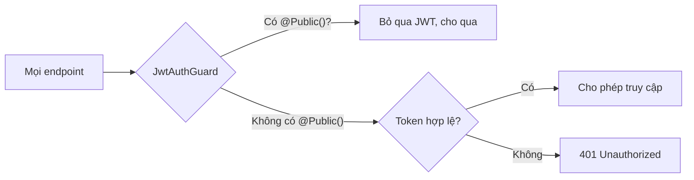

Với thiết kế này, nếu developer quên gắn guard khi tạo endpoint mới, endpoint đó vẫn đư���c bảo vệ. Chỉ khi cố ý đánh dấu `@Public()` thì endpoint mới được truy cập công khai. Cách tiếp cận này an toàn hơn nhiều so với mô hình ngược lại (mặc định mở, phải gắn guard để bảo vệ).

### 9.6.4. Bảo mật mật khẩu

**Hash mật khẩu:** Mật khẩu được hash bằng bcrypt với 10 salt rounds trước khi lưu vào database. Bcrypt tự động tích hợp giá trị salt ngẫu nhiên vào quá trình hash — hai user có cùng mật khẩu sẽ cho ra hai chuỗi hash hoàn toàn khác nhau, chống tấn công Rainbow Table. Tham số 10 salt rounds tạo ra khoảng 2^10 = 1024 vòng lặp tính toán, cân bằng giữa bảo mật và hiệu năng.

**Validate mật khẩu:** Mật khẩu đầu vào phải thỏa mãn năm điều kiện: tối thiểu 8 ký tự, có ít nhất một chữ hoa, một chữ thường, một chữ số, và một ký tự đặc biệt. Quy tắc này tuân theo khuyến nghị của OWASP (Open Web Application Security Project), đảm bảo mật khẩu có đủ entropy để chống lại tấn công từ điển (dictionary attack) và brute-force.

### 9.6.5. Bảo mật File Upload

**Chiến lược lưu trữ:** File upload được lưu trữ tại thư mục `uploads/` trên server, phân loại theo thư mục con (avatars, attachments). NestJS phục vụ file qua static assets middleware.

**Quy tắc bảo mật:**

| Quy tắc | Giá trị | Mục đích |
|---------|---------|----------|
| MIME type whitelist | `image/jpeg`, `image/png`, `image/gif` (avatar); mở rộng hơn cho attachments | Ngăn upload file thực thi |
| Kích thước tối đa | 5 MB (avatar), 10 MB (attachment) | Chống DoS qua file lớn |
| Tên file ngẫu nhiên | `avatar-{timestamp}-{random}.{ext}` | Ngăn path traversal, trùng tên |
| Xóa file cũ | Khi upload avatar mới, file cũ bị xóa | Tránh tích tụ file rác |

---

## 9.7. Biểu đồ tuần tự

Biểu đồ tuần tự (Sequence Diagram) mô tả trình tự tương tác giữa các thành phần trong hệ thống khi xử lý một request. Các luồng được nhóm theo module để dễ theo dõi.

### 9.7.1. Module Auth — Đăng ký, Đăng nhập, Refresh Token, Đăng xuất

**Đăng k�� tài khoản (Register)**

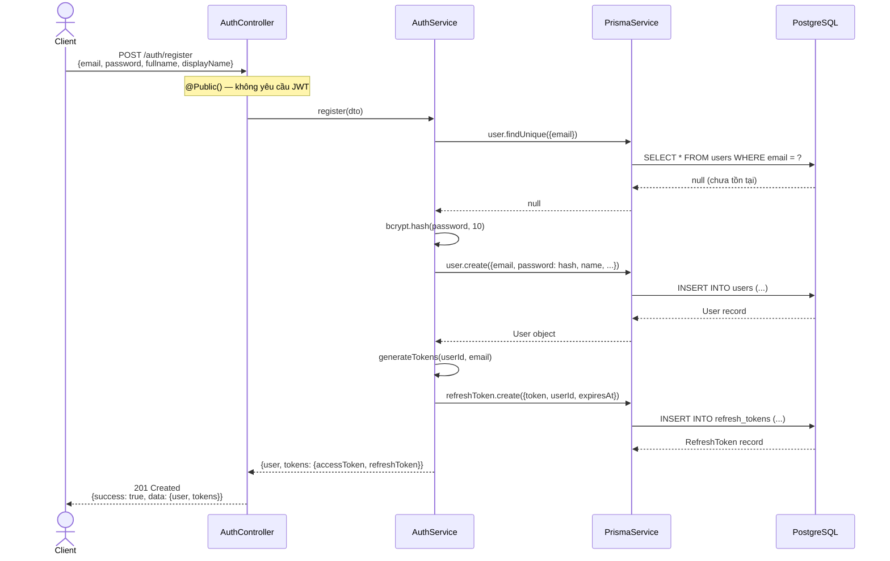

**Đăng nhập (Login)**

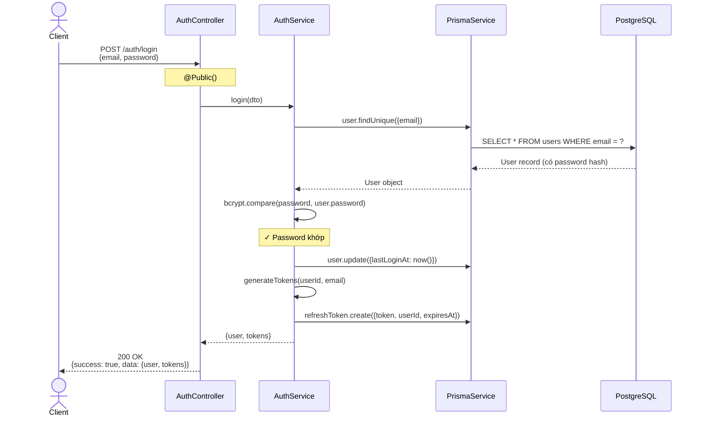

**Làm mới token (Refresh — Token Rotation)**

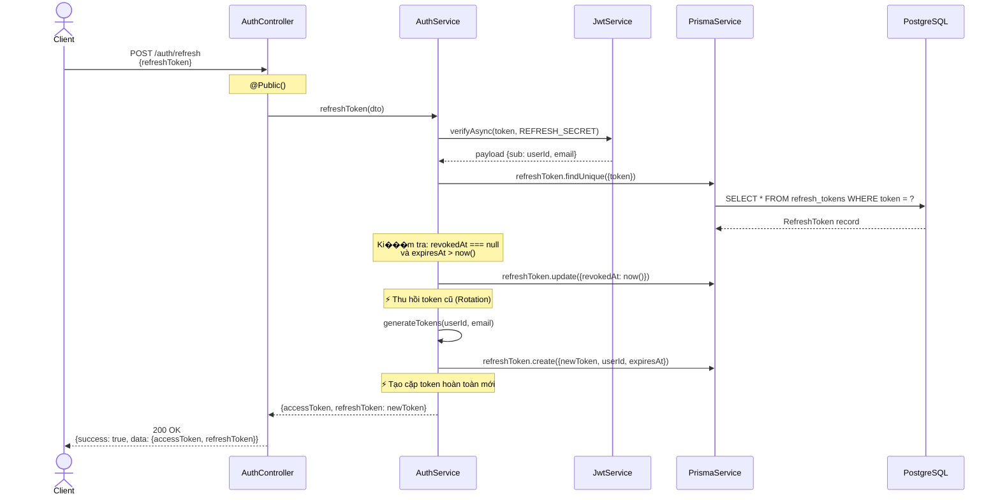

**Đăng xuất (Logout — Token Blacklist)**

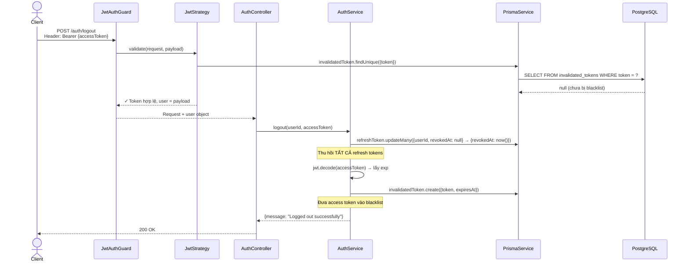

### 9.7.2. Module User — Xem hồ sơ, Đổi mật khẩu, Upload Avatar

**Xem hồ sơ cá nhân (Get Profile — Luồng Authenticated)**

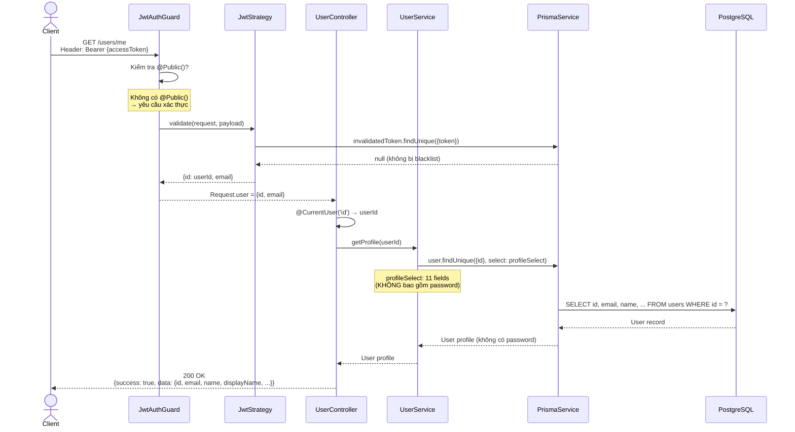

**Đổi mật khẩu (Change Password — Transaction)**

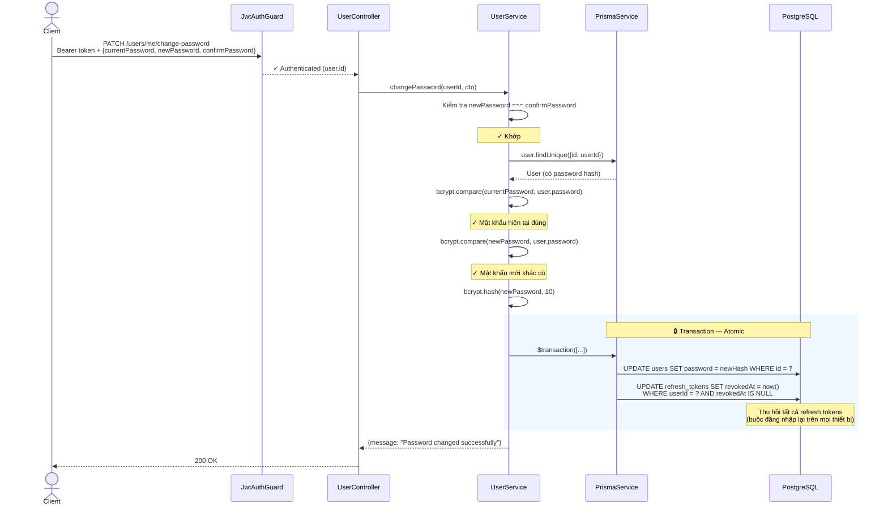

**Upload Avatar (File Upload)**

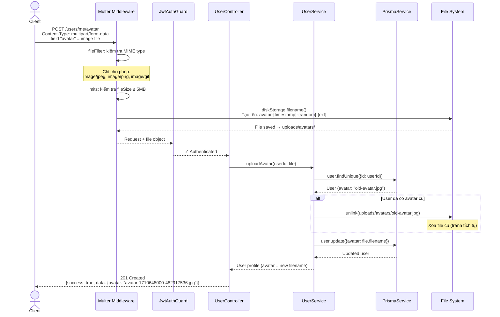

### 9.7.3. Module Workspace — Tạo Workspace, Mời th��nh viên

**Tạo Workspace**

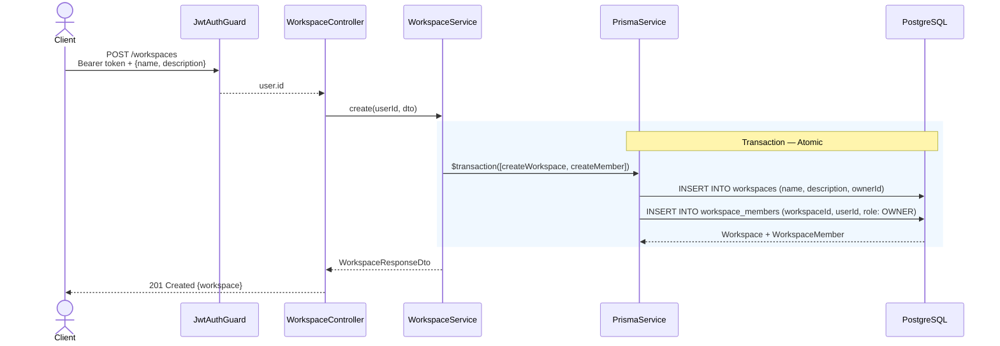

Đáng chú ý: tạo workspace dùng **Prisma Transaction** để đảm bảo tính nguyên tử — hoặc cả workspace lẫn record thành viên Owner đều được tạo, hoặc cả hai đều thất bại. Điều này ngăn trường hợp workspace được tạo nhưng không có owner.

**Mời thành viên (Invite Member)**

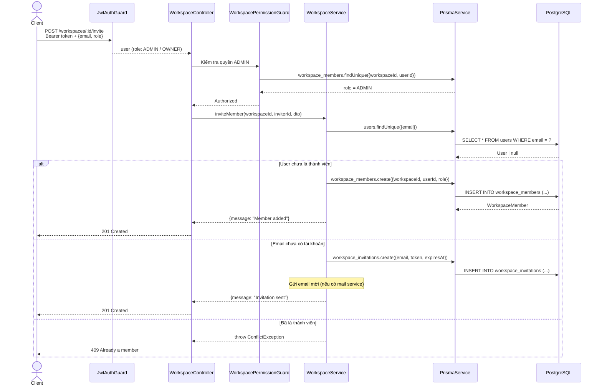

### 9.7.4. Module Project & Task — Tạo Project, Tạo Task, Thay đổi trạng thái

**Tạo Project**

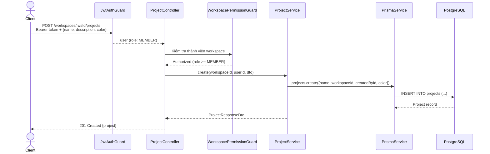

**Tạo Task**

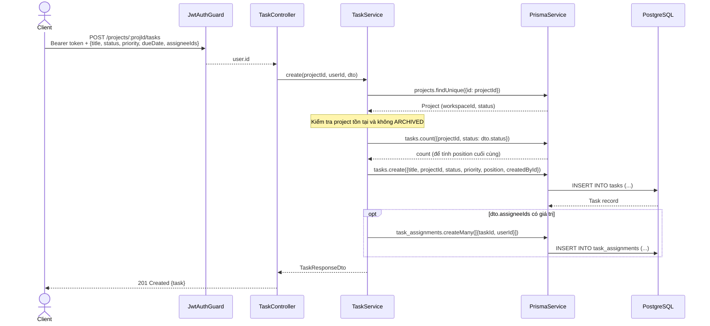

**Thay đổi trạng thái Task (Drag & Drop)**

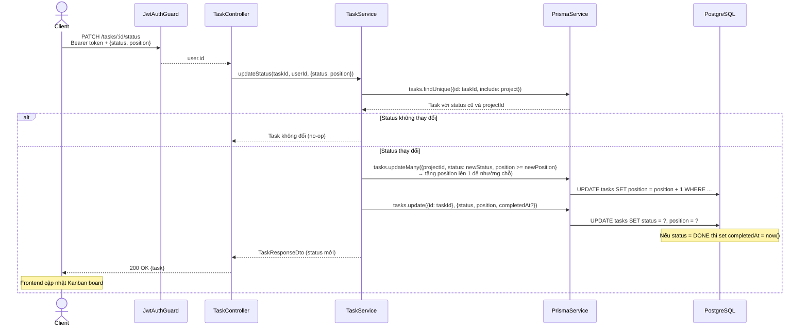

Sequence diagram này thể hiện cơ chế **position reordering**: khi task được kéo vào vị trí mới trong column, các task phía sau được dịch chuyển trước, sau đó mới cập nhật task đang di chuy���n. Điều này đảm bảo không có hai task cùng position trong một column.

### 9.7.5. Module Comment — Thêm bình luận

**Thêm bình luận (Add Comment)**

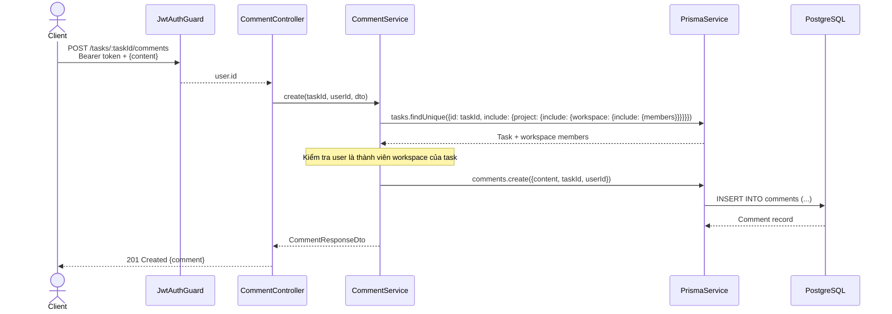

---

## 9.8. Tổng kết

Chương này đã phân tích và thiết kế toàn hệ thống TodoList Collaboration, bao gồm hai phần chính:

**Phần A — Phân tích yêu cầu** xác định rõ ràng bài toán cần giải quyết: quản lý công việc cộng tác trong môi trường nhóm. Hệ thống có 25 yêu cầu chức năng chia thành 7 nhóm module, cùng 12 yêu cầu phi chức năng về bảo mật, hiệu năng, và khả năng bảo trì. Ma trận phân quyền với 5 loại actor theo thứ bậc kế thừa thể hiện rõ ràng ai được làm gì trong hệ thống, tuân theo nguyên tắc Least Privilege.

**Phần B — Thiết kế hệ thống** triển khai giải pháp kỹ thuật cho các yêu cầu:

- **Kiến trúc module** — 14 module theo nguyên tắc phân tách trách nhiệm, với `PrismaModule @Global` làm hạ tầng dùng chung và dependency chain rõ ràng: Workspace → Project → Task. Pipeline xử lý request 5 lớp đảm bảo mọi cross-cutting concerns được xử lý tập trung.

- **Thiết kế CSDL** — PostgreSQL với 17 bảng chia 5 nhóm, trong đó `users` là entity trung tâm liên kết đến 12 bảng. Kỹ thuật soft invalidation cho audit, polymorphic reference cho notification, self-relation cho nested comment.

- **Thiết kế API** — 47 endpoints RESTful chia thành 7 module, bảo vệ hai lớp (JWT + Workspace membership). Response chuẩn hóa thống nhất qua Interceptor và Filter.

- **Thiết kế bảo mật** — Dual-token với Token Blacklist + Token Rotation, Global Guard "secure by default", bcrypt hash mật khẩu, file upload kiểm soát chặt chẽ.

- **Biểu đồ tuần tự** — 13 sequence diagram minh họa luồng xử lý cho các chức năng tiêu biểu: xác thực (register, login, refresh, logout), quản lý người dùng (profile, change password, avatar), cộng tác workspace (tạo workspace, mời thành viên), quản lý project/task (tạo, drag & drop status), và bình luận.

Với nền tảng phân tích và thiết kế này, chương tiếp theo sẽ trình bày sản phẩm tổng hợp — cách các kỹ thuật đã học ở Phần 2 được tích hợp vào từng module, kết quả vận hành thực tế, và hướng dẫn cài đặt.
